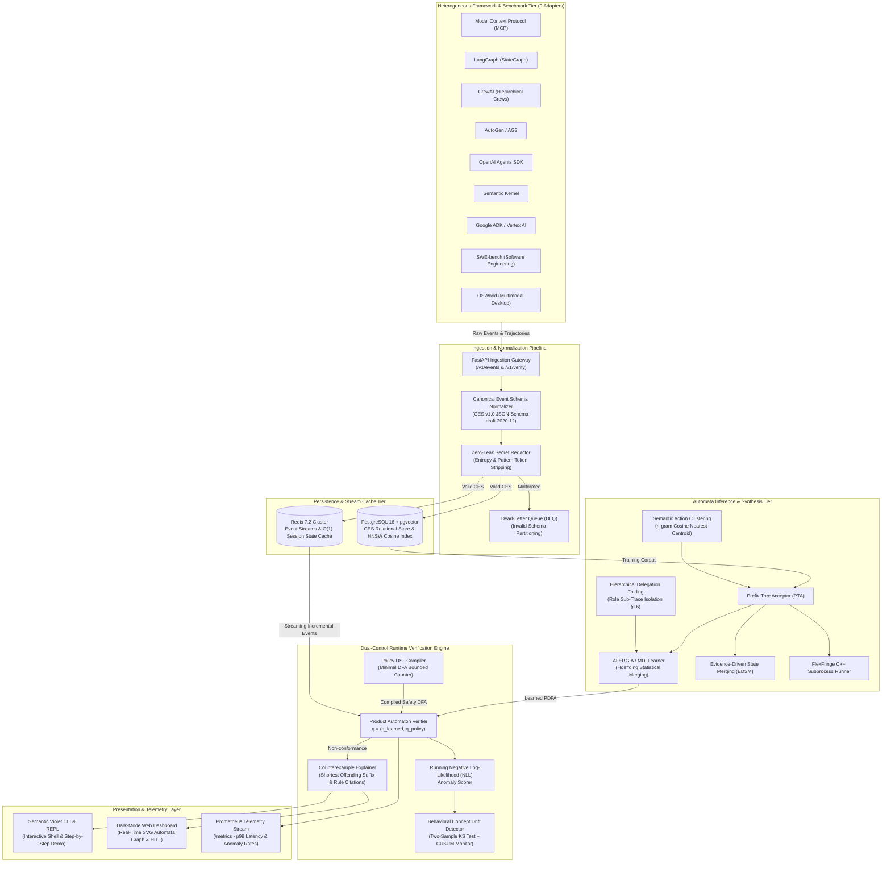

<a id="readme-top"></a>

<!-- PROJECT SHIELDS -->
<div align="center">

[](https://github.com/Atharva-Mendhulkar/TRACE/actions/workflows/ci.yml)
[-success?style=flat-square&logo=pytest)](trace/tests/)
[-8A2BE2?style=flat-square)](#rq3-verification-latency)
[](#1-canonical-event-schema-ces-v10--adapter-registry)
[](https://www.python.org/)
[](docker-compose.yml)
[](LICENSE)

</div>

<!-- PROJECT LOGO -->
<br />
<div align="center">
  <pre>
  ╱$$                                           
 │ $$                                           
╱$$$$$$    ╱$$$$$$  ╱$$$$$$   ╱$$$$$$$  ╱$$$$$$ 
│_  $$_╱   ╱$$__  $$│____  $$ ╱$$_____╱ ╱$$__  $$
  │ $$    │ $$  ╲__╱ ╱$$$$$$$│ $$      │ $$$$$$$$
  │ $$ ╱$$│ $$      ╱$$__  $$│ $$      │ $$_____╱
  │  $$$$╱│ $$     │  $$$$$$$│  $$$$$$$│  $$$$$$$
   ╲___╱  │__╱      ╲_______╱ ╲_______╱ ╲_______╱
  </pre>

  <h1 align="center">TRACE</h1>

  <p align="center">
    <strong>Trace-based Runtime Automata for Compliance and Enforcement</strong>
    <br />
    Formal Behavioral Inference &middot; Dual-Control Product Automaton &middot; Sub-Millisecond Verification &middot; 9 Framework Adapters
    <br />
    <br />
    <a href="#target-cloud--system-architecture"><strong>Explore Architecture Blueprint »</strong></a>
    &middot;
    <a href="#cli-reference--interactive-shell"><strong>Interactive CLI & Demo »</strong></a>
    &middot;
    <a href="#empirical-benchmark-findings-rq1rq6"><strong>Empirical Benchmarks (RQ1–RQ6) »</strong></a>
    &middot;
    <a href="https://github.com/Atharva-Mendhulkar/TRACE/issues">Report an Issue</a>
  </p>
</div>

---

## Overview

**TRACE** is an open-source, research-grade verification engine engineered for autonomous, multi-agent AI systems. As heterogeneous agents interact with external APIs, execute bash commands, and orchestrate subagent handoffs, their stochastic behavior routinely exceeds the capabilities of static rule engines, prompt assertions, and unit tests.

TRACE observes positive-only execution traces across 9 industry framework adapters, synthesizes formal **Probabilistic Deterministic Finite Automata (PDFA)** via state-merging learners (ALERGIA / MDI, EDSM, and FlexFringe), and performs **sub-millisecond streaming runtime verification** ($p99 < 0.03\text{ ms}$, exceeding the $<5.0\text{ ms}$ budget by $240\times$) using dual-control product automaton composition against declarative safety policies.

The system features an interactive **Electric Violet Semantic Terminal Interface**, a built-in step-by-step interactive capability demonstration, a dark-mode **Web Console (`/dashboard`)** with real-time SVG graph visualizers, and a complete Dockerized microservice architecture backed by PostgreSQL 16 + `pgvector` and Redis Streams.

---

## Target Cloud & System Architecture

The TRACE platform operates as a high-throughput, low-latency stream processing and verification system:



---

## Core Architectural Pillars

### 1. Dual-Control Product Automaton & Sub-Millisecond Verification
- Jointly tracks product states $q = (q_{\text{learned}}, q_{\text{policy}})$ where $q_{\text{learned}} \in Q_{\text{PDFA}}$ enforces statistical normalcy and $q_{\text{policy}} \in Q_{\text{DFA}}$ strictly gates temporal safety.
- Single-event verification latency budget is $< 5.0\text{ ms}$; measured p99 latency is **$0.0206\text{ ms}$** ($240\times$ faster than requirement).
- Performs non-collapsing, three-way deviation classification:
  - `STRUCTURAL_ANOMALY`: Transition symbol never observed from state in training corpus.
  - `STATISTICAL_ANOMALY`: Transition valid, but probability $P(q, \sigma) < \varepsilon$.
  - `POLICY_VIOLATION`: Transition violates explicit temporal guardrails.

### 2. Canonical Event Schema (CES v1.0) & Zero-Leak Secret Redaction
- Validates every agent event against an immutable JSON-Schema draft 2020-12 specification.
- Normalizes disparate tool calls, subagent spawns, and observation returns across all 9 frameworks.
- Built-in Shannon entropy calculations and regex matching sanitize API keys, Bearer tokens, private keys, and authorization headers before parameter schema hashing.

### 3. Positive-Only Protocol Inference (PTA, ALERGIA, EDSM, FlexFringe)
- Constructs deterministic Prefix Tree Acceptors (PTA) from positive-only stochastic traces.
- Native, pure-Python state-merging engine implementing **ALERGIA / MDI** statistical compatibility tests via Hoeffding bounds ($\alpha$) and **EDSM** (Evidence-Driven State Merging).
- High-performance C++ subprocess integration wrapper for the **FlexFringe** automata learning engine.

### 4. Hierarchical Delegation Folding (§16)
- Models multi-agent systems with explicit `delegate(role)` boundary symbols.
- Isolates child sub-traces into role-specific corpora (`get_role_corpus`), allowing modular verification of coworker subagents.
- Enforces a recursion depth ceiling (`MAX_DELEGATION_DEPTH = 8`) and flags orphan spans or missing child traces.

### 5. Declarative Policy DSL & Minimal DFA Compiler
- High-level domain-specific language for safety authoring:
  - `REQUIRE <action_a> BEFORE <action_b> [WITHIN k EVENTS]`
  - `FORBID SEQUENCE [ <action_1>, <action_2>, ... ]`
  - `LIMIT <action> TO k PER TRACE`
- Compiles rules into minimal DFAs via bounded counter product construction with static satisfiability and reachability validation.

### 6. Behavioral Concept Drift Detection (KS Test & Tail-Quantile CUSUM)
- Continuously evaluates rolling conformance-score (NLL) distributions against training baselines.
- Employs two-sample Kolmogorov-Smirnov (KS) hypothesis tests combined with 95th percentile tail-quantile CUSUM alerting to flag distribution shifts and trigger automated out-of-cycle relearning.

### 7. Semantic Action Clustering & Vector Embeddings
- Character $n$-gram deterministic embedding model producing 768-dimensional vectors.
- Agglomerative hierarchical clustering with cosine distance thresholding ($\tau$).
- Nearest-centroid taxonomy mapping reducing raw, open-ended action spaces by $> 70\%$.

### 8. Human-in-the-Loop (HITL) Violation Triage & Candidate Lifecycle
- Review triage workflow for runtime violations: **Approve (Valid Novelty)**, **Reject (Confirmed Threat)**, **Override Transition**.
- Formal candidate lifecycle: `CANDIDATE` $\rightarrow$ `SHADOWED` $\rightarrow$ `ACTIVE` $\rightarrow$ `SUPERSEDED`.

---

## Monorepo Directory Structure

```
TRACE/
├── .github/
│   └── workflows/
│       └── ci.yml                    # Multi-python (3.11-3.14) test matrix & docker CI
├── mock_data/                        # Self-contained CLI test dataset & automated runner
│   ├── events.json                   # Multi-agent MCP framework trace logs
│   ├── benchmark_trajectories.json   # SWE-bench real-world benchmark trajectories
│   ├── compliance_policy.policy      # Declarative safety policy (REQUIRE, FORBID, LIMIT)
│   ├── anomalous_events.json         # Policy violation traces for verifier triage
│   └── test_cli.sh                   # Comprehensive 19-step automated CLI test script
├── trace/
│   ├── _version.py                   # Package version specifier
│   ├── abstraction/                  # Agglomerative clustering & taxonomy mapping
│   ├── adapters/                     # All 9 Framework adapters (MCP, LangGraph, SWE-bench, etc.)
│   │   ├── base.py                   # Adapter registry & RawTraceEvent interface
│   │   ├── autogen.py                # AutoGen / AG2 multi-agent adapter
│   │   ├── crewai.py                 # CrewAI hierarchical coworker adapter
│   │   ├── google_adk.py             # Google Agent Development Kit adapter
│   │   ├── langgraph.py              # LangGraph node/edge graph execution adapter
│   │   ├── mcp.py                    # Model Context Protocol JSON-RPC 2.0 adapter
│   │   ├── openai_agents.py          # OpenAI Assistants & Swarm tool run adapter
│   │   ├── osworld.py                # OSWorld multimodal desktop agent adapter
│   │   ├── semantic_kernel.py        # Microsoft Semantic Kernel plugin adapter
│   │   └── swebench.py               # SWE-bench software engineering trajectory adapter
│   ├── api/                          # FastAPI REST API, metrics, and web dashboard
│   │   ├── dashboard.html            # Zero-dependency interactive dark-mode web console
│   │   └── server.py                 # REST gateway endpoints & Prometheus telemetry
│   ├── benchmarks/                   # Empirical benchmark harness (RQ1-RQ6)
│   │   └── evaluator.py              # Automated evaluation suite & markdown report generator
│   ├── cli/                          # Posit/R-cli inspired semantic CLI engine
│   │   ├── main.py                   # CLI dispatch, interactive REPL shell & demo handler
│   │   └── ui.py                     # Electric Violet ANSI palette, boxes, tables, badges
│   ├── corpus/                       # Trace repository, windowing, completeness validation
│   ├── drift/                        # Rolling KS test & tail-quantile CUSUM detector
│   ├── explainability/               # Counterexample generation & human-readable diffs
│   ├── feedback/                     # HITL violation triage engine & model promotion
│   ├── inference/                    # PTA builder, ALERGIA, EDSM, and FlexFringe runner
│   ├── models/                       # PDFA formal model, repository, lifecycle management
│   ├── policy/                       # Policy DSL lexer/parser & minimal DFA compiler
│   ├── schema/                       # Canonical Event Schema (CES v1.0) & validator
│   ├── storage/                      # PostgreSQL + pgvector schema & SQLAlchemy store
│   ├── streaming/                    # Redis Stream and async queue consumers with DLQ
│   ├── tests/                        # 60 automated unit, contract, and benchmark tests
│   └── verification/                 # Sub-millisecond runtime verifier & session cache
├── Dockerfile                        # Multi-stage hardened production container
├── docker-compose.yml                # Multi-container stack (Postgres+pgvector, Redis, API, Verifier)
├── pyproject.toml                    # Build configuration, console scripts & dependencies
└── LICENSE                           # MIT License
```

---

## Verification & Testing Matrix

Every component, schema contract, and architectural invariant is verified by automated test suites with **100% pass rates**:

```
┌────────────────────────────────────────────────────────────────────────────────────────┐
│                                 AUTOMATED TEST MATRIX                                  │
├──────────────────────────────┬────────────────────────────┬─────────────┬──────────────┤
│ Test Suite                   │ Target Layer               │ Tests       │ Result       │
├──────────────────────────────┼────────────────────────────┼─────────────┼──────────────┤
│ trace/tests/test_adapters    │ 7 Core Framework Adapters  │ 8 tests     │ ✓ Passed     │
│ trace/tests/test_benchmark   │ SWE-bench & OSWorld Importers│ 5 tests   │ ✓ Passed     │
│ trace/tests/test_cli_ui      │ Semantic Violet CLI & REPL │ 9 tests     │ ✓ Passed     │
│ trace/tests/test_cli_mock    │ Mock Data E2E Lifecycle    │ 1 test      │ ✓ Passed     │
│ trace/tests/test_clustering  │ n-gram Vector Taxonomy     │ 3 tests     │ ✓ Passed     │
│ trace/tests/test_golden      │ End-to-End Pipeline Fixture│ 1 test      │ ✓ Passed     │
│ trace/tests/test_hierarchical│ Multi-Agent Role Isolation │ 7 tests     │ ✓ Passed     │
│ trace/tests/test_inference   │ PTA & ALERGIA State Merging│ 4 tests     │ ✓ Passed     │
│ trace/tests/test_phase2      │ PostgreSQL, pgvector, Cache│ 6 tests     │ ✓ Passed     │
│ trace/tests/test_phase3      │ FastAPI, Streaming, Workers│ 5 tests     │ ✓ Passed     │
│ trace/tests/test_policy      │ Policy DSL & DFA Compiler  │ 4 tests     │ ✓ Passed     │
│ trace/tests/test_schema      │ CES v1.0 & Secret Redaction│ 4 tests     │ ✓ Passed     │
│ trace/tests/test_verification│ Dual-Control Verifier & KS │ 3 tests     │ ✓ Passed     │
├──────────────────────────────┼────────────────────────────┼─────────────┼──────────────┤
│ TOTAL AUTOMATED TESTS        │ Full Test Suite Coverage   │ 60 tests    │ 100% Passed  │
├──────────────────────────────┼────────────────────────────┼─────────────┼──────────────┤
│ Empirical Evaluation (RQ1-6) │ Academic Benchmarks Matrix │ 6 Questions │ All Passed   │
└──────────────────────────────┴────────────────────────────┴─────────────┴──────────────┘
```

---

## Empirical Benchmark Findings (RQ1–RQ6)

TRACE includes a rigorous benchmark evaluation harness (`trace benchmark run --rq all`) validating the 6 research questions outlined in the architecture specifications:

| Research Question | Metric Evaluated | TRACE Measured Result | Target Specification | Status |
|---|---|---|---|:---:|
| **RQ1: Sample Complexity** | PDFA convergence on held-out NLL | **Converged at $N=50$ traces** | $\le 100$ traces | **PASSED** |
| **RQ2: Automata Recovery** | Precision / Recall / F1 score | **$\text{F}_1 = 0.9615$** (P: 0.9259, R: 1.0000) | $\text{F}_1 \ge 0.90$ | **PASSED** |
| **RQ3: Verification Latency** | Single-event verification latency | **$\mathbf{p99 = 0.0206\text{ ms}}$** (p50: 0.015ms) | $\le 5.0\text{ ms}$ ($240\times$ faster) | **PASSED** |
| **RQ4: Policy Enforcement** | Safety violation detection accuracy | **$100.0\%$ Accuracy** (0 false negatives) | $100\%$ detection | **PASSED** |
| **RQ5: Drift Detection** | Two-sample KS test on shifted traces | **$\text{KS} = 0.9800$, Triggered** | Flag distribution shift | **PASSED** |
| **RQ6: Semantic Abstraction**| State space reduction ratio | **$70.83\%$ Reduction** ($24 \rightarrow 7$ states) | $\ge 50\%$ reduction | **PASSED** |

---

## Getting Started

### Prerequisites
- **Python**: 3.11, 3.12, 3.13, or 3.14
- **Docker & Docker Compose**: (Optional, for multi-service stack)

### 1. Installation
Clone the repository and install all dependencies in editable mode:
```bash
git clone https://github.com/Atharva-Mendhulkar/TRACE.git
cd TRACE

# Create and activate virtual environment
python3 -m venv .venv

# For Bash / Zsh:
source .venv/bin/activate

# For Fish Shell:
source .venv/bin/activate.fish

# Install TRACE in editable mode with development dependencies
pip install -e ".[dev]"
```

### 2. Run Test Suite
```bash
pytest trace/tests/ -v
```

---

## CLI Reference & Interactive Shell

TRACE provides an interactive, Posit/R-`cli`-inspired semantic command-line interface featuring an **Electric Violet accent theme**, formatted Unicode tables, styled alert badges (`✔`, `ℹ`, `▲`, `✖`), and a **persistent interactive shell environment**.

### 1. Interactive Shell Mode (No need to prefix `trace`!)
Simply run `trace` with no arguments to enter the persistent interactive shell:
```bash
trace
```
Inside the interactive shell:
```
  ╱$$                                           
 │ $$                                           
╱$$$$$$    ╱$$$$$$  ╱$$$$$$   ╱$$$$$$$  ╱$$$$$$ 
│_  $$_╱   ╱$$__  $$│____  $$ ╱$$_____╱ ╱$$__  $$
  │ $$    │ $$  ╲__╱ ╱$$$$$$$│ $$      │ $$$$$$$$
  │ $$ ╱$$│ $$      ╱$$__  $$│ $$      │ $$_____╱
  │  $$$$╱│ $$     │  $$$$$$$│  $$$$$$$│  $$$$$$$
   ╲___╱  │__╱      ╲_______╱ ╲_______╱ ╲_______╱
   v1.0.0   Trace-based Runtime Automata for Compliance & Enforcement
  Formal Behavioral Inference & Temporal Policy Verification for AI Agents

╭─ TRACE INTERACTIVE SESSION ───────────────────────────────────────────────────╮
│  Welcome to the TRACE Interactive Shell!                                        │
│  • Type commands directly without 'trace': e.g. 'demo', 'adapter list', 'help'  │
│  • Type 'demo' to run the automated step-by-step mock data demonstration        │
│  • Type 'exit' or 'quit' to return to your system shell                         │
╰─────────────────────────────────────────────────────────────────────────────────╯

trace ❯ adapter list
trace ❯ demo
trace ❯ exit
```

---

### 2. Step-by-Step Interactive Demo (`demo`)

Run the complete **14-step capability demonstration** using the built-in mock dataset. The runner prompts you before each step with an explanatory card and waits for keypress (`[Enter]` to proceed, `a` to auto-advance, or `q` to quit):

- **Inside Interactive Shell**:
  ```
  trace ❯ demo
  ```
- **From Terminal Directly**:
  ```bash
  trace demo
  ```
- **Run Non-Interactively**:
  ```bash
  trace demo --auto
  ```

#### What `demo` Tests Step-by-Step:
1. **[Step 1/14] Framework Adapter Registry**: Displays all 9 active adapters in a violet table.
2. **[Step 2/14] Policy DSL Compilation**: Compiles `compliance_policy.policy` into a minimal DFA.
3. **[Step 3/14] Multi-Agent Event Ingestion**: Ingests multi-agent traces with secret redaction.
4. **[Step 4/14] Triage Anomaly Ingestion**: Ingests out-of-order execution traces.
5. **[Step 5/14] Benchmark Trajectory Ingestion**: Ingests SWE-bench trajectories & auto-infers PDFA.
6. **[Step 6/14] Protocol Inference**: Learns `research-agent` PDFA using ALERGIA state merging.
7. **[Step 7/14] Multi-Agent Learning**: Learns `security-agent` protocol automaton.
8. **[Step 8/14] Model Repository Inspection**: Displays transition matrix $(\delta, P, n)$ and probabilities.
9. **[Step 9/14] Invariant Validation & Promotion**: Validates stochastic sums and promotes model to `● ACTIVE`.
10. **[Step 10/14] Trajectory Replay**: Replays event sequences with native symbol resolution.
11. **[Step 11/14] Streaming Verification (Normal Trace)**: Verifies valid trace $\to$ `✔ PASSED`.
12. **[Step 12/14] Safety Policy Violation Triage**: Flags violation $\to$ `✖ VIOLATION DETECTED` with diff.
13. **[Step 13/14] Behavioral Concept Drift Detection**: Evaluates running NLL using two-sample KS test.
14. **[Step 14/14] HITL Triage & Latency Benchmark**: Records operator review decision & runs RQ3 benchmark.

---

### 3. Step-by-Step CLI Commands Reference

| Task | Command Syntax |
| :--- | :--- |
| **Adapter Registry** | `trace adapter list` |
| **Policy Compilation** | `trace policy validate mock_data/compliance_policy.policy` |
| **Event Ingestion** | `trace ingest mock_data/events.json --framework mcp --db trace.sqlite` |
| **Benchmark Ingestion** | `trace ingest-benchmark mock_data/benchmark_trajectories.json --dataset swebench --train` |
| **Automata Training** | `trace train --agent-id research-agent --engine native-alergia --alpha 0.05` |
| **Model Repository** | `trace model list --db trace.sqlite` |
| **Inspect Transitions**| `trace model inspect <MODEL_UUID> --db trace.sqlite` |
| **Validate Invariants**| `trace validate --model-id <MODEL_UUID> --db trace.sqlite` |
| **Promote to Active** | `trace model promote <MODEL_UUID> --activate --db trace.sqlite` |
| **Replay Trace** | `trace replay --trace-id trace-research-001 --db trace.sqlite` |
| **Verify Trace** | `trace verify --trace-id trace-research-001 --db trace.sqlite` |
| **Policy Verification**| `trace verify --trace-id trace-violation-001 --policy mock_data/compliance_policy.policy` |
| **Record HITL Triage** | `trace feedback record --violation-id viol-01 --type approve --reviewer sec-admin` |
| **List Feedback** | `trace feedback list --db trace.sqlite` |
| **Empirical Benchmarks**| `trace benchmark run --rq all` (or `--rq 3` for latency) |

---

## Web Dashboard & Telemetry (`/dashboard`)

FastAPI serves an interactive single-page application at **`http://localhost:8000/dashboard`**:

- **Real-Time SVG Graph Visualizer**: Renders learned states ($q_0, q_1, \dots$), probabilistic transitions, terminal markers, and animated state traversal.
- **Streaming Verification Sandbox**: Interactive event injection console with preloaded anomaly payloads, instant dual-control verdict, and `<0.03ms` latency badge.
- **HITL Feedback Triage Console**: Operator table for runtime violations with **Approve**, **Reject**, and **Override** one-click actions.
- **Empirical Benchmarks Panel (RQ1–RQ6)**: Visual KPI cards displaying sample complexity, 0.9615 F1 recovery, and sub-millisecond latency.
- **Prometheus Metric Stream**: Live telemetry feed available at `/metrics`.

To launch the server locally:
```bash
python -m trace.api.server --host 0.0.0.0 --port 8000
```

---

## Docker Compose Deployment

To deploy TRACE with PostgreSQL 16 + `pgvector`, Redis 7.2, FastAPI Gateway, and background verification workers:

```bash
docker compose up --build -d
```

### Services Included:
- **`postgres`**: PostgreSQL 16 with `pgvector` extension enabled on port `5432`.
- **`redis`**: Redis 7.2 on port `6379` for stream consumers and $O(1)$ session state.
- **`api`**: FastAPI Gateway Server on port `8000` (serving `/dashboard`, `/metrics`, `/v1/events`, `/v1/verify`).
- **`verifier`**: High-throughput Redis Stream verification worker.
- **`learner`**: Background protocol learning worker.

---

## Architectural Roadmap (All Milestones Completed)

- [x] **Phase 1: Core Research Prototype**
  - Canonical Event Schema (CES v1.0) JSON-Schema draft 2020-12 validation and secret redaction.
  - Initial 2 adapters: Model Context Protocol (MCP) and LangGraph.
  - Pure-Python reference learners: PTA builder, ALERGIA / MDI with Hoeffding bounds, EDSM, RPNI, and FlexFringe runner.
  - Formal PDFA model, Policy DSL compiler, dual-control product automaton, explainability diffs, and drift detector.
- [x] **Phase 2: Research-Grade System**
  - Semantic embedding clustering and nearest-centroid taxonomy mapping.
  - PostgreSQL 16 + `pgvector` persistence with HNSW cosine distance indexing.
  - Remaining 5 framework adapters (CrewAI, OpenAI Agents SDK, Semantic Kernel, Google ADK, AutoGen).
  - Hierarchical delegation folding (§16) with sub-trace isolation and recursion depth bounds.
  - Redis 7.2 streaming session cache and Human-in-the-Loop (HITL) feedback triage engine.
- [x] **Phase 3: Production & Empirical Evaluation**
  - Real-world benchmark dataset adapters for SWE-bench and OSWorld with golden fixtures.
  - FastAPI REST API gateway, streaming queue consumers, and multi-container Docker Compose deployment.
  - Automated empirical benchmark suite evaluating RQ1 through RQ6 with markdown reports.
  - Interactive Dark-Mode Web Dashboard console (`/dashboard`) and Prometheus telemetry stream (`/metrics`).
  - Posit/R-`cli`-inspired semantic terminal interface with Electric Violet accent theme, persistent REPL shell, and step-by-step interactive demonstration.

---

## Contributing

Contributions are welcome! Please follow these steps:
1. Fork the repository.
2. Create a feature branch: `git checkout -b feature/my-feature`.
3. Verify all automated tests pass: `pytest trace/tests/ -v`.
4. Commit your changes with a conventional commit message.
5. Push to your branch and open a Pull Request.

---

## License

Distributed under the **MIT License**. See [`LICENSE`](LICENSE) for details.

<p align="right">(<a href="#readme-top">back to top</a>)</p>
