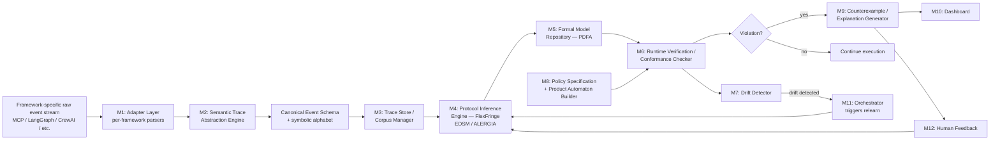

# TRACE — Invention Disclosure and Prior-Art Analysis Report

**Prepared as:** Patent-oriented technical invention disclosure **Basis document:** "TRACE v2.0 — Trace-based Runtime Automata for Compliance and Enforcement," Principal Architect Document **Nature of this report:** Technical prior-art analysis and invention-disclosure drafting aid. This is **not** a legal opinion and does not constitute a patentability determination. A formal novelty and inventive-step analysis should be performed by a registered patent professional before any filing decision.

---

## 1. Title of the Invention

**Recommended title:** _"System and Method for Semantic Abstraction, Probabilistic Automata-Based Behavioral Protocol Inference, and Runtime Conformance Verification of Heterogeneous AI-Agent Execution Traces"_

**Alternative titles:**

1. "Trace-Based Behavioral Protocol Inference and Hierarchical Runtime Conformance Checking for Multi-Framework AI Agent Systems"
2. "Method and System for Inferring Probabilistic Finite-State Behavioral Models from Heterogeneous Agent Execution Logs and Detecting Runtime Policy Deviations"

The recommended title deliberately names the four elements that, in combination, form the candidate inventive core — semantic abstraction of heterogeneous traces, probabilistic automata inference, and runtime conformance verification — rather than using the "TRACE" product name or an unqualified term like "AI agent monitoring," which would read as an overbroad functional claim to a patent examiner.

---

## 2. Field / Area of the Invention

The invention lies at the intersection of several established technical fields:

- **Artificial intelligence / autonomous agent systems** — specifically, systems in which large-language-model-driven planners select and sequence tool invocations, sub-agent delegations, and memory operations at runtime.
- **Software observability and execution-trace analysis** — the capture and structuring of runtime event streams from distributed, multi-component software systems.
- **Automata theory and grammatical inference** — passive learning of finite-state and probabilistic finite-state representations from example sequences (state-merging algorithms such as RPNI, EDSM, and ALERGIA/MDI).
- **Runtime verification / software model checking** — the checking of a single running execution against a formal specification, as distinct from exhaustive state-space model checking of all possible executions.
- **Process mining** — the discovery of process models (typically Petri nets, DFGs, or process trees) from event logs, and conformance checking of new traces against a discovered or specified model.
- **Anomaly and intrusion detection** — behavior-based (as opposed to signature-based) detection of deviations from a learned baseline of normal system activity.
- **Machine learning** — embedding-based semantic clustering used to unify heterogeneous naming schemes across software frameworks.
- **Cybersecurity / AI safety** — policy enforcement and safe operation of autonomous or semi-autonomous software agents that take real-world actions (tool calls, API invocations, financial transactions, data access).

The invention sits specifically at the intersection of the last four items applied to a data source — multi-framework AI-agent execution traces — that differs materially from the classical protocol traces, business-process logs, or program execution traces that each of these fields historically targets. Section 3 and Section 4 analyze in detail whether that intersection, as instantiated in the TRACE architecture, is represented in the prior art.

---

## 3. Prior Patents and Publications from Literature

A structured search was conducted across the terminology families specified in the research brief (AI agent execution monitoring, protocol/grammatical inference, passive automata learning, runtime verification, process mining, behavioral drift detection, hierarchical/recursive workflow modeling, and policy/product automata), using Google Patents, Espacenet-linked records, arXiv, IEEE/ACM-indexed venues, and Semantic Scholar-surfaced sources. Every item below was independently verified from its original source page; bibliographic fields (numbers, dates, assignees/authors) are taken directly from those source pages.

Five directly or closely relevant patents and five directly or closely relevant research publications were identified and are presented below. No fabricated identifiers, authors, or results are included; where full claim text could be retrieved it was reviewed, and this is noted per entry.

### 3.1 Patents

|Sl. No.|Patent No. / Publication|Year|Patent Office / Assignee|Key Contribution|Limitation (relative to TRACE)|Novelty Introduced in Proposed Invention|
|---|---|---|---|---|---|---|
|1|**US 11,989,296 B2** — "Program Execution Anomaly Detection for Cybersecurity" ([Google Patents](https://patents.google.com/patent/US11989296))|Priority 2022; granted 2024-05-21|USPTO; Assignee: CybersentryAi, Inc.; Inventors: Lewak, Sierek, Beeby|Instruments a supervised program, records sequences of events during a controlled "model-building mode," trains an "acceptable behavior model" (AI/statistical) from those sequences, then compares live operational event sequences against the model in a second "operation mode," halting or flagging execution on mismatch. Claims cover both the training method and the runtime enforcement method, including a fixed-length "window" of preceding events as model context.|Operates on generic instrumented program execution (function calls, system calls, exceptions) at the level of a single program/process. Has no concept of a multi-framework symbolic alphabet, no semantic unification of heterogeneous tool names across different agent frameworks, no probabilistic automaton representation with explicit transition-likelihood semantics, no hierarchical/recursive delegation modeling, and no explicit product-automaton composition of a learned model with a separately authored policy automaton. Model is a black-box "acceptable behavior model" (AI/ML or statistical), not a formally minimized, versioned probabilistic finite automaton.|TRACE introduces a canonical event schema and embedding-based semantic abstraction layer that projects _heterogeneous, multi-framework_ tool/action names into a shared alphabet before learning — a step this patent's single-program instrumentation model has no counterpart for — plus an explicit PDFA representation with formal state-merging (EDSM/ALERGIA), hierarchical per-delegation-level automata composition, and a separate, explicitly composed policy automaton via product construction, none of which are present in the claims of this patent.|
|2|**US 2018/0129579 A1** — "Systems and Methods with a Realtime Log Analysis Framework" (LogLens) ([Google Patents](https://patents.google.com/patent/US20180129579A1/en))|Priority 2016-11-10; published 2018-05-10 (application abandoned, but published prior art)|USPTO; Assignee: NEC Laboratories America, Inc.; Inventors: Debnath, Arora, Zhang, Jiang, Solaimani, Gulzar|Builds an unsupervised "event ID" discovery procedure over heterogeneous, multi-source logs, then constructs an automaton per identified transaction type ("event automata") from training logs, and performs real-time, stateful sequence-anomaly detection against that automaton in a streaming (Spark) pipeline, with dynamic model update and a heartbeat mechanism for detecting stalled/incomplete transactions.|The "automata" here are per-transaction-type state machines built from frequency/association-rule statistics over _log line patterns_ (regex-derived fields), not a probabilistic finite automaton learned by an EDSM/ALERGIA-class state-merging algorithm with formal identification-in-the-limit or Hoeffding-bound-style guarantees. No treatment of recursive/hierarchical delegation, no semantic embedding-based unification of heterogeneous _action names_ across different software frameworks (only field/pattern matching within one log corpus), and no separate, explicitly composed policy automaton via product construction — anomalies are purely statistical/structural deviations from the one learned model.|TRACE's contribution over LogLens is (a) a principled probabilistic-automaton learner (EDSM/ALERGIA via FlexFringe) with known theoretical grounding in place of ad hoc association-rule/frequency automata; (b) a semantic-embedding abstraction layer that unifies _cross-framework_ action vocabularies, which LogLens's single-corpus regex/field approach does not address; (c) hierarchical per-delegation-level automaton composition for recursive agent structure; and (d) explicit two-track verification (learned-conformance vs. explicit policy) via product automaton, rather than a single learned-model check.|
|3|**EP 1063828 B1 / US 7,369,507 B1** — "Method for Identifying the Underlying Finite State Machines of a Protocol Implementation" ([Google Patents](https://patents.google.com/patent/EP1063828A3/en))|Priority 1999-06-25; EP granted 2006-10-11|European Patent Office / USPTO; Original Assignee: Tektronix Inc. (later NetScout); Inventor: Marek Musial|Learns the finite-state automaton underlying a communications-protocol implementation directly from example communication traces, by clustering observed time points into equivalence classes that become automaton states, and separately learns arithmetic/statistical classification rules for feature vectors from positive training examples. This is a direct, early instance of passive automata learning applied to protocol traces for identification/conformance purposes.|Targets classical, largely deterministic communication protocols with small, fixed, well-defined message alphabets (the domain explicitly distinguished from AI-agent traces in the source document, §1.3). No treatment of stochastic branching via a probabilistic automaton, no semantic abstraction layer for reconciling _different names for the same action_ across heterogeneous, independently developed frameworks, no hierarchical/recursive structure for delegated sub-processes, and no separate policy-automaton composition for compliance/safety rules distinct from "conformance to the learned protocol."|TRACE differs by (a) targeting a data source with long-tailed, framework-fragmented, semantically overlapping alphabets rather than a small fixed protocol vocabulary — requiring the semantic-clustering abstraction layer this patent has no analog for; (b) using a _probabilistic_ deterministic automaton (PDFA) to model legitimate stochastic branching from LLM sampling, rather than a plain DFA; and (c) explicit hierarchical folding of recursive agent delegation into composed per-level automata, and separate explicit-policy conformance checking via product automaton.|
|4|**US 11,928,629 B2** — "Graph Encoders for Business Process Anomaly Detection" ([Google Patents](https://patents.google.com/patent/US11928629B2/en))|Filed/priority ~2022; published 2023-11-30|USPTO; Assignee: International Business Machines Corporation; Inventors: Huo, Agarwal, Isahagian, Reddy, Muthusamy|Converts business-process event logs into a graph data structure, learns an optimized graph encoding via an unsupervised machine-learning model, and computes a process-aware anomaly score per activity using the learned feature representation, flagging high-scoring activities as anomalous.|Representation is a learned graph embedding, not a finite-state or probabilistic-automaton representation with formal language-theoretic semantics (no explicit states/transitions, no minimization, no product-automaton composability with an explicit policy). Targets conventional, comparatively low-cardinality, largely deterministic business-process logs, not multi-framework AI-agent traces with recursive delegation and high-cardinality, semantically overlapping tool alphabets. No hierarchical delegation modeling and no drift-detection or windowed-relearning mechanism tailored to non-stationary sources.|TRACE's automaton-based representation supports formal operations (minimization, product construction, language-containment/emptiness checks) that a graph-embedding anomaly score does not provide, and adds the semantic-abstraction, hierarchical-folding, and dual learned/explicit-policy conformance mechanisms IBM's graph-encoder approach lacks entirely.|
|5|**US 9,736,172 B2** — "Signature-Free Intrusion Detection" ([Google Patents](https://patents.google.com/patent/US9736172))|Priority 2007-09-12; granted 2017-08-15|USPTO; Assignee: Avaya Inc. (chain of successor assignees to date); Inventors: Garg, Singh, Adhikari, Wu|Maintains a finite-state machine per session/node/protocol combination representing the legal states and transitions of a VoIP signaling protocol (e.g., SIP), and flags any observed state or transition incompatible with the FSM as a potential intrusion, without relying on an attack-signature database. Also composes per-node "local" FSMs with a "global" FSM enforcing cross-node concurrency/timing constraints — a form of product-automaton-like composition.|The finite-state machines are **hand-specified** from the known SIP/VoIP protocol specification, not learned from example traces by a passive automata-learning algorithm — there is no training phase, no state-merging, and no probabilistic transition semantics. No semantic abstraction of heterogeneous action vocabularies (the protocol alphabet is small and fixed by specification), and no treatment of recursive delegation or drift detection/relearning.|TRACE differs fundamentally in that its automata are _inferred_ from execution traces via statistical state-merging rather than manually authored from a known specification — directly addressing the problem this patent's approach cannot: agent behavior for which no such specification exists. TRACE also adds the semantic-abstraction layer, hierarchical delegation folding, and probabilistic (rather than purely legal/illegal) transition semantics.|

**Note on patent count:** Five patents genuinely relevant to the core mechanism (learned or hand-specified behavioral automaton / sequence model + runtime conformance checking) were identified and are presented above. Numerous additional patents surfaced in the search (e.g., on generic log-anomaly detection via machine learning, business-process anomaly detection via association-rule mining, and network intrusion detection via finite-state pattern matching) but were judged less directly on-point than the five selected and are referenced in the discussion below where they add useful context.

### 3.2 Research Publications

|Sl. No.|Publication|Year|Venue|Key Contribution|Limitation (relative to TRACE)|Novelty Introduced in Proposed Invention|
|---|---|---|---|---|---|---|
|1|J. Oncina and P. García, "Inferring Regular Languages in Polynomial Updated Time" ([ResearchGate](https://www.researchgate.net/publication/239643375_Inferring_regular_languages_in_polynomial_update_time); [DOI](https://doi.org/10.1142/9789812797902_0004))|1992|Pattern Recognition and Image Analysis, World Scientific|Introduces RPNI (Regular Positive and Negative Inference), the foundational state-merging algorithm for passively learning a canonical DFA from positive (and optionally negative) example strings, with a polynomial-time identification-in-the-limit guarantee given a characteristic sample.|Targets exact DFA learning from a clean, mostly noise-free sample; provides no probabilistic/frequency semantics and no guidance for noisy, stochastic, high-cardinality, or non-stationary sources such as AI-agent traces. Requires negative examples for its full guarantee, which are rarely available for "normal agent behavior."|TRACE explicitly does not claim RPNI itself as inventive (it is used only as a synthetic-data baseline per §6.1–6.2 of the design document); TRACE's contribution is the surrounding architecture — semantic abstraction, ALERGIA/EDSM-based _probabilistic_ learning suited to positive-sample-only, noisy, non-stationary agent data, and hierarchical/product-automaton extensions RPNI's original formulation does not address.|
|2|S. Verwer and C. A. Hammerschmidt, "flexfringe: A Passive Automaton Learning Package," 2017 IEEE International Conference on Software Maintenance and Evolution (ICSME 2017), pp. 638–642 ([DOI: 10.1109/ICSME.2017.58](https://doi.org/10.1109/ICSME.2017.58); also companion paper "FlexFringe: Modeling Software Behavior by Learning Probabilistic Automata," [arXiv:2203.16331](https://arxiv.org/pdf/2203.16331))|2017 (tool paper); 2022 (extended paper)|ICSME 2017 / arXiv (Logical Methods in Computer Science)|Provides the open-source EDSM/ALERGIA-style state-merging framework (FlexFringe) that TRACE explicitly adopts as its inference engine, including evidence-driven merge search and probabilistic-automaton learning for anomaly detection from software logs.|Demonstrated on general software/protocol logs; provides no agent-specific semantic-abstraction preprocessing, no hierarchical folding for recursive multi-agent delegation, no product-automaton composition with an explicit safety-policy automaton, and no windowed/drift-triggered relearning strategy tailored to LLM-driven non-stationarity.|TRACE explicitly builds _around_, not _instead of_, FlexFringe (per the design document's stated constraint against re-inventing the learner). The claimed contribution is the orchestration layer — abstraction, hierarchical composition, drift detection, and dual-track conformance checking — layered on top of this existing tool, not the state-merging algorithm itself.|
|3|W. M. P. van der Aalst and A. K. Alves de Medeiros, "Process Mining and Security: Detecting Anomalous Process Executions and Checking Process Conformance," _Electronic Notes in Theoretical Computer Science_, vol. 121, pp. 3–21, 2005 ([DOI: 10.1016/j.entcs.2004.10.013](https://doi.org/10.1016/j.entcs.2004.10.013))|2005|Proceedings of the 2nd International Workshop on Security Issues with Petri Nets and Other Computational Models (WISP 2004)|Establishes the process-mining approach of discovering a process model (Petri-net-based) from an event log and then checking new process executions for conformance against that model, explicitly framed as a security/anomaly-detection application — closely analogous in spirit to TRACE's "learned-conformance" track.|Targets classical business-process event logs: comparatively low-cardinality activity alphabets, largely deterministic control flow within a single process definition, no treatment of LLM-driven stochastic action selection, no cross-framework semantic alphabet unification, and no recursive/hierarchical sub-process folding tailored to agent delegation depth. Petri-net representation, not a probabilistic finite automaton with explicit likelihood-based anomaly scoring.|TRACE's PDFA-based representation directly supports the likelihood-threshold anomaly scoring and structural (unseen-symbol) vs. statistical (low-probability) anomaly distinction the Petri-net conformance-checking literature does not natively provide, and adds the semantic-abstraction and hierarchical-delegation mechanisms this line of process-mining work does not address.|
|4|M. Leemans, W. M. P. van der Aalst, and M. G. J. van den Brand, "Recursion Aware Modeling and Discovery for Hierarchical Software Event Log Analysis," 25th IEEE International Conference on Software Analysis, Evolution and Reengineering (SANER 2018), pp. 185–196 ([DOI: 10.1109/SANER.2018.8330208](https://doi.org/10.1109/SANER.2018.8330208))|2018|IEEE SANER 2018|Introduces the first recursion-aware process-model discovery technique that leverages hierarchical call information in _software_ event logs (extending the process-tree model with hierarchy/recursion), enabling analysis at multiple levels of granularity — directly analogous to TRACE's hierarchical trace-folding for recursive agent delegation.|Targets general software execution logs (e.g., method-call hierarchies) using process-tree discovery, not probabilistic automaton learning (EDSM/ALERGIA/PDFA) and not AI-agent-specific concerns such as LLM-driven stochastic branching, cross-framework semantic alphabet unification, or explicit policy/product-automaton runtime conformance checking.|TRACE's `delegate(role)` folding scheme and per-role PDFA composition serve an analogous structural purpose to this paper's recursion-aware process trees, but is instantiated within a probabilistic-automaton / runtime-conformance-checking pipeline specific to multi-framework AI-agent traces, rather than a process-tree discovery pipeline for conventional software logs.|
|5|J. Liu, B. Ruan, X. Yang, Z. Lin, Y. Liu, Y. Wang, T. Wei, and Z. Liang, "TraceAegis: Securing LLM-Based Agents via Hierarchical and Behavioral Anomaly Detection," arXiv:2510.11203 [cs.CR], submitted 13 Oct 2025 ([arXiv](https://arxiv.org/abs/2510.11203))|2025|arXiv preprint (cs.CR)|The closest identified prior work to TRACE's stated goal: a provenance-based framework that abstracts LLM-agent execution traces into a hierarchical structure of "stable execution units" characterizing normal behavior, summarizes these into constrained behavioral rules describing task-completion conditions, and validates new traces against both the hierarchical and behavioral constraints to detect anomalies (evaluated on a purpose-built benchmark spanning healthcare and procurement scenarios).|Behavioral constraints are derived/summarized rules over execution units, not a probabilistic finite automaton learned via a formal state-merging algorithm (RPNI/EDSM/ALERGIA) with likelihood-based transition semantics. No explicit product-automaton composition with a _separately authored_ explicit safety/compliance policy (TraceAegis's constraints are derived only from observed normal behavior). No described treatment of cross-framework semantic-alphabet unification across MCP/LangGraph/CrewAI/etc., no windowed drift-triggered relearning mechanism, and no counterexample/explainability mechanism grounded in automaton state-diff extraction.|TRACE's use of a formally grounded PDFA (with associated minimization, product construction, and likelihood-threshold semantics inherited from the automata-learning literature) in place of derived behavioral rules, combined with explicit dual learned/explicit-policy conformance checking, semantic cross-framework abstraction, and drift-triggered relearning, are the primary points of technical distinction from this closest publication. **This reference should be treated as the single most important piece of prior art for TRACE and reviewed carefully by the inventor before any filing**, given its near-identical problem framing (hierarchical, trace-based, behavioral anomaly detection specifically for LLM-based agents) published shortly before this disclosure.|

---

### 3.3 Prior-Art Comparison Matrix

Legend: **Yes** = the feature is present and central to the reference; **Partial** = a related but materially narrower or differently-implemented mechanism is present; **No** = not addressed; **Unclear** = could not be confirmed from available claims/abstract text.

|Technical Feature|US 11,989,296 (CybersentryAi)|US 2018/0129579 (LogLens)|EP 1063828 (Tektronix)|US 11,928,629 (IBM)|US 9,736,172 (Avaya)|RPNI (Oncina/García)|FlexFringe (Verwer/Hammerschmidt)|van der Aalst & de Medeiros|Leemans et al. (SANER 2018)|TraceAegis|**TRACE**|
|---|---|---|---|---|---|---|---|---|---|---|---|
|Heterogeneous framework adapters (MCP/LangGraph/CrewAI/etc.)|No|No|No|No|No|No|No|No|No|Partial (LLM-agent traces generally; multi-framework adapter layer not described)|**Yes (proposed)**|
|Canonical Event Schema|No|Partial (tokenized key/value log schema, single corpus)|No|Partial (graph node schema)|No|No|No|Partial (event-log schema, business-process-specific)|Partial (hierarchical software-log schema)|Partial (execution-unit abstraction)|**Yes (proposed)**|
|Semantic tool/action abstraction (embedding-based clustering)|No|No (regex/pattern matching only)|No|No (graph embedding is over log structure, not action semantics)|No|No|No|No|No|Unclear (not described as embedding-based)|**Yes (proposed)**|
|Probabilistic automata learning (EDSM/ALERGIA/PDFA)|No (AI/statistical "acceptable behavior model," unspecified representation)|Partial (frequency/association-rule automata, not PDFA)|Partial (equivalence-class-based FSM learning, not explicitly probabilistic)|No (graph embedding)|No (hand-specified FSM)|Partial (exact DFA, not probabilistic)|**Yes**|No (Petri net)|No (process tree)|No (derived rules)|**Yes (proposed, via FlexFringe)**|
|Agent-trace-specific state merging (frequency-weighted, noise-tolerant)|No|Partial|No|No|No|No|Partial (ALERGIA-style, general-purpose)|No|No|Unclear|**Yes (proposed adaptation)**|
|Hierarchical delegation modeling|No|No|No|No|No|No|No|No|**Yes** (recursion-aware process trees, general software)|**Yes** (hierarchical execution units, LLM agents)|**Yes (proposed, PDFA-specific)**|
|Runtime conformance checking|**Yes** (sequence match/no-match)|**Yes** (automaton rule violation)|**Yes** (protocol conformance)|Partial (anomaly score, not automaton conformance)|**Yes** (FSM legality check)|No|Partial (used for anomaly detection in demonstrated use)|**Yes** (Petri-net conformance)|No (discovery only)|**Yes**|**Yes**|
|Explicit policy automaton (separate from learned model)|No|No|No|No|Partial (hand-specified FSM functions as policy, but not separated from "learned" track since nothing is learned)|No|No|No|No|No|**Yes (proposed)**|
|Product automaton (learned ∩ policy)|No|No|No|No|Partial (local × global FSM composition)|No|No|No|No|No|**Yes (proposed)**|
|Behavioral drift detection|No|Partial (dynamic model update, not statistical drift test)|No|No|No|No|No|No|No|No|**Yes (proposed)**|
|Counterexample generation|No|Partial (anomaly type/location reported)|No|Partial (anomaly score per activity)|No|No|No|No|No|Partial|**Yes (proposed)**|
|Human-in-the-loop feedback|No|Partial (human validates/edits model)|No|No|No|No|No|No|No|No|**Yes (proposed)**|
|Windowed relearning|No|**Yes** (dynamic model update)|No|No|No|No|No|No|No|Unclear|**Yes (proposed)**|
|Multi-framework transfer (protocol learned on one framework detects anomalies on another)|No|No|No|No|No|No|No|No|No|No|**Yes (proposed, RQ8 — unvalidated)**|

**Closest prior-art combination.** No single reference combines more than two or three of the above features. The closest _conceptual_ combination is **TraceAegis (2025)** for problem framing (hierarchical, trace-based behavioral anomaly detection specifically for LLM agents) combined with **US 11,989,296** and **US 2018/0129579** for the train/compare runtime-enforcement mechanics, combined with **flexfringe** and **RPNI/EDSM/ALERGIA** for the specific learning algorithm class, combined with **Leemans et al. (SANER 2018)** for the hierarchical/recursive representation technique, and **van der Aalst & de Medeiros (2005)** for the "process conformance as security check" framing. **No single searched reference performs semantic cross-framework alphabet unification via embedding-based clustering feeding a formally learned PDFA with explicit product-automaton composition against a separate policy automaton and drift-triggered relearning.** Whether that specific combination clears the inventive-step bar is a legal judgment outside the scope of this technical report (see §9.8).

---

## 4. Summary and Background of the Invention

### 4.1 Background

Modern AI agent frameworks (MCP, LangGraph, CrewAI, OpenAI Agents SDK, Semantic Kernel, Google ADK, AutoGen) allow an LLM-driven planner to invoke tools, read and write memory, retry failed operations, and delegate sub-tasks to other agents. These execution traces are rich enough to characterize a system's behavior over time, but production practice today largely treats them as unstructured logs, inspected manually after an incident or checked one tool call at a time by content-filter-style guardrails. Neither approach captures whether an execution, considered as a whole sequence, is consistent with how the agent normally behaves — a question that is increasingly important as agents compose tools and delegate work autonomously.

### 4.2 Problem

The technical problem, stated precisely rather than as a general safety concern, is that no existing system infers a **stateful behavioral model** directly from **heterogeneous, multi-framework** AI-agent execution traces that exhibit, simultaneously: (a) stochastic action selection from LLM sampling (the same input does not always produce the same trace); (b) a large, framework-fragmented, semantically overlapping action alphabet (the same underlying action is named differently by different frameworks); (c) recursive, nested structure from sub-agent delegation; (d) non-stationarity as prompts, models, and toolsets change; and (e) the practical unavailability of hand-written behavioral specifications, since the space of legitimate trajectories through a multi-tool, LLM-planned agent is too large to specify manually. Existing runtime-verification tooling (§3.1, items 3 and 5; MOP-style frameworks referenced in the design document) requires a human-authored specification. Existing process-mining conformance-checking tooling (§3.2, item 3) targets low-cardinality, largely deterministic business-process alphabets. Existing behavior-based anomaly-detection patents (§3.1, items 1, 2, 4) learn a model from a single program's or a single log corpus's event sequences but do not perform cross-framework semantic unification or hierarchical/recursive structural modeling.

### 4.3 Existing Gap

- **Supported by literature:** Passive automata-learning algorithms (RPNI/EDSM/ALERGIA) have established theoretical grounding for small, fixed-alphabet, largely deterministic sources (protocol/network traces) but have not, in the searched literature, been evaluated specifically on multi-framework AI-agent traces with the abstraction/hierarchy/drift machinery TRACE proposes. TraceAegis (2025) confirms active, contemporaneous research interest in hierarchical, trace-based behavioral anomaly detection for LLM agents specifically, but uses derived behavioral rules rather than a formally learned probabilistic automaton.
- **Inferred from the architecture, not directly evidenced in literature:** Whether embedding-based semantic clustering of cross-framework tool/action names, feeding a probabilistic automaton learner, materially improves learnability or anomaly-detection accuracy versus operating on the raw, unabstracted, multi-framework alphabet is an empirical question the design document correctly flags for evaluation (RQ1, RQ2) rather than an established result.

### 4.4 Proposed Solution

TRACE proposes a pipeline that (1) normalizes heterogeneous framework-specific logs into a Canonical Event Schema; (2) further abstracts the schema's fine-grained `symbol` field via embedding-based semantic clustering to control alphabet cardinality while preserving behaviorally relevant distinctions; (3) learns a probabilistic deterministic finite automaton from the resulting symbolic-trace corpus using an evidence-driven, frequency-weighted adaptation of EDSM/ALERGIA (via FlexFringe); (4) represents recursive agent delegation via hierarchical folding — a `delegate(role)` symbol in the parent trace plus a separately learned per-role automaton; (5) checks live traces against a product automaton composed from the learned PDFA and a separately authored explicit-policy DFA, distinguishing structural (never-seen-symbol) from statistical (low-probability) anomalies; (6) detects behavioral drift via rolling conformance-score monitoring with a distributional change test, triggering windowed relearning; and (7) incorporates developer feedback to refine merge-acceptance thresholds and policy rules.

### 4.5 Novelty Analysis

| Feature                                                                                                                        | Known in Prior Art?                                                                                                                                             | TRACE-Specific Adaptation?                                  | Potentially Distinguishing?                                                | Evidence                                                                                                                                                             |
| ------------------------------------------------------------------------------------------------------------------------------ | --------------------------------------------------------------------------------------------------------------------------------------------------------------- | ----------------------------------------------------------- | -------------------------------------------------------------------------- | -------------------------------------------------------------------------------------------------------------------------------------------------------------------- |
| Passive automata learning (RPNI/EDSM/ALERGIA)                                                                                  | Yes                                                                                                                                                             | No (used as-is per design document's own constraint)        | No, on its own                                                             | §3.2 items 1–2                                                                                                                                                       |
| Probabilistic finite automaton (PDFA) as target representation                                                                 | Yes (established in grammatical-inference literature)                                                                                                           | No                                                          | No, on its own                                                             | ALERGIA/MDI literature (Carrasco & Oncina)                                                                                                                           |
| FlexFringe as inference engine                                                                                                 | Yes                                                                                                                                                             | No (explicitly adopted unmodified per design document §6.2) | No, on its own                                                             | §3.2 item 2                                                                                                                                                          |
| Canonical Event Schema unifying multiple agent-framework event vocabularies                                                    | Not found in searched prior art at this specificity                                                                                                             | Yes                                                         | **Potentially**                                                            | No matching patent/publication located combining MCP + LangGraph + CrewAI + OpenAI Agents SDK + Semantic Kernel + Google ADK + AutoGen under one schema              |
| Embedding-based semantic clustering of tool/action names specifically to control automaton alphabet size before state-merging  | Not found in searched prior art in this specific combination                                                                                                    | Yes                                                         | **Potentially**                                                            | Closest related work uses regex/pattern clustering (LogLens) or graph embeddings over log structure (IBM), not name-semantic embeddings feeding an automaton learner |
| Hierarchical folding of recursive delegation into composed per-level PDFAs                                                     | Related technique exists for process trees (Leemans et al.) and for LLM-agent execution units (TraceAegis), not for PDFAs specifically                          | Yes (adaptation to PDFA representation)                     | **Potentially**, as an adaptation                                          | §3.2 items 4–5                                                                                                                                                       |
| Product automaton combining learned-conformance and explicit-policy tracks, with structural-vs-statistical anomaly distinction | Analogous local×global FSM composition exists (Avaya patent) but between two hand-specified FSMs, not a learned PDFA and a hand-specified policy DFA            | Yes                                                         | **Potentially**                                                            | §3.1 item 5                                                                                                                                                          |
| Windowed, drift-triggered relearning specific to non-stationary, LLM-driven sources                                            | Dynamic/incremental model update exists generically (LogLens); statistical drift detection exists generically in ML; combination for this data source not found | Yes (adaptation)                                            | Plausible, but weaker — dynamic model update is common in adjacent patents | §3.1 item 2                                                                                                                                                          |
| Human-in-the-loop feedback refining merge thresholds and policy rules                                                          | Human validation of models exists generically (LogLens)                                                                                                         | Yes (adaptation)                                            | Weak on its own                                                            | §3.1 item 2                                                                                                                                                          |

The pattern that emerges: **no individual component is novel**, and the design document itself is explicit and correct about this (§13, "Summary of Rejected Alternatives"). The candidate inventive contribution, if any, is the **specific system-level combination and adaptation** — semantic cross-framework abstraction feeding a formally learned probabilistic automaton, hierarchically composed for recursive agent delegation, verified via product automaton against both a learned and an explicit policy track, with drift-triggered relearning — applied to the specific, materially different data source of heterogeneous multi-framework AI-agent execution traces. TraceAegis (2025) is close enough in problem framing that its methodological differences (derived rules vs. formally learned PDFA; no described explicit-policy product-automaton track) should be the primary basis for distinguishing TRACE, rather than the more generic anomaly-detection patents.

### 4.6 Technical Advantages

The following are **hypothesized/expected** advantages pending the empirical validation described in Section 8; none has been experimentally demonstrated at the time of this disclosure:

- Reduced effective alphabet cardinality (expected to improve learnability of the state-merging algorithm), measurable via the alphabet-compression-ratio metric.
- Improved fidelity to legitimate stochastic branching versus a plain DFA (expected from probabilistic representation), measurable via PDFA-vs-DFA ablation.
- Tractable handling of recursive delegation without the decidability/complexity cost of full pushdown automata (expected from hierarchical folding), measurable via scalability tests on recursion depth.
- Distinguishable "rare but valid" vs. "structurally unseen" anomaly categories (expected from the PDFA's likelihood semantics combined with explicit membership/emptiness checks), measurable via the anomaly-precision/recall metrics in §8.
- Faster detection of behavioral drift than a static model (expected from windowed relearning), measurable via drift-detection latency.

---

## 5. Objectives of the Invention

1. Normalize heterogeneous, multi-framework AI-agent execution logs into a single Canonical Event Schema without requiring per-framework changes to the downstream learning or verification pipeline.
2. Reduce a high-cardinality, framework-fragmented action vocabulary to a smaller, semantically coherent symbolic alphabet suitable for passive automata learning, while measurably preserving behaviorally relevant distinctions (cluster purity, downstream anomaly-detection sensitivity).
3. Infer a probabilistic behavioral model of an agent's normal execution from positive-only, noisy, stochastic execution traces, without requiring hand-labeled negative examples.
4. Represent recursive, multi-level agent delegation via hierarchically composed automata rather than a single flat alphabet or a full pushdown-automaton model, remaining within decidable, tractable regular-language operations.
5. Distinguish, at runtime, between statistically rare-but-previously-seen behavior and structurally never-seen behavior, and report each with an appropriate developer-facing signal.
6. Perform online (streaming) conformance checking of a live agent execution against both a learned behavioral model and a separately authored, explicit compliance/safety policy, via product-automaton composition.
7. Detect behavioral drift — change in the underlying trace distribution — as a measurable shift in trace-to-automaton conformance, and trigger relearning without requiring a full pipeline restart.
8. Generate a developer-interpretable explanation of any detected deviation, expressed in terms of tool/action names rather than internal automaton state indices.

---

## 6. Working Principle of the Invention

### 6.1 End-to-End Workflow

Raw framework trace → adapter (M1) → Canonical Event Schema → semantic abstraction (M2) → symbolic trace → trace corpus (M3) → probabilistic automata learner (M4) → model repository (M5) → runtime conformance checker (M6) → policy automaton (M8) → product automaton → anomaly/violation detection → counterexample explanation (M9) → developer feedback (M12) → drift-triggered or scheduled relearning (M7/M11).

### 6.2 Workflow Diagram

Text representation for patent-drawing purposes: a left-to-right pipeline with a single feedback loop from the conformance checker/drift detector back into the inference engine, and a side input from the policy builder into the conformance checker, matching Figure 1 in the Drawings section below.

### 6.3 Runtime Operation

For each incoming event: (1) the relevant framework adapter emits a raw event tagged with source and schema version; (2) the abstraction engine canonicalizes the event into a Canonical Event Schema record and assigns a symbol via nearest-centroid lookup against the (already-trained) clustering model; (3) the runtime verifier advances the current state of both the learned PDFA (tracking the most-likely-consistent state) and the explicit policy DFA in lockstep (the product-automaton state); (4) if the symbol is unseen from the current PDFA state, a structural-anomaly signal is raised; if the transition probability falls below a tuned threshold ε, a statistical-anomaly signal is raised; if the policy DFA reaches a reject state, a policy-violation signal is raised; (5) in gate mode, the action is blocked or held for approval before execution; in observe-and-alert mode, the action proceeds and the alert is logged.

### 6.4 Learning Operation

Symbolic traces are compiled into a prefix tree acceptor (PTA), with each state and transition annotated with observed frequency/evidence counts. Evidence-driven state merging (EDSM order) proposes merges of state pairs, accepting a merge when a statistical compatibility test (Hoeffding-bound-style, per ALERGIA/MDI) judges the two states' outgoing-symbol distributions sufficiently similar. Accepted merges are folded to preserve determinism. The result is minimized (Hopcroft-style) before storage in the model repository, with transition probabilities retained from the merged frequency counts.

### 6.5 Hierarchical Delegation

When a parent agent delegates to a sub-agent, the parent trace records a single `delegate(role)` symbol rather than inlining the sub-agent's full subtrace. The sub-agent's own trace (tagged with `parent_span_id` and `depth`) is learned as a separate automaton keyed by role. At verification time, encountering `delegate(role)` in the parent PDFA triggers a corresponding check of the child trace against the role-specific automaton; the two checks are independent but time/causally linked via `parent_span_id`. This bounds recursion handling to composed regular-language operations rather than requiring a pushdown-automaton-class representation for the system as a whole, at the cost of not modeling unbounded-depth stack-like properties precisely (an explicitly scoped limitation, consistent with the design document's own analysis in §7 and §9).

### 6.6 Policy Verification

A small declarative policy language compiles to an explicit policy DFA over the same canonical alphabet Σ. At runtime, the product of the learned PDFA's current state and the policy DFA's current state is tracked. Three distinct violation categories are reported: (a) policy DFA reaches a reject state (an "is this allowed" violation, independent of learned normality); (b) PDFA transition probability below threshold ε (statistical anomaly — "rare"); (c) symbol entirely unseen from the current PDFA state (structural anomaly — "never seen"). Keeping these three categories distinct, rather than collapsing them into a single anomaly score, is presented in the design document as a deliberate design choice because each warrants a different developer response.

### 6.7 Drift Detection

A rolling window of per-symbol negative log-likelihood under the current PDFA forms a conformance-score time series. A distributional change test (the design document proposes Kolmogorov–Smirnov, with an explicit invitation in the review brief to assess whether KS is the right test for this score distribution — see §7.10 below) compares successive windows; a detected shift triggers the orchestrator to schedule an out-of-cycle relearn using the current sliding window of recent traces.

---

## 7. Detailed Description of the Invention

### 7.1 System Architecture (M1–M12)

The twelve-module architecture (M1 Trace Ingestion & Adapter Layer; M2 Semantic Trace Abstraction Engine; M3 Trace Store/Corpus Manager; M4 Protocol Inference Engine; M5 Formal Model Repository; M6 Runtime Verification/Conformance Checking Engine; M7 Behavioral Drift Detector; M8 Policy Specification & Product Automaton Builder; M9 Explainability & Counterexample Generator; M10 Dashboard/Developer Interface; M11 Orchestration/Scheduler; M12 Human-in-the-Loop Feedback Module) is described in full in the source design document (§4) and is not reproduced verbatim here for conciseness; the module-by-module input/processing/output/algorithm/interface/failure-mode/relationship structure specified there is adopted as-is for this disclosure's architectural description. The two cross-cutting modules (M11 orchestration, M12 feedback) are notable from a claim-drafting perspective because they turn what would otherwise be a static pipeline into a closed-loop system — a detail worth preserving explicitly in any system claim (see §9.1).

### 7.2 Canonical Event Schema

Each record carries: `agent_id` (source agent identity); `event_type` drawn from a small, stable, cross-framework taxonomy of nine values (`tool_call`, `tool_result`, `delegate`, `retry`, `memory_read`, `memory_write`, `plan_step`, `error`, `terminate`); `symbol` (the fine-grained, canonicalized action identity — the field where cross-framework naming divergence is resolved by the abstraction engine); `attributes` (including `param_schema_hash` and `status`); `timestamp`; `parent_span_id` (linking a child trace to its point of delegation in the parent); and `depth` (nesting level, supporting bounded-recursion-depth analysis). The deliberate separation of a small, hand-engineered, stable `event_type` taxonomy from a large, learned/clustered `symbol` space is the specific design choice that keeps the "join point" across frameworks manually tractable while still allowing the fine-grained action space to be very large.

### 7.3 Framework Adapters

The design document specifies adapters for MCP, LangGraph, CrewAI, OpenAI Agents SDK, Semantic Kernel, Google ADK, and AutoGen. **At the current stage, these are architecturally designed and specified (their expected input formats and event-type mappings are described), not evidenced as implemented and tested against live framework traces.** This disclosure follows Rule 5 of the governing research brief and does not claim implementation evidence beyond what is documented. Any filing should state explicitly which adapters (if any) have working code and test coverage against real framework output at the time of filing.

### 7.4 Semantic Abstraction

Raw event normalization maps framework-native vocabulary into the nine-value `event_type` taxonomy via deterministic, per-framework rule-based rules (this step is explicitly _not_ learned, per the design document, since the taxonomy is small and stable). The harder `symbol`-unification problem is addressed by embedding a concatenation of tool name, docstring, and parameter-schema text with an off-the-shelf sentence/text embedding model, then clustering (with approximate-nearest-neighbor indexing for scale) and assigning new instances to the nearest centroid deterministically post-training, so re-running abstraction on new traces does not silently reshuffle the alphabet. Over-clustering (distinct actions collapsed) and under-clustering (alphabet explosion) are named as measured risks (§7.5 of the source document), evaluated via cluster purity and downstream anomaly-detection-F1 sensitivity rather than assumed away.

### 7.5 Protocol Inference

RPNI is retained only as a secondary baseline for synthetic ground-truth evaluation, where negative examples can be manufactured. The primary inference path is FlexFringe's evidence-driven merge search using a probabilistic (ALERGIA-style) compatibility test as the default heuristic — explicitly an orchestration layer around an existing tool rather than a new learner, per the design document's own stated constraint. **Any adaptation to the merge-acceptance heuristic (frequency-weighting tuned for agent-trace noise) is, at the current stage, a proposed architecture rather than a validated modification** — no evidence of an implemented, tested variant beyond FlexFringe's stock heuristics was supplied.

### 7.6 Hierarchical Trace Folding

Worked example (as given in the source document): a parent trace `plan → search → delegate(reviewer) → merge → terminate` is learned as one automaton over the parent's own symbol set (with `delegate(reviewer)` treated as a single opaque symbol), while the reviewer's own trace `receive → inspect → tool_call → return` is learned as a second, separate automaton keyed to the "reviewer" role. Mathematically, this is a restricted form of automaton composition: the parent language is regular over an alphabet that includes `delegate(role)` as an atomic symbol, and each `delegate(role)` transition is associated with a separate regular language (the role automaton) rather than being expanded inline — avoiding both alphabet explosion in the parent and the need for a context-free/pushdown representation of the combined system. This composition is sound for **bounded-depth** recursion (each level is itself a finite structure) but does not capture unbounded-depth call-stack properties that a true pushdown automaton would; this bound should be stated explicitly in any claim language (see §9.5).

### 7.7 Runtime Verification

Two verification tracks run against the same live trace: learned-conformance checking (is this trace consistent with the PDFA above a likelihood threshold) and explicit-policy checking (does this trace satisfy a hand-authored safety/compliance DFA), explicitly kept separate because they answer different questions ("is this normal" vs. "is this allowed") and conflating them would let a purely statistical model silently override a hard safety rule. Two operating modes are specified: synchronous gate (block/require approval before executing a flagged action) and asynchronous observe-and-alert.

### 7.8 Product Automaton

Given the learned PDFA A = (Q_A, Σ, δ_A, q_A0, P_A) and the explicit policy DFA P = (Q_P, Σ, δ_P, q_P0, F_P), the runtime verifier tracks the pair (q_A, q_P) ∈ Q_A × Q_P, advancing both components on each observed symbol. A trace is accepted by the combined policy if and only if its projection onto A remains above the likelihood threshold at every step **and** its projection onto P never reaches a state outside F_P — i.e., acceptance by the product is equivalent to acceptance by both components independently, which is the standard closure-under-intersection argument for regular languages and is explicitly _not_ presented as classical exhaustive model checking of all possible executions (only the one observed/live trace is checked, per the design document's own scoping in §9 of the source document).

### 7.9 Counterexample Generation

On violation, the shortest offending suffix from the last known-good product-automaton state is extracted, together with the expected symbol set at that state versus the symbol actually observed — an explicit diff rather than a raw log excerpt — with state labels round-tripped through the abstraction layer's taxonomy so the explanation names tools/actions rather than internal automaton indices.

### 7.10 Drift Detection

Rolling per-symbol negative log-likelihood under the current PDFA forms the conformance-score series; the design document proposes a Kolmogorov–Smirnov two-sample test between successive windows. **Critical assessment (per the governing research brief's instruction to evaluate this choice):** KS is a general-purpose, distribution-agnostic test appropriate when no parametric assumption about the score distribution is warranted, which is a reasonable default here since the true distribution of per-symbol negative log-likelihood under a learned PDFA is not analytically known in closed form. However, KS is known to be more sensitive to differences near the center of a distribution than in the tails, whereas the anomalies of interest for drift (new rare high-surprisal event types becoming common) may show up disproportionately in the tail. A tail-sensitive alternative — e.g., an Anderson–Darling test, or monitoring the tail quantiles (e.g., 95th/99th percentile conformance score) directly via a CUSUM-style change-point detector — may give better sensitivity to the specific kind of drift TRACE cares about, without abandoning the overall architecture of "rolling score + statistical test + relearn trigger." This is a tuning/algorithm-selection recommendation, not a change to the system architecture, and should be validated empirically (per §8) rather than adopted on the strength of this report alone.

### 7.11 Human Feedback

Developer labels on flagged deviations (true anomaly / false positive / legitimate rare path) feed back into two places: M4's merge-acceptance thresholds (the Hoeffding-bound-style parameter) and M8's policy DSL (refining or adding explicit rules). Low-friction, single-click labeling from a dashboard alert is specified as the mitigation for label scarcity/noise from time-pressured developers.

### 7.12 Complexity

- Ingestion (M1): O(n) in trace length, per-framework parsing.
- Semantic abstraction clustering (M2): dominated by approximate-nearest-neighbor lookup, O(k log k) for k distinct raw symbols.
- Corpus management (M3): I/O- and storage-bound; not asymptotically characterized in the source document.
- State-merging inference (M4): NP-hard in the worst case for optimal state merging; EDSM's greedy evidence-driven order is the practical standard but carries no polynomial-time guarantee; RPNI's polynomial-time guarantee holds only under a characteristic-sample assumption not guaranteed for stochastic sources.
- Runtime monitoring (M6): O(1) amortized per event for single-automaton state tracking; O(|Σ|) for full product-transition evaluation per event in the worst case (bounded by alphabet size, not trace length).
- Drift detection (M7): O(w) per window of size w for the statistical test, run periodically rather than per-event.

The claim in the source document's §1.1/M1 that ingestion alone is O(n) is accurate and should **not** be generalized to "the system is O(n) overall" — the state-merging search step is the dominant, non-polynomial-guaranteed cost, and this distinction should be preserved in any patent specification's complexity discussion to avoid an inaccurate or overbroad technical assertion.

### 7.13 Data Structures

Event stream (ordered CES records); trace trie / prefix-tree acceptor (used internally by the state-merging learner); automaton graph (states, transitions, per-transition frequency/probability, minimized post-learning); transition-probability table; symbol taxonomy / clustering-centroid table (versioned separately from the small `event_type` taxonomy); model repository records (PDFA + training window + hyperparameters + corpus hash, for reproducible comparison across relearning runs, per M5); rolling conformance-score statistics buffer (for M7).

### 7.14 Security and Failure Modes

- **Poisoned training traces:** if an attacker can inject traces during model-building, the "normal" model itself becomes compromised — an analogous risk exists in every train-then-compare anomaly-detection system reviewed in §3.1 (notably US 11,989,296's explicit use of an isolated "captive" training environment to mitigate exactly this risk); TRACE's design document does not yet specify an equivalent isolation mechanism for its training corpus, which is a gap worth addressing before or shortly after filing.
- **Abstraction errors:** over-clustering can mask a real behavioral change as "the same symbol"; under-clustering can defeat learnability via alphabet explosion — both explicitly named and measured (not merely risked) per §5.5 of the source document.
- **Adversarially chosen tool names:** an attacker naming a malicious tool similarly to a benign one could exploit the semantic-clustering step to have it merged into a trusted symbol — a risk specific to TRACE's semantic-abstraction layer that does not have a direct analog in the reviewed prior art (since none of the five patents perform semantic name-clustering across an adversarial input space) and should be explicitly threat-modeled before filing or deployment.
- **Concept drift / model staleness:** addressed by §7.10's mechanism, with the caveats noted there.
- **Rare legitimate behavior:** addressed by the PDFA's probabilistic (rather than binary legal/illegal) semantics and the human-feedback loop, but false-positive risk on genuinely rare-but-valid paths remains an empirical open question (RQ4, RQ5 in the source document).
- **Incomplete traces:** a crashed agent or truncated log is explicitly named as an M1 failure mode; no specific recovery mechanism beyond flagging is described.
- **False positives / false negatives:** the explicit three-way anomaly taxonomy (policy violation / statistical anomaly / structural anomaly) is itself a mitigation, by avoiding forcing every deviation into one undifferentiated "anomaly" bucket.
- **Policy conflicts:** an unsatisfiable or vacuously satisfied policy DFA is named as an M8 failure mode, mitigated by static emptiness/universality checks (§9 of the source document) — this is a genuine and appropriate use of a decidable regular-language operation and is worth keeping in any filed claim set as a concrete technical safeguard.

---

## Drawings and Figures

The following figure list is recommended for a formal patent drawing set, using consistent reference numbers as specified in the governing research brief.

**Figure 1 — Overall TRACE System Architecture.** Purpose: show the full pipeline end to end. Components: 100 (TRACE system boundary), 110 (ingestion layer / M1), 120 (adapter layer, sub-component of 110), 130 (abstraction engine / M2), 140 (trace store / M3), 150 (inference engine / M4), 160 (model repository / M5), 170 (runtime verifier / M6), 180 (policy engine / M8), 190 (drift detector / M7), 200 (explanation engine / M9), 210 (dashboard / M10), 220 (feedback module / M12). Arrows: 110→130→140→150→160→170; 180→170; 170→190; 170→200→210; 210→220→150 (feedback loop); 190→150 (drift-triggered relearn, via orchestrator, not separately numbered). Demonstrates the closed-loop nature of the system (distinguishing it from a one-shot train/compare pipeline).

**Figure 2 — Framework Adapter and Canonical Event Schema Pipeline.** Purpose: detail M1→CES mapping. Components: per-framework raw event sources (MCP, LangGraph, CrewAI, OpenAI Agents SDK, Semantic Kernel, Google ADK, AutoGen), each feeding a dedicated adapter (120a–120g), converging on a single CES record structure (event_type, symbol, attributes, timestamp, parent_span_id, depth). Demonstrates the "many adapters, one schema" join-point design.

**Figure 3 — Semantic Trace Abstraction Process.** Purpose: detail M2 internals. Components: raw symbol input, text embedding of (name + docstring + parameter schema), approximate-nearest-neighbor index, cluster-centroid assignment (deterministic post-training), canonical symbol output, versioned taxonomy store. Demonstrates the alphabet-compression mechanism and its determinism guarantee.

**Figure 4 — Protocol Inference Pipeline.** Purpose: detail M4 internals. Components: symbolic trace corpus, prefix-tree acceptor construction, evidence-driven state-merging search (EDSM order), probabilistic compatibility test (ALERGIA/Hoeffding-bound), accepted-merge folding, Hopcroft-style minimization, PDFA output to model repository.

**Figure 5 — Hierarchical Delegation Representation.** Purpose: illustrate the worked example from §7.6. Components: parent trace (`plan → search → delegate(reviewer) → merge → terminate`) as one automaton; `delegate(reviewer)` symbol as a linking edge; reviewer-role automaton (`receive → inspect → tool_call → return`) as a second, separately learned automaton; `parent_span_id` link connecting the two at the point of delegation.

**Figure 6 — Runtime Verification and Product Automaton.** Purpose: detail M6/M8 interaction. Components: live event stream, learned-PDFA state tracker, policy-DFA state tracker, product-state pair (q_A, q_P), three-way violation classifier (policy reject / low-probability transition / unseen symbol), gate-mode vs. observe-and-alert-mode branch.

**Figure 7 — Anomaly/Counterexample Generation.** Purpose: detail M9. Components: violation event input, last-known-good-state pointer, shortest-offending-suffix extractor, expected-vs-observed symbol-set diff, taxonomy round-trip (state index → tool/action name), developer-facing explanation output.

**Figure 8 — Behavioral Drift Detection and Relearning Loop.** Purpose: detail M7/M11 interaction. Components: rolling conformance-score buffer, windowed statistical test (KS or tail-sensitive alternative per §7.10), drift-flag output, orchestrator (M11) scheduling logic (periodic batch vs. drift-triggered out-of-cycle), relearn request back to M4.

**Figure 9 — End-to-End Operational Workflow.** Purpose: the sequence/swimlane view corresponding to §6.1–6.7, showing the temporal order of ingestion → abstraction → learning (offline) versus verification → explanation → feedback (online), making clear which parts of the system are batch/offline and which are per-event/online.

For each figure, hand-drawn or CAD-quality versions would replace the Mermaid/text representations above at the time of formal patent-drawing preparation; the Mermaid diagram in §6.2 and the textual descriptions above are sufficient to brief a patent draftsperson.

---

## 8. Experimental Validation Results

### 8.1 Current Implementation Status

Based solely on the source design document supplied for this disclosure (no separate implementation, codebase, or benchmark results were provided):

- **Implemented:** Not evidenced. The source document is an architectural design document ("Principal Architect Document"), not an implementation report, and contains no claimed implementation status, code repository reference, or measured results.
- **Prototype / partially implemented:** Not evidenced.
- **Planned / designed only:** The entire twelve-module architecture, the Canonical Event Schema, the semantic-abstraction clustering approach, the FlexFringe-based inference orchestration, the hierarchical-folding scheme, the product-automaton runtime verifier, the drift detector, and the roadmap (Phase 1 "prove the pipeline runs end to end" through Phase 5 "publication") are all, as of this document, **designed but not evidenced as built or tested.**

This assessment follows Rule 5 of the governing research brief directly: no experimental data was supplied, so none is reported, and no TRL above "concept formulated" can be justified from the available evidence (see §10).

### 8.2 Experimental Methodology (Proposed, Not Yet Executed)

**Synthetic dataset.** Hand-designed ground-truth PDFAs (e.g., a "web research agent" specification) generating traces with controlled noise injection at known rates: symbol substitution, insertion, deletion; controlled stochastic branching probabilities; controlled recursion/delegation depth and fan-out.

**Real framework traces.** Traces from example agents built on each of the seven target frameworks, performing comparable task suites (research, coding-assistant, customer-support scenarios), self-generated by the research team rather than scraped from private user data, to sidestep privacy/consent concerns — consistent with the approach TraceAegis (2025) took in constructing its own benchmark (TraceAegis-Bench) for the same class of problem.

**Metrics to be measured (not yet measured):**

|Category|Metric|
|---|---|
|Grammar-inference-theoretic (synthetic only)|Automaton distance to ground truth (language edit distance or PDFA KL-divergence); state-count ratio|
|Practical anomaly detection|Precision, recall, F1 against traces with injected misbehavior (unauthorized tool sequences, prompt-injection-induced tool-call anomalies, retry/infinite-loop patterns)|
|Drift detection|Detection latency (events until flagged after an injected distribution shift); false-positive rate under natural non-drift variance|
|Scalability|Wall-clock and memory vs. corpus size, alphabet size, recursion depth|
|Runtime overhead|Added per-event monitoring latency relative to underlying tool-call latency|
|Abstraction quality|Alphabet compression ratio; cluster purity (human-reviewed subsample); downstream anomaly-F1 sensitivity to abstraction ablation|

**Baselines to be compared against:** n-gram/Markov model over raw unabstracted sequences; off-the-shelf process mining (Heuristics/Inductive Miner) applied naively to agent logs; an LLM-as-judge anomaly detector prompted directly on the trace; plain RPNI on unabstracted traces (isolates the abstraction layer's contribution specifically).

**Ablations to be run:** with/without semantic abstraction; DFA vs. PDFA representation; EDSM vs. ALERGIA merge heuristic; windowed relearning vs. a single static model; hierarchical folding vs. flat alphabet for recursion-heavy traces.

### 8.3 Results

**Experimental numerical results are not yet available and must be generated during validation.** No F1 scores, latency numbers, state counts, compression ratios, or other quantitative results should be cited in any filing or publication until the above methodology has actually been executed. The following is the exact result-table shape that should be populated once experiments are run (illustrative placeholders only, marked as hypothetical):

|Ablation / Baseline|Anomaly F1 (hypothetical placeholder — TBD)|Drift-Detection Latency (hypothetical placeholder — TBD)|Runtime Overhead (hypothetical placeholder — TBD)|
|---|---|---|---|
|Full TRACE pipeline|—|—|—|
|No semantic abstraction|—|—|—|
|DFA instead of PDFA|—|—|—|
|Flat alphabet (no hierarchical folding)|—|—|—|
|n-gram/Markov baseline|—|—|—|
|Process-mining baseline (naive)|—|—|—|
|LLM-as-judge baseline|—|—|—|

### 8.4 Expected Validation Criteria

Evidence that the invention works, at minimum, would require: (a) on synthetic data, the inferred PDFA's language/KL-distance to the known ground-truth generator decreasing as training-corpus size increases, consistent with the state-merging literature's theoretical expectations; (b) on real multi-framework traces, anomaly-detection F1 against injected misbehavior that is statistically significantly better (paired test, multiple-comparison-corrected, per the design document's own §10 statistical-analysis plan) than the n-gram, naive-process-mining, and LLM-as-judge baselines; (c) the abstraction ablation showing a measurable drop in anomaly-F1 when abstraction is removed, isolating its contribution rather than assuming it; (d) drift-detection latency and false-positive rate that are practically usable (order-of-magnitude judgment to be set once a target deployment scenario is chosen); (e) runtime overhead low enough to be compatible with inline (gate-mode) use, ideally sub-millisecond per event given the O(1)-amortized/O(|Σ|)-worst-case complexity analysis in §7.12.

---

## 9. Aspects of the Invention Needing Protection

_(Candidate claim scope — not a representation that any of the following is in fact patentable; see §9.8 and the disclaimer at the top of this report.)_

### 9.1 Potentially Protectable System Architecture

The specific combination of: heterogeneous multi-framework agent-trace ingestion → canonical schema normalization → semantic embedding-based symbolic abstraction → probabilistic automaton inference (via an evidence-driven, frequency-weighted state-merging process) → hierarchical per-delegation-level automaton composition → runtime product-automaton conformance checking against both a learned model and a separately authored explicit policy → drift-triggered relearning → human-feedback-driven threshold/policy refinement, operating as a **closed loop** (feedback and drift detection route back into the learner) rather than a one-shot train/deploy pipeline.

### 9.2 Potentially Protectable Method

The sequence of technical operations: (1) receiving execution-trace events from multiple, structurally distinct agent-framework sources; (2) mapping each event to a common event-type taxonomy via deterministic per-source rules; (3) mapping each event's fine-grained action identity to a canonical symbol via embedding-based nearest-centroid clustering; (4) constructing a symbolic-trace corpus; (5) inferring a probabilistic deterministic finite automaton from the corpus via evidence-driven state merging with a statistical compatibility test; (6) upon encountering a delegation event, representing the delegated sub-trace as a separately learned automaton linked by a span identifier rather than inlining it into the parent alphabet; (7) at runtime, tracking the joint state of the learned automaton and a separately specified policy automaton; (8) classifying any deviation as a policy violation, a statistically rare transition, or a structurally unseen transition, and responding differently to each; (9) generating a human-readable counterexample referencing canonical action names; (10) monitoring a rolling conformance-score statistic for distributional drift and triggering relearning on detected drift.

### 9.3 Potentially Protectable Data Representation

The Canonical Event Schema's specific field set (agent_id, event_type from a fixed nine-value cross-framework taxonomy, symbol from a learned/clustered space, attributes including param_schema_hash and status, timestamp, parent_span_id, depth) as a data structure engineered specifically to be the "join point" across structurally different agent frameworks, combined with the hierarchical representation (parent automaton + linked per-role child automata via `delegate(role)` + `parent_span_id`) as a technically distinctive representation for recursive multi-agent execution — distinctive relative to the flat event-log schemas used in the reviewed process-mining and log-analysis prior art, though its distinctiveness as a claimable "data structure per se" (as opposed to the method that produces and consumes it) would need patent-counsel evaluation given the general skepticism toward claiming data structures in the abstract.

### 9.4 Potentially Protectable Anomaly-Detection Mechanism

The explicit three-way classification — (a) unseen transition (structural anomaly, no probability estimate exists), (b) low-probability transition (statistical anomaly, probability estimate exists but is below threshold), (c) policy violation (independent of the learned model's probability estimate entirely) — reported as distinct signal types rather than collapsed into one undifferentiated anomaly score, is a specific and reasonably concrete candidate element, distinguished from the graph-embedding anomaly-score approach (US 11,928,629) and the single-model match/no-match approach (US 11,989,296, US 2018/0129579) in the closest prior art identified.

### 9.5 Potentially Protectable Hierarchical Mechanism

Representing delegated agent traces through a parent-level `delegate(role)` symbol plus a separately learned, role-keyed child-level PDFA is **methodologically analogous** to Leemans et al.'s recursion-aware process-tree discovery (SANER 2018) and to TraceAegis's hierarchical execution-unit abstraction (2025), but applies the technique specifically to a **probabilistic finite automaton** representation (with the associated likelihood semantics, minimization, and product-automaton composability that a process tree or a derived-rule representation does not provide). Whether this is a sufficient technical distinction to clear an obviousness challenge — i.e., whether combining "hierarchical/recursive trace folding" (known, per Leemans et al. and TraceAegis) with "PDFA-based state-merging" (known, per FlexFringe/ALERGIA) would have been obvious to try for a person skilled in both automata learning and process/trace mining — is precisely the kind of question that requires formal inventive-step analysis and should not be assumed favorably.

### 9.6 Potentially Protectable Feedback/Relearning Loop

Developer feedback (true anomaly / false positive / legitimate rare path) feeding back into **both** (a) the state-merging algorithm's merge-acceptance threshold (a quantitative hyperparameter) and (b) the explicit policy DSL (a qualitative rule set) is a candidate element, though "human feedback improves an ML model's hyperparameters" and "human feedback edits explicit rules" are each, individually, well-established patterns (cf. US 2018/0129579's human-validated model updates); the candidate distinction is narrowly the _dual_ routing to both a statistical threshold and a symbolic rule set from a single feedback event.

### 9.7 Potential Independent Claim Concept

_(Concept only — not proposed as filed claim language.)_

"A computer-implemented method for monitoring execution behavior of an AI agent, the method comprising: receiving a plurality of execution-trace events from two or more structurally distinct agent execution frameworks; mapping each event to a canonical event schema comprising a fixed event-type taxonomy and a clustered symbol identity; constructing, from a corpus of canonicalized traces, a probabilistic finite automaton via evidence-driven state merging; upon detecting a delegation event in a trace, representing a corresponding delegated sub-trace as a separately learned automaton linked to the delegation event by a span identifier; receiving a live execution trace and tracking its state jointly against the probabilistic finite automaton and a separately specified policy automaton; classifying any detected deviation as one of a policy violation, a statistically improbable transition, or a structurally unobserved transition; and generating a human-readable explanation of the deviation referencing the canonical symbol identities."

**Possible dependent-claim concepts:** (a) wherein the symbol identity is assigned via nearest-centroid clustering over a text embedding of tool name, docstring, and parameter schema; (b) wherein the probabilistic finite automaton is periodically or drift-triggeredly relearned from a sliding window of recent traces; (c) wherein drift is detected via a statistical distributional-change test over a rolling conformance-score series; (d) wherein developer feedback on a classified deviation adjusts a merge-acceptance threshold of the state-merging algorithm; (e) wherein developer feedback on a classified deviation adds or modifies a rule in the policy automaton's source specification; (f) wherein the delegated sub-trace's automaton is selected by an agent role identifier shared across multiple delegation events; (g) wherein the method operates in a synchronous gate mode blocking execution pending the deviation classification, or an asynchronous observe-and-alert mode.

### 9.8 Novelty versus Obviousness

**Elements individually known:** passive automata learning via RPNI/EDSM/ALERGIA (§3.2 items 1–2); probabilistic finite automata as a representation (ALERGIA/MDI literature); FlexFringe as an off-the-shelf inference tool; embedding-based semantic clustering (general ML technique, not specific to this application); train-then-compare behavioral anomaly detection (§3.1 items 1, 2, 5); hierarchical/recursive trace or log modeling (§3.2 items 4–5); product-automaton-style composition of two state machines (§3.1 item 5); process-mining conformance checking framed as a security mechanism (§3.2 item 3).

**Complete combination not found in searched prior art:** No single searched reference combines cross-framework semantic alphabet unification via embedding clustering, feeding a formally learned PDFA (via EDSM/ALERGIA-class state merging), hierarchically composed for recursive agent delegation, verified at runtime via explicit product-automaton composition against a _separately authored_ policy automaton with a three-way anomaly taxonomy, plus drift-triggered relearning — applied specifically to multi-framework AI-agent execution traces.

**Strongest inventive-step challenge:** TraceAegis (2025) is the closest single reference, sharing the problem framing (hierarchical, trace-based behavioral anomaly detection for LLM agents) closely enough that an examiner could plausibly argue the remaining differences (formally learned PDFA vs. derived behavioral rules; explicit separate policy-automaton track; semantic cross-framework abstraction) are obvious engineering refinements to a person skilled in both automata learning and LLM-agent security, especially given that FlexFringe, ALERGIA, and hierarchical/recursive trace modeling (Leemans et al.) were all independently well-established _before_ TraceAegis was published. A second-strongest challenge combines US 11,989,296 (train/compare acceptable-behavior-model mechanics) with US 2018/0129579 (unsupervised automaton-based sequence anomaly detection with dynamic model update) — an examiner could argue that adding "run this on multi-framework AI-agent logs instead of a single program's or single corpus's logs" and "use a formally probabilistic automaton instead of an ad hoc one" are, individually, foreseeable extensions.

**Technical interactions that should therefore receive emphasis** in any filed disclosure: the _specific mechanism_ by which semantic abstraction is shown (not merely asserted) to improve state-merging learnability and downstream anomaly-detection accuracy on this data source specifically (this is squarely an empirical claim requiring the Section 8 validation before it can support a non-obviousness argument); the _specific_ three-way anomaly taxonomy and its mapping to distinct developer-facing responses; and the _specific_ bounded-recursion hierarchical-folding mechanism as an explicitly scoped alternative to full pushdown automata, with the tractability argument made precise (regular-language operations remain decidable at every level of the hierarchy).

---

## 10. Technology Readiness Level (TRL)

**Recommended TRL: 2 (Technology concept formulated).**

**Category: Research** (not Development, not Deployment).

**Evidence supporting this level:** The source document is a detailed, internally consistent architectural design with an explicit research-question framework (RQ1–RQ8), a staged roadmap beginning with a 4–6-week "prototype" phase whose stated goal is merely to "prove the pipeline runs end to end," and an evaluation plan that is itself prescriptive rather than retrospective (i.e., it describes what should be measured, not what has been measured). This is textbook TRL 2: the basic principles (passive automata learning, applied to a new data source) have been articulated and a credible technology concept has been formulated, but no experimental proof of concept has been demonstrated in this disclosure.

**Missing evidence preventing TRL 3 (experimental proof of concept):** No implemented code, no synthetic-data experiment results (even the Phase 1 prototype's own stated goal — pipeline runs end to end on synthetic data with two framework adapters — has not been evidenced as complete), no measurement of any metric in the Section 8.2 table, and no comparison against any baseline.

**Concrete work needed to reach TRL 3:** (1) Implement the Phase 1 prototype exactly as scoped in the source document's roadmap — canonical event schema, two framework adapters (e.g., MCP and LangGraph), RPNI/EDSM via FlexFringe wrapper, synthetic data only, minimal CLI; (2) run the synthetic-ground-truth experiment described in §8.2 and report actual automaton-distance and state-count-ratio numbers against the known generator; (3) run at least the "with/without semantic abstraction" ablation on synthetic data to get a first, even preliminary, empirical signal on the abstraction layer's actual contribution, since this is the single most novelty-load-bearing component per §4.5 and §9.8.

---

## Executive Novelty Assessment

### A. What is clearly established prior art?

Passive automata learning via state-merging (RPNI, EDSM, ALERGIA/MDI) and the FlexFringe tool implementing it; probabilistic deterministic finite automata as a representation class; embeddings and clustering as general ML techniques; product-automaton composition of two finite-state machines; process-mining conformance checking as a security/anomaly-detection framing; train-then-compare behavioral-model anomaly detection in software/log-analysis systems (multiple patents, §3.1); hierarchical/recursive process or trace modeling in both classical software-log and, very recently, LLM-agent contexts (§3.2 items 4–5).

### B. What appears technically differentiated?

The specific system-level combination — cross-framework semantic alphabet unification feeding a formally learned PDFA, hierarchically composed for recursive delegation, verified via product automaton against a _separately authored_ explicit policy with a three-way anomaly taxonomy, closed by drift-triggered relearning and dual-target human feedback — was not found combined in any single searched reference. The strongest individual candidate distinctions are (1) the semantic-clustering abstraction layer specifically feeding an automaton learner (not found in the process-mining or log-anomaly-detection prior art reviewed), and (2) the explicit separation of learned-conformance from explicit-policy conformance via product automaton with a three-way (not binary) anomaly classification.

### C. What is the strongest prior-art challenge?

TraceAegis (arXiv:2510.11203, October 2025) — nearly identical problem framing (hierarchical, trace-based behavioral anomaly detection specifically for LLM-based agents), published very shortly before this disclosure. Combined with the pre-existing FlexFringe/ALERGIA tooling and the Leemans et al. (2018) hierarchical/recursive discovery technique, an examiner has a credible basis to argue that TRACE's specific technical choices (formally learned PDFA instead of derived rules; explicit product-automaton policy track) are obvious refinements rather than an inventive leap, absent strong empirical evidence that these specific choices produce a non-obvious _effect_ (materially better accuracy, materially better explainability, or a capability — like formal emptiness/universality checking of policies — genuinely absent from the closest prior art).

### D. What should NOT be claimed as novel?

RPNI, EDSM, or ALERGIA/MDI as algorithms; FlexFringe as a tool; the general concept of learning a behavioral model from execution traces and comparing live traces against it; the general concept of hierarchical/recursive modeling of nested software or agent execution; the general concept of composing two finite-state machines; embeddings or clustering as generic techniques; the general concept of "runtime verification" or "process conformance checking." None of these should be presented, in a filed application or elsewhere, as first-of-kind.

### E. What should be emphasized in the invention disclosure?

The semantic cross-framework abstraction layer's _specific, measured_ effect on automaton learnability and anomaly-detection accuracy for this data source (pending Section 8 validation); the three-way structural/statistical/policy anomaly taxonomy and its concrete developer-facing consequences; the bounded-recursion hierarchical-folding tractability argument, stated precisely against the pushdown-automaton alternative that was considered and rejected; and the closed-loop nature of the full system (feedback and drift detection routing back into relearning), which is architecturally more complete than any single reviewed reference.

### F. What evidence is still required?

At minimum: (1) a working Phase 1 prototype per the source document's own roadmap; (2) synthetic-data experiments showing the inferred automaton's distance to ground truth as a function of corpus size; (3) the abstraction-layer ablation, since this is the most novelty-load-bearing and least prior-art-supported component; (4) a formal, attorney-conducted freedom-to-operate and novelty search specifically against TraceAegis and the five patents identified in §3.1, examining full claim scope (this report reviewed claims where retrievable, but a formal search should go further, including non-English-language patent offices and non-arXiv preprint servers this report did not exhaustively cover); (5) finalized, precise claim language from patent counsel, since the claim concepts in §9.7 are deliberately high-level and non-binding.

### G. Overall Assessment

The TRACE v2.0 architecture, as documented, assembles a coherent and internally well-reasoned set of known techniques applied to a data source — heterogeneous, multi-framework AI-agent execution traces — that differs in specific, articulable ways (stochasticity, alphabet fragmentation and cardinality, recursive delegation, non-stationarity, absence of hand-written specifications) from the classical protocol, business-process, and single-program-execution traces that the closest prior art targets. Whether this system-level combination and adaptation clears the inventive-step bar cannot be determined from a technical prior-art review alone, particularly in light of the very close, very recently published TraceAegis reference. A cautious, technically grounded conclusion is that the architecture **contains candidate elements of potential system-level distinction** — most concretely the semantic-abstraction-to-automaton-learning pipeline and the three-way product-automaton anomaly taxonomy — that are worth pursuing toward a formal patentability opinion, provided the Section 8 empirical validation is completed first to substantiate that these architectural choices produce a measurable, non-obvious technical effect rather than remaining a plausible-but-unvalidated design.

---

## Critical Issues Requiring Inventor Review

1. **TraceAegis (arXiv:2510.11203, Oct. 2025) is the single closest piece of prior art found and should be read in full by the inventor before any further disclosure drafting or filing.** Its problem framing overlaps with TRACE's stated goals closely enough that the entire novelty argument should be restructured around precisely how TRACE's mechanisms differ from it, rather than around the more generic anomaly-detection patents.
2. **No implementation evidence exists at the time of this report.** The TRL-2 assessment and the "not yet available" experimental-results section in §8.3 are not a formality — filing or publicly disclosing before at least the Phase 1 prototype and the abstraction-layer ablation are run risks staking novelty claims on an unvalidated hypothesis (that semantic abstraction meaningfully helps) that could turn out to be false or only marginally true.
3. **The semantic-abstraction layer is the single most novelty-load-bearing component identified in this analysis, and it is also the least validated.** If the abstraction-ablation experiment shows little or no measurable benefit over operating on the raw, unabstracted alphabet, the strongest differentiator from the process-mining and log-anomaly-detection prior art weakens substantially.
4. **The hierarchical-folding mechanism's scope (bounded-depth recursion only) must be stated precisely in any claim language.** Overclaiming it as handling "recursive delegation" without the bounded-depth qualifier invites a straightforward pushdown-automaton-based prior-art or enablement challenge, since the design document itself acknowledges this limitation (§7 and §9 of the source document) rather than claiming full recursive-structure coverage.
5. **The drift-detection statistical test (KS) may not be the best-suited test for the tail-sensitive drift patterns TRACE cares about** (see §7.10). This is a tunable implementation detail rather than a novelty issue, but should be empirically resolved before any performance claims about drift-detection latency are made.
6. **Training-data poisoning is not yet addressed by an explicit architectural mitigation**, unlike the closest patent prior art (US 11,989,296's isolated "captive" training environment). This is both a security gap and a point where TRACE currently offers _less_ protection than existing patented systems in an adjacent domain — worth closing before or alongside filing.
7. **The framework-adapter claims (MCP, LangGraph, CrewAI, OpenAI Agents SDK, Semantic Kernel, Google ADK, AutoGen) are, at present, designed rather than implemented and tested.** Any patent specification or public disclosure should state this precisely; claiming "adapters for seven frameworks" without qualification risks an enablement or written-description challenge if none are actually working at filing time.
8. **A formal, attorney-conducted prior-art and freedom-to-operate search is still required** and was intentionally not attempted here (this report is a technical aid, not a substitute) — in particular, this search did not exhaustively cover non-English-language patent offices (Indian Patent Office searches were not separately conducted beyond the general Google Patents index, which does include some non-US/EP records but is not a substitute for a direct IPO search) or non-arXiv preprint/working-paper repositories.
9. **Terminology precision:** the source document is generally careful (e.g., explicitly scoping "runtime verification" away from exhaustive model checking, explicitly noting RPNI's guarantee requires a characteristic sample). This precision should be preserved verbatim in any patent specification — loosening these qualifications in the interest of broader-sounding claims would create both an accuracy problem and a written-description/enablement risk.
10. **Patentability is not guaranteed by anything in this report.** This document identifies candidate technical distinctions and the closest prior art found in a good-faith but non-exhaustive search; only a registered patent professional's formal novelty and inventive-step analysis, informed by the completed Phase 1–3 validation work, can responsibly inform a filing decision.