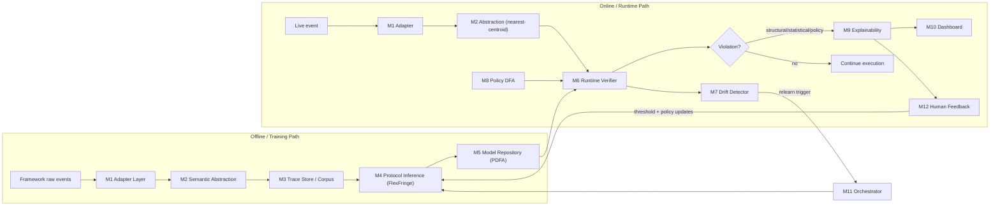
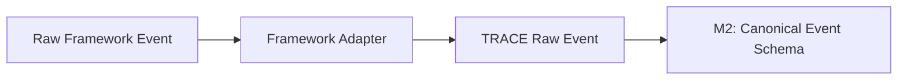
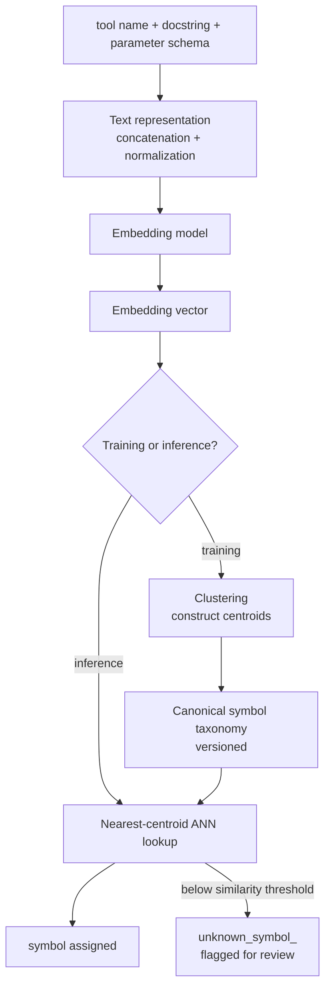
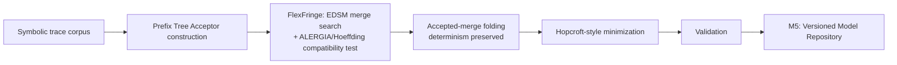
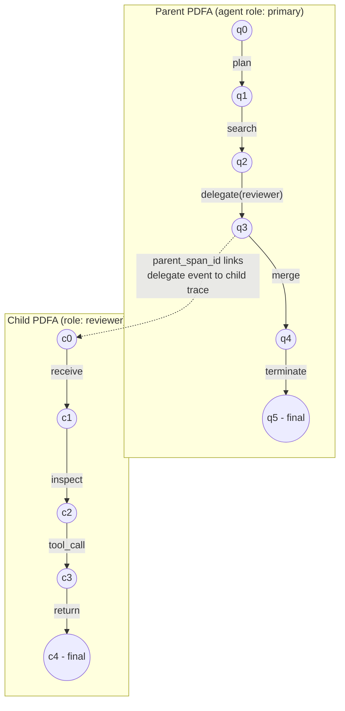
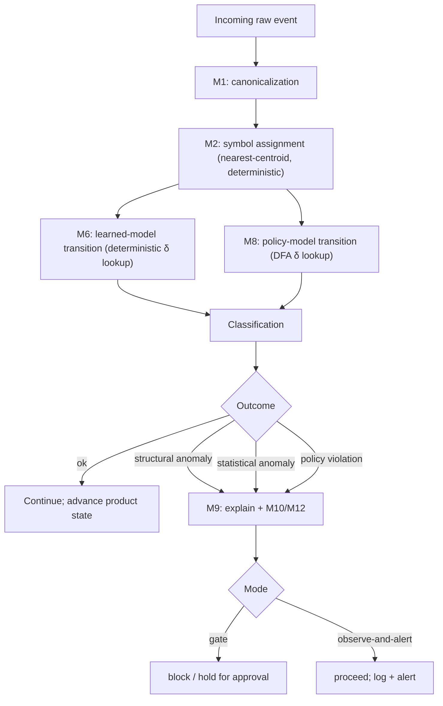
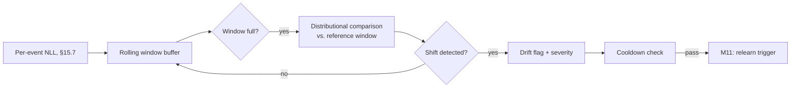
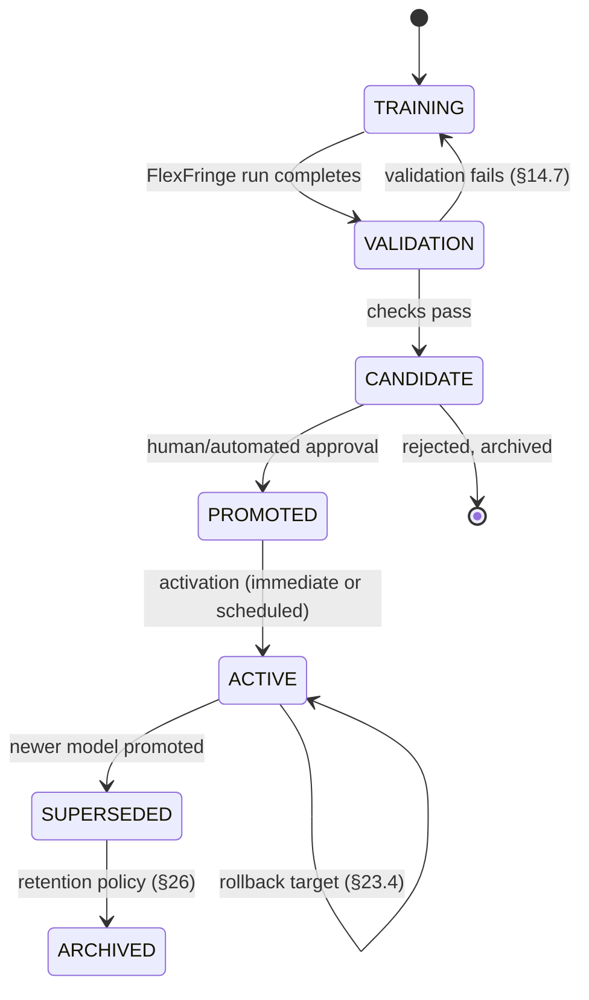
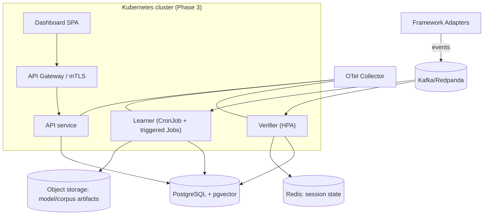

# TRACE 
## Technical Product Requirements Document
### Trace-based Runtime Automata for Compliance and Enforcement

**Document status:** Engineering PRD — not a patent application, not a legal opinion, not a claim of working implementation.
**Source basis:** TRACE v2.0 Principal Architect Document; TRACE v2.0 Invention Disclosure & Prior-Art Analysis.
**Labeling convention used throughout this document:** every capability is tagged **[IMPLEMENTED]**, **[PROPOSED]**, **[REQUIRED]**, **[EXPERIMENTAL]**, **[TBD]**, or **[FUTURE]**. As of this document, **no component of TRACE is IMPLEMENTED**. The tag appears next to every claim precisely so a reader never has to infer status.

---

## Table of Contents

1. Executive Summary
2. Product Definition
3. Problem Statement
4. Goals
5. Non-Goals
6. Users and Use Cases
7. System Requirements
8. Architecture
9. Component Specifications
10. Canonical Event Schema
11. Framework Adapter System
12. Semantic Abstraction Engine
13. Trace Storage and Corpus Management
14. Protocol Inference Engine
15. PDFA Formal Model
16. Hierarchical Delegation
17. Runtime Verification
18. Policy DSL
19. Product Automaton
20. Anomaly Classification
21. Explainability
22. Drift Detection
23. Model Lifecycle
24. Human Feedback
25. Security Architecture
26. Privacy
27. Observability
28. APIs
29. Storage Schema
30. CLI
31. Dashboard Requirements
32. Testing Strategy
33. Evaluation Framework
34. Performance Requirements
35. Deployment Architecture
36. Repository Structure
37. Roadmap
38. Acceptance Criteria
39. Technical Differentiators
40. Patent-Evidence Instrumentation
41. Risks
42. Open Questions
43. Architecture Decision Records
44. Glossary
45. Appendix

---

## 1. Executive Summary

TRACE v2.0 is a system that watches how an AI agent actually behaves — which tools it calls, in what order, how it retries, how it delegates to sub-agents — and learns a statistical model of "normal" from that behavior, so that deviations can be caught and explained at runtime. It does this without anyone hand-writing a specification of correct behavior, because for LLM-planned, multi-tool agents that specification does not exist and cannot practically be written by hand.

TRACE is **[PROPOSED]** in its entirety. Nothing described in this PRD has been built, benchmarked, or deployed as of this writing. The Principal Architect Document and Invention Disclosure that this PRD is derived from are design artifacts (Technology Readiness Level 2 — "technology concept formulated"), not implementation reports.

TRACE does **not** invent a new automata-learning algorithm, a new anomaly-detection statistic, or a new formal-verification technique. It composes existing, well-studied techniques — passive automata learning (RPNI/EDSM/ALERGIA, via the open-source FlexFringe tool), probabilistic deterministic finite automata (PDFA), and product-automaton conformance checking — around a **semantic trace-abstraction layer** and a **hierarchical delegation-folding scheme** that are engineered specifically for the properties of heterogeneous, multi-framework AI-agent execution traces (stochastic branching, framework-fragmented and semantically overlapping action names, recursive delegation, non-stationarity, and the absence of any hand-written specification). This PRD treats that abstraction layer and the surrounding closed-loop architecture (learn → verify → explain → detect drift → relearn → incorporate feedback) as the thing to actually build; it treats the automata-learning core as a wrapped external dependency (FlexFringe), not a component to reimplement.

This document turns the M1–M12 module architecture into buildable services, schemas, APIs, and acceptance criteria, phased across three deployment tiers (Phase 1 research prototype → Phase 2 research-grade system → Phase 3 production-capable architecture), while flagging every place where the source material's technical claims required scrutiny or correction (see §Appendix, "Technical Decisions and Open Questions") and every place where a claim is a hypothesis pending the evaluation plan in §33, not an established result.

---

## 2. Product Definition

TRACE is a **behavioral protocol inference and runtime conformance-checking system for AI-agent execution traces**. Concretely, it is:

- An **ingestion layer** that normalizes execution events from heterogeneous agent frameworks into one canonical schema.
- An **abstraction layer** that collapses framework-specific, semantically overlapping action names into a shared symbolic alphabet.
- A **learning subsystem** that infers a probabilistic finite-state model of normal behavior from a corpus of past traces, using an external passive-automata-learning tool (FlexFringe), not a novel learner.
- A **runtime verification subsystem** that checks a live trace, event by event, against both the learned model and an explicit, hand-authored policy, and classifies any deviation into one of three distinct categories.
- An **explainability subsystem** that turns a deviation into a diagnosis a developer can act on.
- A **drift-detection and relearning loop** that keeps the model from going stale as prompts, tools, and models change.
- A **human-feedback loop** that lets developers correct the system's mistakes without retraining from scratch.

TRACE is explicitly **not** a generic AI-agent observability platform, not a generic anomaly detector, and not a new automata-learning algorithm. It is a specific pipeline architecture applied to a specific, previously underserved data source: multi-framework AI-agent execution traces.

---

## 3. Problem Statement

Agent frameworks (MCP, LangGraph, CrewAI, OpenAI Agents SDK, Semantic Kernel, Google ADK, AutoGen) let an LLM-driven planner invoke tools, read/write memory, retry, and delegate to sub-agents. In production practice today, these traces are either read manually after an incident, or checked one tool call at a time by content-filter-style guardrails that have no notion of the sequence a call sits in. Neither approach answers: *is this execution, taken as a whole, consistent with how this agent normally behaves?*

Answering that question requires a model of normal behavior. Nobody writes that model by hand — the space of legitimate trajectories through a multi-tool, LLM-planned agent is too large and too fluid. The technical problem TRACE addresses, stated precisely: **no existing system infers a stateful behavioral model directly from heterogeneous, multi-framework AI-agent execution traces that are simultaneously stochastic, alphabet-fragmented, recursively structured, and non-stationary, without requiring a hand-written specification.** Existing runtime-verification tooling requires a human-authored spec. Existing process-mining conformance checking targets low-cardinality, largely deterministic business-process alphabets. Existing behavior-based anomaly-detection systems (see prior-art comparison, §39) learn from a single program's or single log corpus's events, without cross-framework semantic unification or hierarchical structural modeling.

---

## 4. Goals

**G1.** Normalize heterogeneous, multi-framework execution logs into a single Canonical Event Schema (CES) without per-framework changes downstream of ingestion.

**G2.** Reduce a high-cardinality, framework-fragmented action vocabulary to a smaller, semantically coherent alphabet suitable for passive automata learning, while measurably preserving behaviorally relevant distinctions.

**G3.** Infer a probabilistic model of normal execution from positive-only, noisy, stochastic traces, without hand-labeled negative examples.

**G4.** Represent recursive, multi-level delegation via hierarchically composed automata, staying within decidable regular-language operations rather than adopting full pushdown-automaton cost.

**G5.** Distinguish, at runtime, "statistically rare but previously seen" from "structurally never seen," and report each differently.

**G6.** Perform streaming conformance checking of a live trace against both a learned model and a separately authored explicit policy, via product-automaton composition.

**G7.** Detect behavioral drift as a measurable shift in trace-to-automaton conformance and trigger relearning without a full pipeline restart.

**G8.** Generate developer-interpretable explanations of deviations, in terms of tool/action names, not internal automaton state indices.

**G9.** Close the loop with low-friction human feedback that improves both the statistical model and the explicit policy set, with safeguards against feedback poisoning.

---

## 5. Non-Goals

- **Not** a new automata-learning algorithm. TRACE wraps FlexFringe (EDSM/ALERGIA); it does not reimplement or claim to improve on state-merging theory itself.
- **Not** exhaustive model checking of all possible agent executions. TRACE performs *runtime* verification of one observed execution at a time.
- **Not** a chain-of-thought monitor. TRACE operates on observable, externally visible execution events (tool calls, results, delegations, memory ops) — it does not assume access to, and does not attempt to collect, an agent's internal reasoning trace.
- **Not** a general-purpose business-process-mining tool. It is scoped to AI-agent execution traces specifically.
- **Not**, at v1, a system that supports unbounded pushdown-style recursion modeling. Hierarchical delegation is folded to bounded depth (§16).
- **Not** a source of production SLA guarantees, benchmark results, or security guarantees at this stage — all such numbers are **[TBD — Phase 1/3 benchmarking]**.
- **Not** a replacement for existing single-call content-filter guardrails; TRACE is complementary (sequence-level) rather than a substitute for point-in-time input/output filtering.

---

## 6. Users and Use Cases

| User | Use case |
|---|---|
| Agent platform engineer | Wants to know when a production agent deviates from its normal tool-use pattern (e.g., a coding agent suddenly calling a shell-exec tool it has never used). |
| AI safety / security engineer | Wants to author explicit policies ("never call `delete_*` without a preceding `confirm_step`") independent of what the model has learned as "normal," because normal-but-unsafe should still be blocked. |
| SRE / on-call engineer | Wants a fast, non-technical explanation when an alert fires — not a raw automaton state ID. |
| Research engineer evaluating TRACE itself | Wants reproducible model versions, corpus hashes, and metrics to compare relearning runs and ablations. |
| Framework integrator | Wants to add a new agent framework's adapter without touching the rest of the pipeline. |

---

## 7. System Requirements

### 7.1 Functional requirements

- **FR1** [REQUIRED, Phase 1] Ingest execution events from at least two agent frameworks via adapters conforming to a stable interface.
- **FR2** [REQUIRED, Phase 1] Normalize events into the Canonical Event Schema, validating every record against a formal schema before it enters the pipeline.
- **FR3** [REQUIRED, Phase 2] Map fine-grained action names to canonical symbols via embedding-based clustering, deterministically post-training.
- **FR4** [REQUIRED, Phase 1] Learn a PDFA from a symbolic-trace corpus using FlexFringe (EDSM baseline in Phase 1; ALERGIA-style probabilistic merge in Phase 2).
- **FR5** [REQUIRED, Phase 2] Perform per-event runtime conformance checking against the learned PDFA and an explicit policy DFA, in both gate and observe-and-alert modes.
- **FR6** [REQUIRED, Phase 2] Classify every deviation as structural, statistical, or policy, and never collapse these into one score.
- **FR7** [REQUIRED, Phase 2] Generate a counterexample explanation for every violation, referencing canonical action names.
- **FR8** [REQUIRED, Phase 2] Detect distributional drift in conformance scores and trigger relearning.
- **FR9** [REQUIRED, Phase 2] Support hierarchical delegation via `delegate(role)` folding, to a configurable bounded depth.
- **FR10** [REQUIRED, Phase 2] Accept structured human feedback on flagged deviations and route it to merge-threshold tuning and/or policy editing, with an approval gate before any change reaches a production model (§24).
- **FR11** [REQUIRED, Phase 1] Provide a CLI covering ingest → normalize → abstract → train → validate → verify → replay.
- **FR12** [REQUIRED, Phase 4] Provide a dashboard for automaton visualization, trace replay, and alert triage.

### 7.2 Non-functional requirements (see §34 for full detail)

- Runtime verification overhead: target sub-millisecond per event in gate mode — **[TBD, Phase 1 benchmarking]**.
- All model, taxonomy, and policy versions must be reproducible from stored metadata (corpus hash, hyperparameters, embedding-model version).
- No component may silently degrade determinism: symbol assignment and policy compilation must be deterministic given a fixed model/taxonomy version.
- The system must operate in both **offline mode** (train/analyze historical traces) and **online mode** (observe or gate live execution).


---

## 8. Architecture

### 8.1 Logical architecture

TRACE is a pipeline with two closed feedback loops (drift → relearn; human feedback → thresholds/policy), not a one-shot train/deploy system.



### 8.2 Component inventory

| Layer | Modules | Nature |
|---|---|---|
| Ingestion | M1 | Per-framework adapters, stateless parsers |
| Preprocessing | M2 | Embedding + clustering service |
| Storage | M3, M5 | Trace corpus, model repository |
| Learning | M4 | Orchestration around external FlexFringe binary/library |
| Runtime | M6, M8, M9 | Stateful per-trace verifier, policy compiler, explainer |
| Monitoring | M7 | Statistical drift test over rolling windows |
| Human-facing | M10 | Dashboard/UI |
| Control | M11, M12 | Scheduler, feedback router |

### 8.3 Phase 1 architecture — minimum viable research prototype

**Goal:** prove ingestion → abstraction(rule-based only) → learning → replay runs end-to-end on synthetic data.

- **Runtime:** single Python process (modular monolith) — no microservices, no message bus. Modules M1–M6 are Python packages called in-process by the CLI.
- **Storage:** SQLite (or a single local PostgreSQL instance) for traces/events/models; local filesystem for FlexFringe input/output files.
- **Learning:** FlexFringe invoked as a subprocess (CLI binary) or via its C++ library bindings if available; no distributed training.
- **No semantic embedding clustering yet** — Phase 1 abstraction is the rule-based `event_type` mapping only (§12 abstraction is Phase 2).
- **No streaming runtime** — verification runs against completed/replayed traces, not live callbacks.
- **No dashboard** — CLI output and flat-file reports only.
- **Rationale:** avoids premature microservices/Kafka/Kubernetes investment before the core hypothesis (passive learning works on agent traces at all) is validated. This directly follows the source document's own Phase 1 scoping and the constraint against over-engineering the first prototype.

### 8.4 Phase 2 architecture — research-grade system

- **Runtime:** modular monolith grows into a small set of services: `api` (REST), `verifier` (stateful, in-memory per-trace state + Redis for cross-instance session state), `learner` (batch job, can run on a schedule or via API trigger), `abstraction` (embedding + ANN index service).
- **Storage:** PostgreSQL (traces, events, models, policies, violations, feedback — see §29) + `pgvector` extension for embedding centroids and nearest-centroid lookup (avoids standing up a separate vector database at this scale — typical corpora are thousands to low millions of symbol instances, well within pgvector's practical range).
- **Event transport:** for online/streaming mode, a lightweight event bus (Redpanda or Kafka) decouples adapters (producers) from the verifier (consumer); for offline/batch mode, direct DB writes suffice and the bus is bypassed.
- **Object storage:** S3-compatible bucket for FlexFringe model artifacts and training-corpus snapshots (content-addressed by corpus hash, §17/§23).
- **APIs:** REST (§28), synchronous.
- **Observability:** OpenTelemetry instrumentation on the verifier and learner services (§27).
- **Containerization:** Docker Compose for local/dev; each service in its own container image.

### 8.5 Phase 3 architecture — production-capable

- **Runtime:** Kubernetes deployment; `verifier` horizontally scaled (stateless per-event with session state externalized to Redis) behind a gRPC or REST gateway; `learner` as a scheduled Job/CronJob plus event-triggered Jobs for drift-triggered relearning.
- **Event transport:** Kafka/Redpanda cluster, partitioned by `agent_id` to preserve per-agent event ordering.
- **Storage:** managed PostgreSQL (with read replicas for dashboard queries) + pgvector; object storage for model/corpus artifacts with lifecycle/retention policies (§26).
- **Streaming interface:** WebSocket/SSE for live dashboard alert feeds; gRPC for low-latency gate-mode verification calls from agent middleware.
- **Security:** mTLS between services, signed events at ingestion (§25), RBAC on the API gateway, secrets in a managed secrets manager (not env vars).
- **Multi-tenancy:** tenant isolation at the storage layer (row-level security or per-tenant schema) — **[REQUIRED before any multi-tenant deployment, TBD design]**.

### 8.6 Explicit non-adoption

Per the review brief's instruction not to blindly adopt every listed technology: TRACE does **not** use Kafka in Phase 1 (no streaming need yet), does **not** use a dedicated vector database in Phase 2 (pgvector suffices at expected corpus scale — **[TBD: revisit if centroid count or embedding-cardinality benchmarks in Phase 3 show pgvector is a bottleneck]**), and does **not** adopt Kubernetes before Phase 3 (Docker Compose is sufficient for a small number of services with no elastic-scaling requirement in Phase 1/2).


---

## 9. Component Specifications

For each module: purpose, inputs/outputs, interface, state, algorithm, failure modes, retry/idempotency, observability, security, scalability, testing, acceptance criteria. High-level table first; full detail for the most architecturally significant modules (M2, M4, M6, M7, M8, M9) is expanded in §12–§22, which this section cross-references rather than duplicates.

| Module | Purpose | Inputs | Outputs | State | Phase |
|---|---|---|---|---|---|
| **M1** Trace Ingestion & Adapter Layer | Normalize framework-native events into raw TRACE events | Framework-native logs/callbacks | Raw events tagged with source + schema version | Stateless | 1 |
| **M2** Semantic Trace Abstraction Engine | Map raw events to CES + canonical symbol | Raw events | CES records | Stateful (centroid table, taxonomy version) | 1 (rule-based) / 2 (embedding) |
| **M3** Trace Store / Corpus Manager | Durable, queryable trace storage | CES records | Windowed training corpora | Stateful (DB) | 1 |
| **M4** Protocol Inference Engine | Learn PDFA from corpus | Symbolic trace corpus | PDFA + training metadata | Stateless (orchestrates external learner) | 1 |
| **M5** Formal Model Repository | Version/store learned automata | PDFA + metadata | Retrievable, comparable model versions | Stateful (DB + object store) | 1 |
| **M6** Runtime Verification Engine | Check live/replayed trace against PDFA + policy | Live event, PDFA, policy DFA | Classification (ok/structural/statistical/policy) | Stateful (per-trace product state) | 1 (replay) / 2 (live) |
| **M7** Behavioral Drift Detector | Detect distributional shift in conformance score | Rolling NLL series | Drift flag + relearn trigger | Stateful (rolling buffer) | 2 |
| **M8** Policy Specification & Product Automaton Builder | Compile policy DSL to DFA; build product | Policy source, PDFA, policy DFA | Policy DFA, product state | Stateless compiler; stateful runtime product | 2 |
| **M9** Explainability & Counterexample Generator | Turn violation into diagnosis | Violation event | Counterexample JSON | Stateless | 2 |
| **M10** Dashboard / Developer Interface | Visualize model, replay, alerts, policy authoring | API data | UI | Stateless (client) | 4 |
| **M11** Orchestration / Scheduler | Schedule relearning, batch jobs | Drift flags, cron | Job triggers | Stateful (job queue) | 2 |
| **M12** Human-in-the-Loop Feedback Module | Capture labels, route to M4/M8 | Developer labels | Threshold/policy update requests | Stateful (feedback log) | 2 |

**Cross-cutting requirement (all modules):** every module emits structured logs with `trace_id`/`event_id` correlation (§27), and every persistent object it produces carries a version and provenance record (§17 model lifecycle, §29 storage schema).


---

## 10. Canonical Event Schema (CES)

### 10.1 Design rationale

The source material lists seven conceptual fields (`agent_id, event_type, symbol, attributes, timestamp, parent_span_id, depth`). That set is necessary but not sufficient for an implementation: it lacks identifiers needed for deduplication, ordering, cross-framework provenance, and error representation. Every field added below exists to satisfy a specific downstream need (traceability, dedup, ordering, learning-corpus integrity, or explanation quality) — no field is added for completeness alone.

### 10.2 JSON Schema

```json
{
  "$schema": "https://json-schema.org/draft/2020-12/schema",
  "$id": "https://trace.dev/schema/ces-v1.json",
  "title": "TRACE Canonical Event Schema v1",
  "type": "object",
  "required": [
    "schema_version", "event_id", "trace_id", "span_id", "agent_id",
    "event_type", "symbol", "timestamp", "framework", "framework_schema_version",
    "sequence_no", "status"
  ],
  "properties": {
    "schema_version":          { "type": "string", "const": "1.0", "description": "CES schema version. Bump on any breaking field change; adapters declare which version they emit." },
    "event_id":                { "type": "string", "format": "uuid", "description": "Globally unique ID for this event. Used for idempotent ingestion and duplicate-event detection." },
    "trace_id":                { "type": "string", "format": "uuid", "description": "ID of the top-level execution this event belongs to. Shared by a parent and all its delegated children's events for cross-referencing (not for flattening them)." },
    "span_id":                 { "type": "string", "format": "uuid", "description": "ID of this event's local execution span (framework-native span/step ID if available, else generated)." },
    "parent_span_id":          { "type": ["string", "null"], "format": "uuid", "description": "Span ID of the delegating parent event, when this event belongs to a delegated sub-trace. Null for top-level (depth=0) events. Required for hierarchical folding (§16)." },
    "session_id":              { "type": ["string", "null"], "description": "Optional higher-level grouping (e.g., a user conversation) spanning multiple traces. Not required by the core pipeline; present for downstream corpus filtering." },
    "agent_id":                { "type": "string", "description": "Stable identifier of the executing agent instance/role (e.g., 'research-agent-v3', not a random per-run ID). Used to key per-agent PDFAs." },
    "role":                    { "type": ["string", "null"], "description": "Delegation role label (e.g., 'reviewer'), required when event_type='delegate' or when this event belongs to a delegated child trace. Keys the child PDFA lookup (§16)." },
    "depth":                   { "type": "integer", "minimum": 0, "description": "Nesting level of delegation. 0 = top-level agent. Bounded by MAX_DELEGATION_DEPTH (§16, config, default 8)." },
    "event_type": {
      "type": "string",
      "enum": ["tool_call", "tool_result", "delegate", "retry", "memory_read", "memory_write", "plan_step", "error", "terminate"],
      "description": "Small, stable, framework-independent taxonomy. This is the manually-engineered join point across frameworks (§12); NOT learned or clustered."
    },
    "symbol": {
      "type": "string",
      "description": "Fine-grained canonicalized action identity, e.g., 'web_search'. Produced by M2's clustering/nearest-centroid assignment (Phase 2) or by rule-based mapping (Phase 1). This is the alphabet symbol the PDFA is learned over."
    },
    "raw_symbol":              { "type": "string", "description": "The framework-native, pre-canonicalization action name (e.g., 'browse', 'search_web'). Retained for audit/debugging and for re-clustering when the taxonomy is updated." },
    "attributes": {
      "type": "object",
      "required": ["param_schema_hash", "status"],
      "properties": {
        "param_schema_hash":  { "type": "string", "description": "SHA-256 hash of the (redacted, see §26) parameter schema/shape passed to this action. Used for semantic-clustering input and for detecting parameter-shape drift without storing raw parameter values." },
        "status":             { "type": "string", "enum": ["success", "failure", "timeout", "unknown"], "description": "Outcome status of this event, when applicable (tool_result, error)." },
        "latency_ms":         { "type": ["integer", "null"], "description": "Wall-clock duration of the underlying operation, when measurable. Feeds the timed-automata-alternative latency side-channel (§Formal Model rejection of timed automata)." },
        "retry_count":        { "type": ["integer", "null"], "description": "Attempt number, present when event_type='retry'." }
      }
    },
    "error": {
      "type": ["object", "null"],
      "properties": {
        "error_class":        { "type": "string", "description": "Coarse, framework-independent error category (e.g., 'tool_error', 'timeout', 'validation_error'). NOT a raw stack trace — raw error text is a privacy/injection risk (§26) and is not part of CES by default." },
        "retryable":          { "type": "boolean" }
      },
      "description": "Populated when event_type='error'."
    },
    "timestamp":               { "type": "string", "format": "date-time", "description": "Event-emission time, ISO-8601 UTC, framework/adapter-supplied where available else ingestion-time fallback (flagged via provenance.timestamp_source)." },
    "framework":               { "type": "string", "enum": ["mcp", "langgraph", "crewai", "openai_agents_sdk", "semantic_kernel", "google_adk", "autogen", "custom"], "description": "Source framework, set by the adapter. Drives compatibility-matrix reporting (§11)." },
    "framework_schema_version":{ "type": "string", "description": "Version of the framework's own event schema this adapter targeted, for schema-drift detection (§11)." },
    "adapter_version":         { "type": "string", "description": "Version of the TRACE adapter that produced this record, for reproducibility." },
    "sequence_no":             { "type": "integer", "description": "Monotonically increasing per-(trace_id, span_id) sequence number, assigned by the adapter. Resolves ordering when timestamps collide or clocks skew (see 10.4 ordering semantics)." },
    "provenance": {
      "type": "object",
      "properties": {
        "timestamp_source":   { "type": "string", "enum": ["framework", "ingestion"] },
        "ingested_at":        { "type": "string", "format": "date-time" }
      }
    }
  }
}
```

### 10.3 Field-by-field rationale for additions beyond the source's seven fields

| Added field | Why it exists |
|---|---|
| `schema_version` | Without it, a downstream consumer cannot tell which CES revision produced a record; required for safe schema evolution. |
| `event_id` | Enables idempotent ingestion (10.5) — replays/retries from an adapter must not double-count in the training corpus. |
| `trace_id` / `span_id` | The source's `parent_span_id` presupposes a `span_id` to point at, and both a trace-level and span-level ID are required to correlate parent/child delegation (§16) and to support explanation round-tripping (§21). |
| `raw_symbol` | Required for re-clustering (§12.9) and audit trails; without the pre-canonicalization name, taxonomy changes cannot be replayed. |
| `framework` / `framework_schema_version` / `adapter_version` | Required for the adapter compatibility matrix (§11) and to diagnose "is this a behavioral anomaly or did the framework's API change" (a named M1 failure mode). |
| `sequence_no` | Timestamps from different frameworks/adapters are not guaranteed monotonic or collision-free; ordering by sequence_no within (trace_id, span_id) is required for correct automaton state advancement. |
| `error.error_class` (not raw error text) | Raw error/stack-trace text risks leaking secrets and is unbounded-cardinality noise for the symbol alphabet; a coarse class is enough for behavioral modeling. |
| `provenance.timestamp_source` | Distinguishes a framework-native timestamp from an ingestion-time fallback, since incomplete/truncated traces (a named M1 failure mode) may lack framework timestamps. |

### 10.4 Ordering semantics

Within a single `(trace_id, span_id)`, events are ordered by `sequence_no` (adapter-assigned, monotonic), **not** by `timestamp`. Across different `span_id`s under the same `trace_id` (e.g., parent vs. delegated child), no total order is assumed or required — the child trace is verified independently against its own role automaton (§16), linked only causally via `parent_span_id`, not interleaved into one sequence.

### 10.5 Duplicate-event handling

Ingestion is idempotent on `event_id`: M1 upserts on `event_id`, so a redelivered event (adapter retry, at-least-once event-bus delivery) is a no-op on second arrival. This is a `[REQUIRED]` invariant of M3's storage layer (unique constraint on `event_id`, §29).

### 10.6 Privacy-sensitive fields

`attributes.param_schema_hash` is a hash of parameter **shape**, not parameter **values** — raw tool-call arguments (which may contain PII, secrets, or proprietary data) are never part of CES by default (§26 defines the redaction boundary precisely). `error.error_class` is a coarse enum, not raw error text, for the same reason.


---

## 11. Framework Adapter System

### 11.1 Pipeline



### 11.2 Adapter interface

```python
class FrameworkAdapter(Protocol):
    framework: Literal["mcp","langgraph","crewai","openai_agents_sdk",
                        "semantic_kernel","google_adk","autogen","custom"]
    adapter_version: str
    supported_framework_schema_versions: list[str]

    def detect_schema_version(self, raw_event: dict) -> str: ...
    def parse(self, raw_event: dict) -> list[RawTraceEvent]:
        """One framework event MAY expand to >1 raw event (e.g., a combined call+result)."""
    def validate(self, raw_event: dict) -> ValidationResult: ...
    def to_ces(self, raw_event: "RawTraceEvent") -> CESRecord:
        """Deterministic event_type mapping (rule-based, §12.2); symbol left as raw_symbol
        pending M2 canonicalization, which is NOT the adapter's responsibility."""
```

### 11.3 Lifecycle

`register()` at process start (or dynamic plugin load) → `detect_schema_version()` per incoming raw event → `validate()` → `parse()` → `to_ces()` → emit to M2. An adapter that fails `validate()` emits a `schema_drift` alert (§27 metric `adapter_failures`) and routes the raw event to a dead-letter store rather than dropping it silently.

### 11.4 Versioning and schema-drift handling

Each adapter declares `supported_framework_schema_versions`. When a raw event's detected schema version is not in that list, the adapter either (a) applies a best-effort compatibility shim if one is registered for that version pair, or (b) rejects the event to the dead-letter store and raises `adapter_schema_drift`. Framework API changes are explicitly **not** conflated with behavioral drift (§22) — a schema-drift alert and a behavioral-drift alert are different signals with different responses (fix the adapter vs. relearn the model).

### 11.5 Test fixtures and contract tests

Each adapter ships with a fixture directory of recorded (anonymized) raw events per supported framework-schema-version, and a contract test asserting: every fixture event round-trips through `parse → validate → to_ces` into a CES record that validates against the JSON Schema in §10.2, with 100% field-required-ness satisfied. This is the adapter's acceptance criterion (§38).

### 11.6 Phase 1 scope

**[REQUIRED, Phase 1]** Exactly two adapters: **MCP** and **LangGraph** (chosen because MCP's JSON-RPC call/response structure and LangGraph's node/edge execution events are the two most structurally different event shapes among the seven target frameworks, giving the abstraction layer real heterogeneity to prove out early). The remaining five (CrewAI, OpenAI Agents SDK, Semantic Kernel, Google ADK, AutoGen) are **[PROPOSED, Phase 2+]** — designed to the same interface but not implemented until Phase 2, and not claimed as working until each has passing contract tests.

### 11.7 Compatibility matrix (to be populated; template)

| Framework | Adapter status | Schema versions supported | Contract tests passing |
|---|---|---|---|
| MCP | [REQUIRED, Phase 1] | TBD | TBD |
| LangGraph | [REQUIRED, Phase 1] | TBD | TBD |
| CrewAI | [PROPOSED, Phase 2] | — | — |
| OpenAI Agents SDK | [PROPOSED, Phase 2] | — | — |
| Semantic Kernel | [PROPOSED, Phase 2] | — | — |
| Google ADK | [PROPOSED, Phase 2] | — | — |
| AutoGen | [PROPOSED, Phase 2] | — | — |

### 11.8 Registration mechanism

Adapters register via a Python entry-point group (`trace.adapters`), discovered at process start; `trace adapter list` (CLI, §30) enumerates registered adapters and their declared schema-version support. New frameworks require only a new adapter package — no change to M2–M9.


---

## 12. Semantic Abstraction Engine (M2)

This is the most architecturally significant subsystem, per both source documents: it is what makes the alphabet learnable at all, and it is the least prior-art-supported, most novelty-load-bearing component (§39).

### 12.1 Pipeline



### 12.2 Two distinct mapping steps (do not conflate)

1. **`event_type` mapping** (rule-based, deterministic, per-adapter, NOT learned): maps framework-native event kinds into the nine-value taxonomy. Small and stable by design — this is the manually-engineered join point.
2. **`symbol` unification** (embedding + clustering, statistical): maps the framework-native *action name* (e.g., "browse", "search_web", "web_search") to one canonical symbol. This is the hard problem and the actual subject of this section.

### 12.3 Embedding model interface

```python
class EmbeddingModel(Protocol):
    model_id: str            # e.g. "sentence-transformers/all-mpnet-base-v2"
    model_version: str
    dimensions: int
    def embed(self, texts: list[str]) -> np.ndarray: ...  # shape (n, dimensions)
```

**[PROPOSED, Phase 2]** Use an off-the-shelf sentence-embedding model (not a bespoke trained model — per the design constraint against unnecessary novel components). Candidate default: a general-purpose open sentence-transformer model; **exact model selection is [TBD — open question OQ-2, §42]**, since embedding-model choice materially affects cluster purity and must be selected empirically, not assumed.

**Input text construction:** `f"{tool_name}\n{docstring or ''}\n{json.dumps(sorted(param_schema.keys()))}"`, truncated to the embedding model's max sequence length, then L2-normalized post-embedding so cosine similarity and Euclidean nearest-centroid search agree.

### 12.4 Clustering

**[PROPOSED, Phase 2]** Agglomerative clustering with a cosine-distance threshold over the training corpus's distinct raw symbols, producing centroids. Threshold is a tunable hyperparameter (§12.8), not a fixed constant, because the over-/under-clustering tradeoff (12.7) is corpus-dependent.

- **Similarity metric:** cosine similarity (standard for sentence embeddings).
- **ANN indexing:** for corpora with many distinct raw symbols, approximate nearest-neighbor search (HNSW, via pgvector's `hnsw` index type in Phase 2 storage) avoids O(k²) pairwise comparison at cluster-construction time and O(k) at assignment time.
- **Determinism:** clustering (centroid construction) is **training-time only** and may be non-deterministic across reruns (agglomerative clustering has tie-breaking sensitivity); centroid **assignment** (inference-time nearest-centroid lookup) is fully deterministic given a fixed, versioned centroid table — this is the property the source material calls out as required ("re-running abstraction on new traces doesn't silently reshuffle the alphabet"), and it holds because assignment, not clustering, is what runs on new traces.

### 12.5 Canonical symbol taxonomy versioning

The centroid table is versioned (`taxonomy_version`, monotonically increasing integer + content hash of the centroid set). A PDFA is trained against exactly one `taxonomy_version`; changing the taxonomy invalidates comparability of models trained under different versions unless symbols are re-mapped (§12.9).

### 12.6 Unknown-symbol handling

If a raw symbol's nearest centroid has similarity below a configured floor (`UNKNOWN_SYMBOL_THRESHOLD`, tunable), it is assigned `unknown_symbol_<sha256(raw_symbol)[:8]>` rather than forced into the nearest (poor-fit) cluster, and flagged for human review (M12). This prevents silent over-clustering when a genuinely new action type appears.

### 12.7 Over-clustering and under-clustering — explicit treatment

- **Over-clustering example (from source material):** `delete_record` and `archive_record` collapsing into one symbol — dangerous, because it would hide a real behavioral distinction (deletion vs. archival) that a safety policy (§18) may specifically need to distinguish. Mitigation: parameter-schema hash is part of the embedding input specifically so that same-name-different-signature actions are less likely to over-merge; cluster-purity review (12.10) on a human-labeled subsample is a required Phase 2 evaluation step, not optional.
- **Under-clustering example:** `search_web`, `web_search`, `browse` remaining as separate symbols — defeats learnability via alphabet explosion. Mitigation: threshold tuning against the compression-ratio and downstream-F1 metrics (12.10); this is explicitly an empirical tuning problem, not something solved by architecture alone.

### 12.8 Threshold selection

`[TBD — open question OQ-1, §42]`. Proposed default starting point: cosine-distance threshold selected via grid search on a labeled validation subsample (12.10), optimizing downstream anomaly-detection F1 (not cluster purity alone, since purity cannot distinguish good compression from harmful over-merging per the source document's own §5.5).

### 12.9 Re-clustering strategy and rollback

Re-clustering (recomputing centroids from an updated/larger training corpus) produces a new `taxonomy_version`. Symbol reassignment under the new taxonomy is applied only to newly ingested traces by default; **[REQUIRED]** re-mapping historical traces to a new taxonomy version is an explicit, auditable batch operation (`trace abstract --remap --taxonomy-version N`, §30), never implicit. Rollback = pinning `taxonomy_version` back to the previous value; because assignment is deterministic per version, this is safe and instantaneous (no recomputation needed, only repointing which centroid table is active).

### 12.10 Metrics (evaluation, not assumed)

| Metric | Definition | Data required |
|---|---|---|
| Compression ratio | distinct raw symbols ÷ distinct canonical symbols | Any corpus |
| Cluster purity | fraction of clustered symbol pairs judged semantically equivalent by a human reviewer, on a labeled subsample | Human-labeled subsample |
| False merge rate | fraction of human-reviewed pairs incorrectly merged | Human-labeled subsample |
| False split rate | fraction of human-reviewed pairs incorrectly kept separate | Human-labeled subsample |
| Downstream anomaly-F1 sensitivity | change in anomaly-detection F1 (§33) when abstraction is ablated or threshold varied | Labeled anomaly-injection benchmark (§33) |

### 12.11 Adversarial tool naming — threat and mitigation

**Threat:** an attacker registers a malicious tool with a name/docstring engineered to embed near a trusted cluster's centroid (e.g., naming a data-exfiltration tool `web_search_v2` with a docstring copied from the legitimate `web_search` tool), causing it to be silently assigned the trusted symbol and inherit that symbol's "normal" transition probabilities.

**Mitigations [PROPOSED]:**
- Parameter-schema hash as part of the embedding input raises the bar (a genuinely different tool's parameter shape differs from the tool it's impersonating in most realistic cases, though not all — this is a partial mitigation, not a guarantee).
- New-tool registration triggers a review flag (`new_raw_symbol_near_existing_centroid`) when a never-before-seen raw symbol is assigned to an *existing, established* cluster on first sighting, rather than assigned silently — this surfaces exactly the "did a new tool just silently absorb into a trusted symbol" case for human review (M12).
- Tool registration provenance (which adapter/framework introduced this raw symbol, and when) is retained (`raw_symbol` + `framework` + first-seen timestamp) so a security reviewer can audit cluster membership changes over time.
- This threat is **[EXPERIMENTAL]** — no red-team evaluation of clustering-collision attacks has been run; §33 should include an explicit adversarial-clustering ablation before any security claim is made about this mitigation's effectiveness.


---

## 13. Trace Storage and Corpus Management (M3)

### 13.1 Responsibilities

Durable, queryable storage of CES records and symbolic traces; provenance tracking (framework, timestamp, agent identity, task label if available); construction of **windowed corpora** for training (§14) and evaluation (§33), keyed by time window, `agent_id`, and `taxonomy_version`.

### 13.2 Interfaces

- `write_events(list[CESRecord]) -> WriteResult` — idempotent on `event_id` (§10.5).
- `get_trace(trace_id) -> Trace` — reconstructs an ordered event sequence per `(trace_id, span_id)` using `sequence_no` ordering (§10.4).
- `get_corpus(agent_id, window_start, window_end, taxonomy_version) -> Corpus` — returns the set of complete traces (see 13.4) in the window, for M4 training input.

### 13.3 Corpus imbalance

**[Named failure mode, unresolved by architecture alone]** If one task type dominates a training window, the learned PDFA will underrepresent rarer-but-legitimate task types, producing false structural/statistical anomalies for those tasks. Mitigation: `get_corpus` supports optional **stratified sampling** by a `task_label` field (when available from the framework/adapter) to cap any one task type's share of the training window — **[PROPOSED, Phase 2, requires task-label availability which is not guaranteed by all frameworks — TBD per-framework]**.

### 13.4 Complete vs. truncated traces

A trace is **complete** if it contains a `terminate` event at `depth=0` (or, for a delegated child, a `tool_result`/return event correlating to its `delegate` parent event) within a configurable timeout; otherwise it is **truncated** (crashed agent, in-flight at query time). Truncated traces are **excluded from training corpora by default** (they would teach the learner incomplete prefixes as if they were valid complete behaviors) but **are** valid input to runtime verification (a live trace is truncated by definition until it completes). This distinction — training input requires completeness, verification input does not — is a `[REQUIRED]` invariant.

### 13.5 Failure modes

| Failure | Response |
|---|---|
| Corpus imbalance | Stratified sampling (13.3), flagged in training metadata |
| Truncated traces mixed into training corpus | Excluded by default (13.4); explicit `--include-truncated` flag for research use only, with a warning |
| Duplicate events | Deduped on `event_id` at write time (§10.5) |
| Schema-version mismatch within one corpus window | Corpus build fails fast with an explicit error rather than silently mixing CES schema versions |


---

## 14. Protocol Inference Engine (M4)

### 14.1 Explicit scope statement

TRACE does **not** implement a new automata-learning algorithm. M4 is an orchestration layer around **FlexFringe**, an existing open-source EDSM/ALERGIA-style state-merging tool. This must remain explicit in any specification or claim to avoid overclaiming (per both source documents' repeated emphasis).

### 14.2 Pipeline



### 14.3 Algorithm family — clearly distinguished

| Algorithm | Role in TRACE |
|---|---|
| **RPNI** | Secondary baseline, synthetic ground-truth evaluation only (§33), where negative examples can be manufactured. Exact DFA output; polynomial-time identification-in-the-limit guarantee holds only given a characteristic sample — not guaranteed for stochastic agent-trace sources, so this guarantee does **not** transfer to production use. |
| **EDSM** | Primary merge-*ordering* heuristic in Phase 1 (evidence-driven greedy search, no polynomial-time guarantee, but the practical standard). |
| **ALERGIA / MDI** | Primary merge-*acceptance* test in Phase 2+: a Hoeffding-bound-style statistical compatibility test decides whether two states' outgoing-symbol/frequency distributions are similar enough to merge. This is the closest existing match to TRACE's actual data (frequency-annotated, stochastic, positive-sample-heavy) and is used **as-is**, not modified, in Phase 1; a frequency-weighting adaptation tuned for agent-trace noise is **[PROPOSED, EXPERIMENTAL, Phase 2]** and must be validated against the stock heuristic before being claimed as an improvement. |
| **FlexFringe** | The external implementation providing both. TRACE calls it via subprocess (Phase 1) or library binding (Phase 2+); TRACE does not fork or reimplement it. |

### 14.4 Input / output format

- **Input:** symbolic traces as FlexFringe's expected format — one line per trace, space-separated symbol sequence, with a leading trace-length and alphabet-size header per FlexFringe's `.dat` convention. M4 is responsible for this serialization from the CES/symbolic-trace representation.
- **Output:** FlexFringe's learned automaton (states, transitions, frequency counts) in its native `.dot`/JSON export, parsed by M4 into TRACE's internal PDFA representation (§15) — states relabeled with stable IDs, transitions annotated with computed probabilities (frequency-normalized, §15.3).

### 14.5 Configuration

| Parameter | Meaning | Phase 1 default |
|---|---|---|
| `merge_heuristic` | `edsm` \| `alergia` | `edsm` (Ph1) → `alergia` (Ph2) |
| `hoeffding_bound_alpha` | Significance level for ALERGIA compatibility test | `[TBD — tune empirically, OQ-4]` |
| `min_support` | Minimum frequency for a state/transition to be considered for merging (handles rare transitions) | `[TBD, tune per corpus size]` |
| `training_window` | Time window / trace-count window for windowed batch relearning (§14.6) | `[TBD, tune per relearning cadence]` |

**Rare and unseen transitions:** transitions below `min_support` are retained in the model (not pruned) but flagged `low_confidence: true`; at runtime, a `low_confidence` transition still counts as "seen" (not a structural anomaly) but its probability estimate is treated as unreliable, which is surfaced in the explanation output (§21) rather than hidden. A transition never observed in training is structurally unseen (§20) — this is a distinct case from low-support-but-observed.

### 14.6 Incremental vs. windowed relearning — decision

**[DECISION, see ADR-003 §43]** True incremental state-merging exists in the literature but is less mature/battle-tested than batch EDSM/ALERGIA. TRACE v1 uses **windowed batch relearning**: a sliding window of recent complete traces (§13.4) is relearned periodically (scheduled by M11) and out-of-cycle on drift detection (§22). True incremental learning is **[FUTURE, Phase 2+ roadmap item, not v1]**.

### 14.7 Model validation

Before a newly learned PDFA is promoted to `CANDIDATE` status (§23), M4 runs: (a) a determinism check (no state has two outgoing transitions on the same symbol — required for the PDFA definition in §15); (b) a coverage check (every symbol in the training corpus's alphabet appears in the model); (c) held-out likelihood check (log-likelihood of a held-out split of the training corpus is not catastrophically worse than the training split — a basic overfitting guard). Failing any check blocks promotion and logs a `model_validation_failed` event.

### 14.8 Complexity

State-merging search is **NP-hard in the worst case** for optimal merging; EDSM's greedy evidence-driven order gives **no polynomial-time guarantee** — it is the practical standard, not a theoretical one. This must not be conflated with M1 ingestion's O(n) cost; the two are asymptotically unrelated, and the source document's ingestion-complexity claim should not be generalized to "the system is O(n) overall" (per the review brief's explicit instruction).


---

## 15. PDFA Formal Model

### 15.1 Formal definition

A Probabilistic Deterministic Finite Automaton is defined as:

**A = (Q, Σ, δ, q₀, P, F)**

where:

- **Q** — finite set of states. Each state represents an abstracted execution context (a distinguishable "point" in normal behavior reached by some prefix of canonical symbols).
- **Σ** — the canonical symbol alphabet (output of M2, §12), fixed for a given `taxonomy_version`.
- **δ: Q × Σ → Q** — the **deterministic** transition function (partial: not every symbol is defined from every state).
- **q₀ ∈ Q** — the start state.
- **P: Q × Σ → [0,1]** — transition probability, with ∀q ∈ Q: Σ_{σ ∈ Σ} P(q, σ) ≤ 1 (see 15.2 on why this is ≤, not =).
- **F ⊆ Q** — accepting/final states.

### 15.2 Determinism-with-probability, made precise

**[CORRECTION — flagged by the review brief as requiring scrutiny]** The phrase "the PDFA is deterministic while still probabilistic" is easy to state loosely and get wrong. The precise statement: **δ is a deterministic (partial) function of (state, symbol) → state** — i.e., there is at most one *next state* for a given symbol from a given state (unlike an NFA/HMM, where the same observed symbol sequence could correspond to multiple state paths). Probability enters *only* through **P**, which assigns a likelihood to *which symbol is taken next*, not to *which state results from a given symbol*. This is why "most-likely-consistent state" (source document's phrasing) is a **misleading construct for this representation**: because δ is deterministic, tracking a live trace against a PDFA does **not** require choosing among multiple candidate states — there is exactly one state reachable from q₀ by any given symbol sequence prefix (or the sequence is off the model entirely, at the first symbol where δ is undefined). **Correction applied throughout this PRD:** runtime state tracking (§17) uses **exact deterministic state advancement**, not a "most-likely" heuristic; "most-likely" language from the source material is retained only where it describes model *training* (which merge to accept), not runtime *tracking*.

### 15.3 Probability computation

For state q with observed transition frequency counts `c(q, σ)` from training: **P(q, σ) = c(q, σ) / Σ_{σ' ∈ Σ} c(q, σ')**. This is a maximum-likelihood frequency estimate, standard for ALERGIA-learned PDFAs.

### 15.4 Missing / unseen transitions

If σ was never observed from q in training, **δ(q, σ) is undefined** and **P(q, σ) = 0** (not smoothed by default — see 15.6 caveat). Encountering such a symbol at runtime is a **structural anomaly** (§20), distinct from a low-but-nonzero-probability transition.

### 15.5 Sink / reject state

**[DECISION]** TRACE does **not** route unseen transitions to an implicit sink/accept-reject state the way a classical DFA-based protocol checker might. Instead, an undefined `δ(q, σ)` is surfaced directly as a structural-anomaly classification (§20) and the live trace's product-automaton tracking (§19) continues from the last known-good state for explanation purposes (§21), rather than being forced into a single absorbing reject state that would lose information about *where* the deviation occurred.

### 15.6 Accepting/final states and termination semantics

**[CORRECTION — flagged by the review brief]** For a PDFA learned from agent traces, "acceptance" should not be read as classical language acceptance (the whole string is legal or illegal). TRACE redefines **F** operationally: q ∈ F iff q was observed, in training, as a state from which a `terminate` (depth 0) or return event (delegated child) occurred with nonzero frequency. A live trace reaching a non-final state at the point its `terminate` event arrives is itself a **structural anomaly** (an unexpected place to stop), reported like any other. This is a deliberate redefinition of the classical PDFA "final state" concept to fit truncated/streaming execution traces (source material did not specify this precisely; the review brief flagged termination semantics as needing definition — this is the resolution, logged as ADR-006-adjacent in §43).

### 15.7 Likelihood calculation

**Per-event negative log-likelihood:** for a transition taken at step i, **NLL_i = −log P(q_{i−1}, σ_i)** (with the convention that a structural anomaly, P=0, is reported as `NLL = +∞` / a distinct flag, never silently computed as a real number, to avoid corrupting downstream statistics).

**Trace likelihood — normalization issue [CORRECTION — flagged by the review brief]:** summing raw NLL over a trace is **not comparable across traces of different lengths** (a longer trace accumulates more NLL even if every step is highly probable). TRACE reports **mean per-event NLL** (`(Σ NLL_i) / n`) as the trace-level conformance score, not the raw sum, specifically so that drift detection (§22) and anomaly thresholds (§20) are not confounded by trace-length variation. This normalization choice is applied consistently to every place the source material references "likelihood" at the trace level.

### 15.8 Minimization — what it means here

**[CORRECTION — flagged by the review brief]** Classical Hopcroft minimization is defined for DFAs based on *language equivalence* (two states are equivalent if they accept the same language). For a PDFA, the analogous operation is **not** identical: two states must have both (a) equivalent reachable-language structure **and** (b) statistically indistinguishable outgoing transition-probability distributions to be considered redundant. TRACE's "minimization" step (§14, M5) is therefore: Hopcroft-style state-equivalence merging on the **structural** (δ) component, applied only to states whose transition-probability distributions also pass the same Hoeffding-bound compatibility test used during learning (§14.3) — i.e., minimization for storage is the *same* statistical-compatibility operation as merge-acceptance during learning, applied post-hoc for canonicalization, not a separate classical-DFA algorithm bolted on unmodified. This resolves the review brief's flagged question of "whether Hopcroft minimization applies directly to the chosen PDFA representation" — the answer is: not directly; it applies to the structural skeleton, gated by the same statistical test used elsewhere.

### 15.9 Incomplete / truncated trace representation

A truncated trace (§13.4) is represented, for runtime-verification purposes, as a partial symbol sequence with no `terminate` event; its current PDFA state after the last observed symbol is tracked normally, but §15.6's final-state check is simply not yet evaluated (the trace hasn't reached a point of judgment on termination) — this is distinct from an anomaly.


---

## 16. Hierarchical Delegation

### 16.1 Worked example (from source material, formalized)

Parent trace: `plan → search → delegate(reviewer) → merge → terminate`
Child (reviewer) trace: `receive → inspect → tool_call → return`



### 16.2 Implementation

- `delegate(role)` is a single opaque symbol in the parent's alphabet — the child subtrace is **never** inlined into the parent's symbol sequence (this is what avoids both parent alphabet explosion and pushdown-automaton cost, per §7 of the source's formal-model rejection table).
- The child subtrace is learned as a **separate PDFA, keyed by `role`** (not by parent agent identity) — so the same `reviewer` role delegated to by different parent agents shares one learned automaton (§16.5).
- Linkage at verification time is via `parent_span_id`: encountering `delegate(role)` in the parent triggers a lookup of the role-keyed child PDFA and independent tracking of the child trace's events against it.

### 16.3 What v1 does and does not support

| Capability | v1 support |
|---|---|
| Bounded-depth recursion (fixed max depth) | **[REQUIRED, Phase 2]** — supported, depth capped by `MAX_DELEGATION_DEPTH` (config, default 8; §10 `depth` field enforces this) |
| Unbounded recursion / general pushdown behavior | **[NOT SUPPORTED, explicitly rejected]** — per §7's formal-model analysis, full PDA cost is disproportionate to the one structurally important feature (bounded delegation); this bound must be stated in any claim language (per invention-disclosure §9.5) |
| Concurrent child agents (fan-out delegation) | **[PROPOSED, Phase 2, EXPERIMENTAL]** — multiple `delegate(role)` events from one parent state are tracked as independent, concurrently-live child-trace verifications, each keyed by its own `span_id`; there is no cross-child synchronization constraint in v1 (see 16.4) |
| Repeated delegation to the same role | **[REQUIRED]** — supported natively; each occurrence is a fresh child-trace verification against the same role automaton |
| Same role shared across multiple distinct parent agents | **[REQUIRED, Phase 2]** — supported by keying the child PDFA on `role` alone, not `(parent_agent_id, role)`; **[TBD, OQ]** whether this cross-parent sharing is actually desirable or whether it conflates genuinely different usage contexts under one role name — flagged as an open question (§42) rather than assumed correct |

### 16.4 Concurrency semantics

**[CORRECTION — flagged by review brief]** The source material does not specify concurrency behavior precisely. TRACE's resolution: each `delegate(role)` event spawns an **independent** child-trace verification, uncoupled from sibling delegations except through the parent's own state machine (the parent PDFA still requires its *own* next symbol, e.g. `merge`, regardless of how many children are in flight). There is **no** joint/product state across sibling children in v1 — this is a scope limitation, not an oversight, and should be stated as such rather than implied to be handled.

### 16.5 Orphan and missing child traces, timeouts

- **Orphan child trace:** a child-trace span with no matching `delegate` parent event (adapter/ingestion gap). Flagged (`orphan_child_span`), excluded from training corpora, retained for audit.
- **Missing child trace:** a `delegate(role)` event with no corresponding child events within `CHILD_TIMEOUT` (config, default **[TBD]**). Reported as a **distinct condition from a structural anomaly** — "expected a delegation to complete but it never reported back" — since this is an operational/reliability signal, not necessarily a behavioral deviation.
- **Repeated delegation:** each instance independently timed and tracked; no cross-instance state.


---

## 17. Runtime Verification

### 17.1 Per-event flow



### 17.2 Three outcomes — kept strictly separate

| Outcome | Condition | Meaning |
|---|---|---|
| **Structural anomaly** | δ(q_learned, σ) undefined — symbol/transition unseen from current learned state | "Never seen this here" |
| **Statistical anomaly** | δ(q_learned, σ) defined but P(q_learned, σ) < ε (tunable threshold) | "Rare, but not unprecedented" |
| **Policy violation** | δ(q_policy, σ) reaches a state ∉ F_policy | "Not allowed, independent of normality" |

These are never collapsed into one score (§20 expands the rationale and precedence rules).

### 17.3 Thresholds, severity, precedence

- **ε (statistical-anomaly threshold):** per-transition probability floor. **[TBD, tuned empirically, OQ-4]** — a single global ε is the Phase 1 default; per-symbol or per-state adaptive thresholds are **[FUTURE, Phase 3]**.
- **Severity:** policy violation > structural anomaly > statistical anomaly, as a **default** precedence for alert routing (a policy violation is "not allowed" regardless of how normal it looks statistically) — **[PROPOSED default, configurable per deployment]**.
- **Combined violations:** if more than one outcome fires on the same event (e.g., structurally unseen **and** a policy reject), all applicable classifications are reported together in one counterexample (§21), not just the highest-severity one — losing a co-occurring signal would degrade explainability.

### 17.4 Gate vs. observe-and-alert mode

- **Gate mode [REQUIRED, Phase 2]:** the action is held pending classification; on violation, execution is blocked or routed to an approval flow (human-in-the-loop or a configured auto-policy). Requires low, bounded latency (§34) since it sits inline.
- **Observe-and-alert mode [REQUIRED, Phase 1, replay-based]:** the action proceeds; the alert is logged and routed to M9/M10 asynchronously. This is the only mode available in Phase 1 (replay-only runtime, §8.3).
- **Approval flow:** **[PROPOSED, Phase 2]** a held action in gate mode either times out (fail-open or fail-closed, configurable per deployment — **[TBD, security-relevant default, see §25]**) or receives an explicit human/automated approval routed back to the verifier.
- **Fail-open vs. fail-closed:** **[REQUIRED DECISION per deployment]** — TRACE does not mandate one default; a deployment handling irreversible/high-risk actions (financial transactions, data deletion) should configure fail-closed; a deployment prioritizing availability may configure fail-open with alerting. This choice is a deployment-time policy decision, not a TRACE architectural default, and must be explicit in deployment configuration (§35).

### 17.5 State recovery and trace replay

Per-trace verification state (current PDFA state, current policy-DFA state, i.e. the product state) is persisted per `trace_id`/`span_id` (Redis in Phase 2+, in-memory in Phase 1) so that a verifier process restart does not lose in-flight trace state; **[REQUIRED]** state must be reconstructable by replaying the trace's stored events from `sequence_no=0` if the cache is lost, since CES records are durably stored (§13) independent of verifier process state. `trace replay` (CLI, §30) performs this reconstruction for both recovery and offline analysis/debugging.

---

## 18. Policy DSL

### 18.1 Grammar (EBNF)

```ebnf
policy        ::= "POLICY" identifier policy_body
policy_body   ::= rule+
rule          ::= require_rule | forbid_rule | order_rule | limit_rule

require_rule  ::= "REQUIRE" symbol_expr "BEFORE" symbol_expr
                   ("WITHIN" integer "EVENTS")?
                   ("SCOPE" scope)?

forbid_rule   ::= "FORBID" "SEQUENCE" "[" symbol_expr ("," symbol_expr)+ "]"
                   ("WITHIN" integer "EVENTS")?

order_rule    ::= "REQUIRE" "ORDER" "[" symbol_expr ("," symbol_expr)+ "]"

limit_rule    ::= "LIMIT" symbol_expr "TO" integer "PER" scope

symbol_expr   ::= symbol_literal | "tool_call(" pattern ")" | "delegate(" pattern ")"
pattern       ::= identifier | identifier "*"          // trailing-wildcard match only
scope         ::= "TRACE" | "DELEGATION"
identifier    ::= [a-zA-Z_][a-zA-Z0-9_]*
integer       ::= [0-9]+
```

**Scope note:** wildcard matching is restricted to a trailing `*` on an identifier (e.g., `delete_*`) — full regex is deliberately excluded from v1 to keep static emptiness/universality checking (18.5) decidable and fast; this is a `[DECISION]`, not an oversight.

### 18.2 Five worked examples

```
POLICY require_confirm_before_delete
  REQUIRE confirm_step BEFORE tool_call(delete_*)
  WITHIN 5 EVENTS

POLICY forbid_delegate_then_delete
  FORBID SEQUENCE [ delegate(*), tool_call(delete_*) ]
  WITHIN 3 EVENTS

POLICY memory_write_requires_read_first
  REQUIRE memory_read BEFORE memory_write
  SCOPE TRACE

POLICY bounded_retries
  LIMIT retry TO 3 PER TRACE

POLICY reviewer_cannot_delegate_further
  FORBID SEQUENCE [ delegate(reviewer), delegate(*) ]
  SCOPE DELEGATION
```

Coverage against the required categories: dangerous tool invocation (`require_confirm_before_delete`), required approval (same), forbidden sequence (`forbid_delegate_then_delete`, `reviewer_cannot_delegate_further`), delegation restriction (`reviewer_cannot_delegate_further`), memory access restriction (`memory_write_requires_read_first`), ordering constraint (`memory_write_requires_read_first`, `REQUIRE ORDER`), retry limits (`bounded_retries`).

### 18.3 Compiler pipeline

```
Policy source (.trace-policy)
   → Lexer/Parser → AST
   → Static checks (18.5)
   → DFA compilation (18.4)
   → Versioned policy DFA (stored, §29)
```

### 18.4 DFA compilation — the "WITHIN k EVENTS" question

**[CORRECTION — flagged by the review brief]** "Within the last k symbols" is **not** directly expressible by a plain DFA over Σ alone — the automaton needs to track "how many events have elapsed since the trigger symbol was last seen," which requires **counter state**, not just a control state per canonical-symbol history. **Resolution [DECISION]:** compile `WITHIN k EVENTS` constraints into a DFA over an **augmented alphabet/state space** that includes a bounded counter component (state = (base policy state, `min(k, events_since_trigger)`)), which remains a *finite* state space (bounded by k) and therefore still a valid DFA — this is a standard technique (product with a bounded counter automaton) and is explicitly noted here because the source material's DSL sketch did not specify how this compiles, and a naive plain-DFA-over-Σ reading would be incorrect.

### 18.5 Static checks

- **Emptiness check:** does the compiled DFA accept *any* string at all (i.e., is there a legal, non-immediately-violating continuation)? An empty accepted language means the policy is unsatisfiable — flagged as a compile-time error, not discovered at runtime.
- **Universality check:** does the compiled DFA accept *every* string over Σ (i.e., is the policy vacuous, rejecting nothing)? Flagged as a compile-time warning — likely an authoring mistake.
- Both checks are standard, decidable regular-language operations (finite-automaton emptiness/universality are both decidable in time linear/polynomial in automaton size) — retained as named, concrete `[REQUIRED]` safeguards per the invention disclosure's explicit endorsement of this mechanism (§7.14 of that document).

### 18.6 Errors and policy versioning

Compile errors reference source line/column and the specific rule that failed. Every successfully compiled policy DFA is stored with a `policy_version` and content hash (§29); the runtime product-automaton (§19) is always evaluated against one explicit, pinned `policy_version` — never "the latest policy," to avoid a live trace's classification silently changing mid-execution if a policy is edited concurrently.


---

## 19. Product Automaton

### 19.1 The representation question — resolved

**[CORRECTION — flagged by the review brief as needing critical examination]** The source material calls this a "product automaton" combining "learned PDFA × policy DFA." Taken literally, a classical automata-theoretic product construction assumes both components have the *same kind* of transition semantics (both deterministic-accept/reject). Here, one component (the PDFA) has **probabilistic** transition semantics and the other (the policy) has **classical deterministic accept/reject** semantics — these are not directly composable into one product automaton with a single unified acceptance condition in the classical sense.

**Resolution [DECISION, see ADR-005]:** TRACE's "product automaton" is, precisely, **a deterministic control-state pair (q_learned, q_policy) tracked jointly, plus a separately maintained likelihood/probability trace** (the running mean-NLL score, §15.7) associated with the q_learned component. Acceptance/classification at each step is **not** a single boolean from one combined automaton; it is the **conjunction of three independently evaluated conditions**: (a) is δ_learned(q_learned, σ) defined [structural], (b) is P_learned(q_learned, σ) ≥ ε [statistical], (c) does δ_policy(q_policy, σ) stay within F_policy [policy]. This is the technically correct framing: a **product of control states** for joint tracking, with likelihood handled as a **parallel scalar signal**, not folded into the product's accept/reject semantics. This resolves the review brief's question of "whether product construction is meaningful when one component has probabilistic transition semantics" — the answer is: yes, for the *control-state* projection (both components are deterministic there), but the probabilistic component's likelihood must be tracked and evaluated separately, not merged into one joint acceptance predicate.

### 19.2 Formalization

Given learned automaton A = (Q_A, Σ, δ_A, q_A0, P_A, F_A) and policy automaton B = (Q_B, Σ, δ_B, q_B0, F_B):

**Product control-state:** (q_A, q_B) ∈ Q_A × Q_B, advanced by (δ_A(q_A, σ), δ_B(q_B, σ)) on each observed σ.

**Joint classification function**, evaluated per step:

```
classify(q_A, q_B, σ):
    structural  = (δ_A(q_A, σ) is undefined)
    statistical = (not structural) and (P_A(q_A, σ) < ε)
    policy      = (δ_B(q_B, σ) leads outside F_B, or is undefined for a FORBID rule)
    return {structural, statistical, policy}   # any subset may be true simultaneously
```

**A live trace is accepted by the combined policy at step i iff** none of the three flags is true at any step ≤ i. This preserves the closure-under-intersection *intuition* from the source material's §7.8 (acceptance = accepted by both projections) while being precise about where probability actually lives.

### 19.3 State persistence

Product control-state (q_A, q_B) is persisted per live trace (§17.5); the running mean-NLL is persisted alongside it as the parallel scalar. Both are part of the same per-trace runtime-state record (§29 storage schema, `verification_state` table).


---

## 20. Anomaly Classification

### 20.1 The three categories, restated as developer-facing contract

| Category | Developer question it answers | Typical response |
|---|---|---|
| Structural | "Has this ever happened before, in this context?" | Investigate — could be a new legitimate pattern (feed back as `legitimate_rare_behavior`) or a real problem |
| Statistical | "Is this unusually rare?" | Lower urgency than structural if the transition is at least known; still worth review if ε is well-tuned |
| Policy | "Is this allowed, regardless of how normal it looks?" | Highest default urgency — a policy violation fires independent of the learned model entirely |

### 20.2 Why they must not be collapsed

A single combined "anomaly score" would let a statistically-common-but-policy-forbidden action (e.g., an agent that has, in practice, been calling `delete_record` without confirmation for months because the policy was only just authored) slip through as "normal," and conversely would let a genuinely novel-but-benign action get the same treatment as a policy breach. Keeping them separate is a `[REQUIRED]` architectural invariant, not a reporting nicety — enforced by §19's classification function returning a set, not a single label.

### 20.3 Precedence for single-label contexts (e.g., alert subject lines)

When a single headline label is needed (dashboard alert title, §31), precedence is policy > structural > statistical (§17.3), but the full classification set is always available in the underlying record (§21 JSON).

---

## 21. Explainability

### 21.1 Required output fields

```json
{
  "violation_id": "b6f1...",
  "trace_id": "b1e2...",
  "event_id": "9a3c...",
  "classification": ["structural"],
  "offending_action": {
    "framework_native_name": "browse_web_v2",
    "canonical_symbol": "web_search",
    "event_type": "tool_call"
  },
  "previous_known_good_state": {
    "state_id": "q17",
    "reached_via_symbol": "plan_step"
  },
  "expected_symbols_at_state": ["memory_read", "web_search", "terminate"],
  "observed_symbol": "delete_record",
  "probability_if_applicable": null,
  "policy_rule_if_applicable": null,
  "shortest_offending_suffix": ["plan_step", "delete_record"],
  "delegation_context": {
    "depth": 0,
    "parent_span_id": null,
    "role": null
  },
  "model_version": "pdfa-v14",
  "policy_version": null,
  "timestamp": "2026-09-07T10:22:31Z"
}
```

### 21.2 Generation algorithm

1. From the last known-good product control-state, extract the **shortest offending suffix**: the minimal symbol sequence from that state to the violating event (a bounded breadth-first search over the observed trace suffix, not the whole automaton — the trace itself bounds the search).
2. Compute the **expected-vs-observed diff**: `expected_symbols_at_state = {σ : δ_A(q, σ) is defined}` (for a structural anomaly) or the specific `policy_rule_if_applicable` (for a policy violation).
3. **Round-trip state labels through the abstraction taxonomy** (§12): the explanation must reference `canonical_symbol` and, where available, `framework_native_name` (from `raw_symbol`, §10.2) — never a bare internal state ID like `q17` as the primary label. `state_id` is retained for debugging/dashboard cross-referencing but is not the human-facing explanation.

---

## 22. Drift Detection

### 22.1 Pipeline



### 22.2 Statistical test — selection and rationale

**[CORRECTION / critical evaluation, as instructed by the review brief]** The source material proposes Kolmogorov–Smirnov. KS is a reasonable general-purpose, distribution-agnostic default (no parametric assumption is warranted, since the true distribution of per-symbol NLL under a learned PDFA has no known closed form). **However**, KS is more sensitive to differences near the center of a distribution than in the tails, while the drift TRACE most needs to catch — new, rare, high-surprisal event types becoming common — shows up disproportionately in the **tail**.

**Decision for v1 [ADR-relevant, see §43]:** use KS as the v1 default (matches the source material, keeps the architecture simple), but **also** monitor a tail-quantile statistic (95th/99th-percentile conformance score per window) via a simple threshold/CUSUM-style check as a **secondary, tail-sensitive signal**, rather than replacing KS outright without evidence. This is presented as a tuning/algorithm-selection recommendation requiring empirical validation (§33), not a settled architectural change — Anderson–Darling and PSI remain candidate alternatives, explicitly **[TBD, OQ-7]** pending a comparison experiment.

| Candidate | Verdict for v1 |
|---|---|
| Kolmogorov–Smirnov | **Selected as primary**, distribution-agnostic default |
| Anderson–Darling | **[TBD]** — more tail-sensitive than KS; candidate for v1.1 pending comparison |
| CUSUM | **Selected as secondary**, applied to the tail-quantile series specifically, for faster detection of a sustained shift |
| PSI (population stability index) | **[Deferred]** — common in credit-risk-style monitoring, less standard for this data type; not selected for v1 without stronger justification |
| Tail-quantile monitoring | **Selected as secondary signal** (paired with CUSUM above) |

### 22.3 Parameters

| Parameter | Purpose | v1 default |
|---|---|---|
| `window_size` | Events per comparison window | `[TBD, needs enough traces per window for statistical power]` |
| `min_sample_size` | Minimum traces before a test is run at all | `[TBD]` |
| `significance_threshold` (α) | KS test significance level | `[TBD]` |
| `cooldown_period` | Minimum time between repeated drift alerts for the same agent | `[TBD]` — required to avoid alert storms once a drift-triggered relearn is already in flight |
| `drift_severity` | Derived from effect size (KS statistic magnitude / tail-quantile shift magnitude), not just p-value significance | `[PROPOSED]` |

### 22.4 False-positive protection

A single unusual-but-legitimate session must not trigger drift on its own — `min_sample_size` and `window_size` exist specifically to require a *sustained* shift across multiple traces before flagging, not a single outlier trace (which is instead a candidate structural/statistical anomaly at the trace level, §20, not a drift signal at the population level).

### 22.5 Relearning trigger, rollback, promotion

A drift flag above `drift_severity` threshold triggers M11 to schedule an out-of-cycle relearn (§14.6) using the current sliding window. The resulting model goes through the same `CANDIDATE → PROMOTED` gate as any scheduled relearn (§23) — **drift detection never auto-promotes a model directly to `ACTIVE`**, since a drifted-but-still-being-attacked population could otherwise poison the very model meant to catch it (see §25 threat model).


---

## 23. Model Lifecycle

### 23.1 State machine



### 23.2 Model metadata record

| Field | Purpose |
|---|---|
| `model_id`, `model_version` | Identity, monotonic version |
| `taxonomy_version` | Which symbol taxonomy this model was trained under (§12.5) — models are not comparable across taxonomy versions without re-mapping |
| `training_corpus_hash` | Content hash of the exact training window's trace set — reproducibility |
| `training_window` | Time range / trace-count range used |
| `learner_config` | `merge_heuristic`, `hoeffding_bound_alpha`, `min_support`, etc. (§14.5) |
| `embedding_model_version` | Which M2 embedding model produced the symbols this model was trained on |
| `policy_version` | **Not** bundled with the PDFA — policies are versioned independently (§18.6) and referenced, not embedded, since learned-conformance and policy checking are deliberately separate tracks (§17.2) |
| `evaluation_metrics` | Held-out likelihood, state count, transition count, and (once available) anomaly-F1 against the benchmark (§33) |
| `creator` | User or scheduled-job identity that triggered training |
| `timestamps` | `trained_at`, `validated_at`, `promoted_at`, `activated_at`, `superseded_at` |
| `status` | Current lifecycle state |

### 23.3 Promotion

**[REQUIRED]** `CANDIDATE → PROMOTED` requires an explicit approval step — a human action via dashboard/CLI, or an automated policy (e.g., "auto-promote if held-out likelihood improves by >X% and state count doesn't grow more than Y%") that a deployment must opt into explicitly. No model is silently auto-promoted by default. This is a direct safeguard against the training-corpus-poisoning risk named in the invention disclosure (§7.14) as an unaddressed gap in the source design — this PRD closes that gap by making promotion an explicit gate rather than an implicit pipeline step.

### 23.4 Rollback

Rolling back `ACTIVE` to a previous `SUPERSEDED` model is a metadata operation (repoint the `ACTIVE` pointer) — because every promoted model is retained (until archival per retention policy, §26), rollback does not require retraining and is near-instantaneous. Rollback is logged as a first-class lifecycle event with a required reason field.

---

## 24. Human Feedback (M12)

### 24.1 Feedback types and routing

| Feedback type | Routes to | Effect |
|---|---|---|
| `true_anomaly` | (confirmation only) | No model/policy change; confirms the alert was correct, feeds precision metrics (§33) |
| `false_positive` | M4 merge-threshold tuning queue | Candidate input to next scheduled relearn's threshold adjustment — **queued, not applied immediately** (24.3) |
| `legitimate_rare_behavior` | M4 merge-threshold tuning queue | Same as above — signals the merge/threshold may be too conservative |
| `policy_error` | M8 policy-edit queue | Routed to a human policy author for review; **[REQUIRED]** TRACE never auto-edits policy DSL source from feedback alone — a policy is a deliberately hand-authored safety artifact (§18), and feedback can only *flag* a candidate edit, never apply one unreviewed |
| `unknown` | M12 review queue | Held for manual triage; does not silently default to any of the above |

### 24.2 Low-friction capture

Single-click labeling from a dashboard alert (§31), avoiding a separate workflow — directly addresses the source material's own named failure mode (label scarcity/noise from time-pressured developers).

### 24.3 Poisoning safeguards — closing a named gap

The invention disclosure explicitly names an **uncontrolled feedback loop** as a risk and does not describe a mitigation in the source design. This PRD adds the following `[REQUIRED]` safeguards:

- **Feedback is queued, not applied in real time.** `false_positive`/`legitimate_rare_behavior` labels accumulate and are only incorporated at the *next scheduled or drift-triggered relearn* (§14.6), going through the same `CANDIDATE → PROMOTED` approval gate as any other model change (§23.3) — never a live, unreviewed threshold mutation.
- **Per-reviewer feedback is attributed and rate-limited.** A single account cannot single-handedly move a merge threshold or policy through volume alone; feedback aggregation requires a minimum number of **distinct** reviewers agreeing (`[TBD, configurable, default requires ≥2 distinct reviewers or a designated-reviewer role]`) before it's queued as a candidate change.
- **Policy edits require a named human policy author**, never an automated action from feedback volume alone (24.1).
- **All feedback and all resulting model/policy changes are logged with reviewer identity and timestamp** in an immutable audit trail (§25), so a poisoning attempt is forensically traceable even if it partially succeeds.


---

## 25. Security Architecture

TRACE is treated as a security-sensitive system in its own right, not merely a security *tool* for other systems.

### 25.1 Threat model and mitigations

| Threat | Mitigation | Status |
|---|---|---|
| Poisoned training traces | Isolated/sandboxed training-corpus ingestion path; provenance tracking per event (`framework`, `adapter_version`, ingestion timestamp); training-corpus hash pinned to every model version (§23.2) enables forensic diffing | **[REQUIRED, Phase 2]** — the source material names this gap explicitly (unlike US 11,989,296's "captive" training environment) and this PRD closes it with an isolated-ingestion-path requirement |
| Malicious tool names / semantic-clustering attacks | §12.11 mitigations (parameter-hash input, new-symbol-near-existing-centroid review flag, provenance) | **[EXPERIMENTAL]** — unvalidated, needs red-team evaluation |
| Compromised framework adapters | Adapters run with least-privilege access to their source system; adapter output is schema-validated before entering the pipeline (§10, §11.5); adapter code is versioned and subject to the same review process as any other TRACE component | **[REQUIRED]** |
| Forged trace events | **[REQUIRED, Phase 3]** event signing at ingestion (adapter signs each CES record with a per-deployment key); verifier rejects unsigned/invalid-signature events in production-gate deployments | **[PROPOSED, Phase 3]** |
| Replay attacks | `event_id` idempotency (§10.5) prevents double-counting; **[TBD]** whether a maliciously *replayed old* event (not a duplicate, but a stale legitimate event replayed to manipulate model state) needs a distinct freshness check beyond timestamp/sequence_no plausibility bounds | **[TBD, Phase 3]** |
| Trace tampering | Immutable append-only event store (§13); any correction is a new event, never an in-place mutation | **[REQUIRED]** |
| Policy bypass | Policy DFA evaluated independently of the learned model (§17.2) specifically so a statistically-normal action cannot silently satisfy a policy it violates; policy source is versioned and requires named-author sign-off (§18.6, §24.1) | **[REQUIRED]** |
| Model poisoning | §23.3 explicit promotion gate; held-out validation (§14.7); corpus-hash provenance | **[REQUIRED]** |
| Feedback poisoning | §24.3 safeguards | **[REQUIRED]** |
| Unauthorized model promotion | RBAC on promotion action (§25.3); audit log entry required | **[REQUIRED, Phase 2]** |
| Privilege escalation | RBAC scoped per API endpoint (§25.3, §28); no endpoint grants broader access than its stated purpose | **[REQUIRED]** |
| Dashboard compromise | Dashboard is read/propose-only for policy edits by default — actual policy/model state changes require the same API-level RBAC and audit trail as CLI/API access, so a compromised dashboard session cannot silently promote a model without a logged, attributable action | **[REQUIRED, Phase 4]** |
| Sensitive data leakage | §26 privacy boundary (no raw parameter values, no raw error text, no chain-of-thought in CES by default) | **[REQUIRED]** |
| Malicious child-agent delegation | Child-trace verification is independent per §16.4; a malicious child cannot directly manipulate the parent's product state, only its own role-keyed automaton's classification | **[REQUIRED by design, §16]** |
| Timestamp manipulation | `sequence_no`, adapter-assigned and monotonic, is authoritative for ordering (§10.4), not client-supplied `timestamp` alone; **[TBD]** plausibility bounds on timestamp vs. ingestion time for anomaly purposes | **[PROPOSED]** |

### 25.2 Event integrity, authentication, provenance

Every CES record carries `framework`, `adapter_version`, and (Phase 3) a signature. Authentication of adapters to the ingestion API is via per-adapter credentials (API key or mTLS client cert, Phase 2/3 respectively); authorization is scoped so an adapter can write events only under its declared `framework`/`agent_id` namespace.

### 25.3 RBAC

| Role | Permissions |
|---|---|
| `viewer` | Read traces, models, violations, drift, dashboard |
| `policy_author` | Author/edit policy DSL source; cannot promote models |
| `model_approver` | Promote/rollback models (§23.3, §23.4); cannot edit policy source |
| `feedback_reviewer` | Submit feedback labels (§24) |
| `admin` | All of the above + adapter/tenant configuration |

No single role combines `policy_author` and `model_approver` by default — a deliberate separation-of-duties control, since a single compromised or malicious account should not be able to both loosen the learned-conformance model *and* rewrite the explicit safety policy.

### 25.4 Secrets, encryption, immutable audit log

Secrets (adapter credentials, DB credentials, signing keys) live in a secrets manager (Phase 3) / environment-injected secrets (Phase 1/2), never in the repository or model artifacts. All storage is encrypted at rest (managed DB/object-store defaults); all inter-service traffic is TLS-encrypted (mTLS in Phase 3, §8.5). An **append-only audit log** records every promotion, rollback, policy edit, and feedback-driven change with actor identity and timestamp — this log is itself immutable (write-once storage or a hash-chained log) to support forensic review after a suspected poisoning incident.

---

## 26. Privacy

### 26.1 Never stored by default

- Raw tool-call parameter **values** (only `param_schema_hash`, §10.6).
- Raw error text / stack traces (only `error.error_class`, a coarse enum).
- Chain-of-thought / internal LLM reasoning — TRACE explicitly operates on **observable execution events only** and does not assume chain-of-thought is logged or available; nothing in the architecture requires it.

### 26.2 Secret detection and redaction

**[REQUIRED, Phase 2]** Before `param_schema_hash` is computed, adapters run a configurable secret-detection pass (pattern-based: API-key-shaped strings, tokens, credential-like field names) on parameter data; detected secrets are excluded from the hash input and flagged (`secret_redacted: true`) rather than silently hashed-in (which would still leak a fingerprint of the secret's structure in edge cases).

### 26.3 Retention, sampling, tenant isolation

- **Configurable retention** per deployment, per event type — e.g., short retention for `attributes`/error detail, longer retention for structural trace shape needed for model training. `[TBD, deployment-specific policy, default retention window TBD]`.
- **Trace sampling:** for high-volume deployments, ingestion may sample (e.g., retain 100% of anomalous/flagged traces, sample a configurable fraction of "normal" traces for corpus refresh) — `[PROPOSED, Phase 3]`.
- **Tenant isolation:** required before any multi-tenant deployment (§8.5); row-level security or per-tenant schema, with per-tenant model/policy/corpus isolation — a model trained on one tenant's traces must never be applied to another tenant's live verification.
- **Access controls:** scoped by RBAC (§25.3) and tenant boundary together.
- **Audit logging:** every read of raw (pre-redaction) data, where such access exists at all, is itself logged.


---

## 27. Observability

### 27.1 Metrics

| Metric | Type | Module |
|---|---|---|
| `events_ingested_total` | Counter | M1 |
| `adapter_failures_total` | Counter, labeled by framework/reason | M1 |
| `canonicalization_failures_total` | Counter | M2 |
| `unknown_symbols_total` | Counter | M2 |
| `abstraction_compression_ratio` | Gauge | M2 |
| `model_inference_duration_ms` | Histogram | M4 |
| `model_state_count` | Gauge, per model_version | M5 |
| `model_transition_count` | Gauge, per model_version | M5 |
| `verification_latency_ms` | Histogram | M6 |
| `structural_anomaly_rate` | Gauge (rolling) | M6 |
| `statistical_anomaly_rate` | Gauge (rolling) | M6 |
| `policy_violation_rate` | Gauge (rolling) | M6 |
| `drift_alerts_total` | Counter | M7 |
| `runtime_overhead_ms` | Histogram (added latency vs. baseline tool-call latency) | M6 |
| `feedback_rate` | Counter, labeled by feedback_type | M12 |

### 27.2 Logs

Structured (JSON) logs from every module, correlated by `trace_id`/`event_id`/`model_version`/`policy_version` where applicable. Log levels distinguish operational events (ingestion, training runs) from security-relevant events (promotion, rollback, policy edit, RBAC denial) — the latter always logged regardless of configured verbosity, feeding the immutable audit log (§25.4).

### 27.3 Traces (internal, OpenTelemetry)

**[PROPOSED, Phase 2]** Each verification request and each training run is itself wrapped in an OpenTelemetry span, so TRACE's own operational behavior is debuggable with the same tracing tooling operators already use for the agents it monitors — a deliberate consistency choice, not a requirement of the core architecture.

---

## 28. APIs

All endpoints are REST/JSON, versioned under `/v1`. Authentication: bearer token (Phase 2) / mTLS (Phase 3). RBAC per §25.3. Idempotency: write endpoints accept an `Idempotency-Key` header where applicable.

### POST /v1/events
Ingest one or more CES-shaped raw events (post-adapter, pre-canonicalization) or fully-formed CES records.
- **Auth:** adapter credential, scoped to `framework`/`agent_id`.
- **Request:** `{ "events": [ CESRecord, ... ] }`
- **Response:** `201 { "accepted": n, "rejected": [ {event_id, reason} ] }`
- **Errors:** `400` schema validation failure (§10.2); `409` duplicate `event_id` (treated as success per §10.5, not an error, but reported in a `duplicates` field).
- **Idempotency:** native, via `event_id`.
- **Rate limits:** per-adapter token bucket, `[TBD, deployment-specific]`.

### POST /v1/traces
Explicit trace-completion signal (optional — a trace also completes implicitly via a `terminate` event, §13.4). Useful for batch/offline ingestion of already-complete traces.
- **Request:** `{ "trace_id": "...", "status": "complete" | "truncated" }`

### POST /v1/models/train
Trigger a training run (scheduled or on-demand).
- **Auth:** `admin` or a scheduled-job service account.
- **Request:** `{ "agent_id": "...", "window": {...}, "learner_config": {...} }`
- **Response:** `202 { "training_job_id": "..." }` (async — training is not synchronous)
- **Errors:** `409` if a training job for this `agent_id`/window is already in flight.

### GET /v1/models
List models, filterable by `agent_id`, `status`, `taxonomy_version`.

### GET /v1/models/{id}
Full model metadata (§23.2). Does **not** return raw automaton internals by default (large payload) — use a separate export endpoint for that, `[TBD, Phase 2]`.

### POST /v1/models/{id}/promote
- **Auth:** `model_approver` only (§25.3).
- **Request:** `{ "reason": "..." }`
- **Response:** `200`, or `409` if model is not in `CANDIDATE` status.

### POST /v1/models/{id}/rollback
- **Auth:** `model_approver`.
- **Request:** `{ "reason": "..." }` (required — §23.4).

### POST /v1/verify
Synchronous verification of a single event against a live trace's current state (used by gate-mode middleware).
- **Request:** `{ "trace_id", "event": CESRecord }`
- **Response:** `{ "classification": [...], "violation": CounterexampleJSON | null, "mode": "gate"|"observe" }`
- **Latency target:** `[TBD — Phase 1 benchmarking, target sub-10ms p99 for gate-mode viability]`.

### POST /v1/policies
Compile and store a new policy version (§18.6). Requires `policy_author`.
- **Request:** `{ "name": "...", "source": "<policy DSL text>" }`
- **Response:** `201 { "policy_id", "policy_version" }`, or `400` with compiler error detail (§18.6) if compilation fails (including emptiness/universality warnings, §18.5).

### GET /v1/policies
List policies/versions.

### POST /v1/feedback
Submit a feedback label (§24).
- **Request:** `{ "violation_id", "feedback_type": "true_anomaly"|"false_positive"|"legitimate_rare_behavior"|"policy_error"|"unknown", "comment": "..." }`
- **Auth:** `feedback_reviewer`.

### GET /v1/violations
Query violations, filterable by `agent_id`, `trace_id`, `classification`, time range.

### GET /v1/drift
Query drift events/status per `agent_id`.


---

## 29. Storage Schema

Relational (PostgreSQL) representation, Phase 2+ (Phase 1 uses a reduced subset in SQLite).

```sql
-- Events / traces
CREATE TABLE events (
    event_id            UUID PRIMARY KEY,
    trace_id            UUID NOT NULL,
    span_id             UUID NOT NULL,
    parent_span_id      UUID NULL,
    agent_id            TEXT NOT NULL,
    role                TEXT NULL,
    depth               INT NOT NULL DEFAULT 0,
    event_type          TEXT NOT NULL,
    symbol              TEXT NOT NULL,
    raw_symbol          TEXT NOT NULL,
    framework           TEXT NOT NULL,
    framework_schema_version TEXT NOT NULL,
    sequence_no         BIGINT NOT NULL,
    status              TEXT NOT NULL,
    param_schema_hash   TEXT NOT NULL,
    taxonomy_version    INT NOT NULL,
    "timestamp"          TIMESTAMPTZ NOT NULL,
    ingested_at          TIMESTAMPTZ NOT NULL DEFAULT now()
);
CREATE INDEX idx_events_trace ON events (trace_id, span_id, sequence_no);
CREATE INDEX idx_events_agent_time ON events (agent_id, "timestamp");
CREATE INDEX idx_events_parent_span ON events (parent_span_id);
CREATE INDEX idx_events_symbol ON events (symbol, taxonomy_version);
CREATE INDEX idx_events_framework ON events (framework);

-- Symbol taxonomy
CREATE TABLE symbol_taxonomies (
    taxonomy_version INT PRIMARY KEY,
    embedding_model_version TEXT NOT NULL,
    created_at TIMESTAMPTZ NOT NULL DEFAULT now(),
    content_hash TEXT NOT NULL
);
CREATE TABLE symbol_centroids (
    taxonomy_version INT REFERENCES symbol_taxonomies(taxonomy_version),
    canonical_symbol TEXT NOT NULL,
    centroid VECTOR(768),   -- pgvector; dimension per embedding model, §12.3
    PRIMARY KEY (taxonomy_version, canonical_symbol)
);
CREATE INDEX idx_centroids_hnsw ON symbol_centroids USING hnsw (centroid vector_cosine_ops);

-- Models
CREATE TABLE models (
    model_id UUID PRIMARY KEY,
    model_version INT NOT NULL,
    agent_id TEXT NOT NULL,
    taxonomy_version INT NOT NULL REFERENCES symbol_taxonomies(taxonomy_version),
    training_corpus_hash TEXT NOT NULL,
    training_window_start TIMESTAMPTZ NOT NULL,
    training_window_end TIMESTAMPTZ NOT NULL,
    learner_config JSONB NOT NULL,
    evaluation_metrics JSONB,
    status TEXT NOT NULL CHECK (status IN
        ('TRAINING','VALIDATION','CANDIDATE','PROMOTED','ACTIVE','SUPERSEDED','ARCHIVED')),
    creator TEXT NOT NULL,
    trained_at TIMESTAMPTZ, validated_at TIMESTAMPTZ,
    promoted_at TIMESTAMPTZ, activated_at TIMESTAMPTZ, superseded_at TIMESTAMPTZ
);
CREATE INDEX idx_models_agent_status ON models (agent_id, status);

CREATE TABLE automaton_states (
    model_id UUID REFERENCES models(model_id),
    state_id TEXT NOT NULL,
    is_final BOOLEAN NOT NULL DEFAULT false,
    PRIMARY KEY (model_id, state_id)
);
CREATE TABLE automaton_transitions (
    model_id UUID REFERENCES models(model_id),
    from_state TEXT NOT NULL,
    symbol TEXT NOT NULL,
    to_state TEXT NOT NULL,
    frequency BIGINT NOT NULL,
    probability DOUBLE PRECISION NOT NULL,
    low_confidence BOOLEAN NOT NULL DEFAULT false,
    PRIMARY KEY (model_id, from_state, symbol)
);
CREATE INDEX idx_transitions_model ON automaton_transitions (model_id, from_state);

-- Policies
CREATE TABLE policies (
    policy_id UUID PRIMARY KEY,
    name TEXT NOT NULL,
    policy_version INT NOT NULL,
    source TEXT NOT NULL,
    content_hash TEXT NOT NULL,
    author TEXT NOT NULL,
    compiled_dfa JSONB NOT NULL,
    created_at TIMESTAMPTZ NOT NULL DEFAULT now()
);
CREATE UNIQUE INDEX idx_policy_name_version ON policies (name, policy_version);

-- Violations
CREATE TABLE violations (
    violation_id UUID PRIMARY KEY,
    trace_id UUID NOT NULL,
    event_id UUID NOT NULL,
    agent_id TEXT NOT NULL,
    classification TEXT[] NOT NULL,
    model_id UUID REFERENCES models(model_id),
    policy_id UUID REFERENCES policies(policy_id),
    explanation JSONB NOT NULL,
    created_at TIMESTAMPTZ NOT NULL DEFAULT now()
);
CREATE INDEX idx_violations_agent_time ON violations (agent_id, created_at);
CREATE INDEX idx_violations_trace ON violations (trace_id);

-- Drift events
CREATE TABLE drift_events (
    drift_id UUID PRIMARY KEY,
    agent_id TEXT NOT NULL,
    model_id UUID REFERENCES models(model_id),
    test_used TEXT NOT NULL,
    statistic DOUBLE PRECISION NOT NULL,
    p_value DOUBLE PRECISION,
    severity TEXT NOT NULL,
    window_start TIMESTAMPTZ NOT NULL,
    window_end TIMESTAMPTZ NOT NULL,
    relearn_triggered BOOLEAN NOT NULL DEFAULT false,
    created_at TIMESTAMPTZ NOT NULL DEFAULT now()
);
CREATE INDEX idx_drift_agent_time ON drift_events (agent_id, created_at);

-- Feedback
CREATE TABLE feedback (
    feedback_id UUID PRIMARY KEY,
    violation_id UUID REFERENCES violations(violation_id),
    feedback_type TEXT NOT NULL,
    reviewer TEXT NOT NULL,
    comment TEXT,
    applied BOOLEAN NOT NULL DEFAULT false,
    applied_in_model_id UUID REFERENCES models(model_id),
    created_at TIMESTAMPTZ NOT NULL DEFAULT now()
);
CREATE INDEX idx_feedback_violation ON feedback (violation_id);

-- Live verification state (also mirrored in Redis for hot path, Phase 2+)
CREATE TABLE verification_state (
    trace_id UUID NOT NULL,
    span_id UUID NOT NULL,
    model_id UUID REFERENCES models(model_id),
    policy_id UUID REFERENCES policies(policy_id),
    current_learned_state TEXT NOT NULL,
    current_policy_state TEXT NOT NULL,
    running_mean_nll DOUBLE PRECISION NOT NULL DEFAULT 0,
    event_count BIGINT NOT NULL DEFAULT 0,
    updated_at TIMESTAMPTZ NOT NULL DEFAULT now(),
    PRIMARY KEY (trace_id, span_id)
);
```

Index rationale follows the fields the PRD calls out as query-critical: `trace_id`, `agent_id`, `timestamp`, `parent_span_id`, `model_id`, `symbol`, `framework`, `policy_id` all have a covering index above.

---

## 30. CLI

| Command | Behavior |
|---|---|
| `trace ingest <path\|--stream>` | Run raw events through the adapter layer into CES storage |
| `trace normalize --agent-id X` | Re-run rule-based `event_type` mapping (idempotent) |
| `trace abstract [--remap --taxonomy-version N]` | Run/re-run M2 symbol assignment; `--remap` re-maps historical traces (§12.9) |
| `trace train --agent-id X --window ... [--config file.yaml]` | Trigger M4 training (blocks in Phase 1 CLI; async job in Phase 2+ API) |
| `trace validate --model-id X` | Run §14.7 validation checks on demand |
| `trace model list [--agent-id X --status Y]` | List models |
| `trace model inspect <model-id>` | Print state/transition summary, metadata |
| `trace verify --trace-id X [--model-id Y --policy-id Z]` | Run §17 verification over a stored (replayed) trace |
| `trace policy validate <file>` | Compile + run emptiness/universality checks (§18.5) without storing |
| `trace replay --trace-id X` | Reconstruct verification state from stored events (§17.5) |
| `trace drift --agent-id X` | Show current drift status/history |
| `trace feedback submit --violation-id X --type Y` | CLI equivalent of `POST /v1/feedback` |
| `trace adapter list` | Show registered adapters and supported schema versions (§11.8) |


---

## 31. Dashboard Requirements

**[PROPOSED, Phase 4]**

- **Automaton visualization:** rendered state/transition graph per model version, with edge thickness/opacity indicating probability, and low-confidence transitions (§14.5) visually distinguished.
- **Trace replay:** step through a stored trace event-by-event alongside the automaton, highlighting current product state (§19) and any classification at each step.
- **Violation/drift alert feed:** live feed (WebSocket/SSE, Phase 3) of new violations and drift events, filterable by agent/severity/classification.
- **Policy-authoring UI:** DSL editor with inline compile-error/emptiness/universality feedback (§18.5) before save; diffing between policy versions.
- **Feedback triage:** single-click labeling (§24.2) directly from a violation alert.
- **Model lifecycle view:** current `ACTIVE` model per agent, `CANDIDATE`s pending approval, rollback action (RBAC-gated, §25.3).
- **Non-goal:** the dashboard does not bypass API-level RBAC or audit logging (§25.1) — it is a client of the same APIs, not a privileged backdoor.

---

## 32. Testing Strategy

| Test category | Scope | Example |
|---|---|---|
| **Unit tests** | Every module in isolation | M2 nearest-centroid assignment determinism given a fixed centroid table |
| **Contract tests** | Every framework adapter (§11.5) | Fixture round-trip → 100% CES schema validation |
| **Property-based tests** | Automaton transitions, policy compilation, product construction, replay, probability calculations | e.g., ∀ trained PDFA: Σ_σ P(q,σ) ≤ 1 for every reachable q; ∀ compiled policy DFA: emptiness/universality checks agree with a brute-force reference on small alphabets |
| **Synthetic ground-truth tests** | Known PDFAs + controlled noise injection | Inferred-vs-true automaton distance decreases as corpus size increases (§33) |
| **Security tests** | Poisoning, semantic collisions, forged events | Inject an adversarially-named tool (§12.11) and assert the review-flag mechanism fires; attempt event replay and assert idempotency holds |
| **Performance tests** | Ingestion throughput, abstraction latency, inference runtime, verification latency, memory | Measured, not assumed — see §34 for the metrics, all currently `[TBD]` pending Phase 1 benchmarking |
| **Regression tests** | Model/taxonomy version changes | A `taxonomy_version` bump must not silently change symbol assignment for already-mapped raw symbols without an explicit `--remap` (§12.9) |

Every module's acceptance criteria in §38 double as its minimum required test coverage.

---

## 33. Evaluation Framework

### 33.1 RQ → experiment mapping

| RQ | Experiment | Dataset | Baseline | Metric | Failure criterion |
|---|---|---|---|---|---|
| RQ1 (Abstraction) | Cluster-purity + compression-ratio study on labeled subsample | Real multi-framework traces | None (descriptive) | Purity, compression ratio (§12.10) | Purity below a pre-registered floor `[TBD]` on a human-reviewed sample |
| RQ2 (Learnability) | Synthetic-PDFA recovery under increasing noise | Synthetic, controlled noise injection | RPNI on unabstracted traces | Automaton distance to ground truth | Distance does not decrease with corpus size |
| RQ3 (Scalability) | Wall-clock/memory vs. corpus size, alphabet size, recursion depth | Synthetic, scaled | None (descriptive) | Wall-clock, memory | Superlinear blowup beyond a documented, acceptable bound `[TBD]` |
| RQ4 (Stochastic fidelity) | DFA vs. PDFA ablation | Synthetic + real | Plain DFA (RPNI) | Fit to known stochastic branching probabilities | PDFA does not outperform DFA on held-out likelihood |
| RQ5 (Drift detection) | Injected distribution shift, detection latency/accuracy | Synthetic + real | Static (non-relearning) model | Detection latency, false-positive rate | Latency exceeds a usability threshold `[TBD]`, or FP rate makes alerts unusable |
| RQ6 (Verification) | Product-automaton conformance + counterexample quality, runtime overhead | Real traces + explicit policies | None (descriptive for overhead) | Overhead ms/event, correctness of classification vs. hand-labeled ground truth | Overhead incompatible with gate-mode use, or misclassification against hand-labeled cases |
| RQ7 (Explainability) | Developer study: diagnosis speed/accuracy with vs. without TRACE explanations | Human-subjects study | Raw log inspection | Task completion time/accuracy | No measurable improvement |
| RQ8 (Generalization) | Cross-framework transfer: model learned on framework A detects anomalies on a semantically similar agent on framework B | Real, matched task suites across two frameworks | None | Anomaly-F1 on the transfer target | F1 near chance level |

### 33.2 Baselines

n-gram/Markov model over raw unabstracted sequences; naive process mining (Heuristics/Inductive Miner) applied directly to agent logs; LLM-as-judge anomaly detector prompted on the raw trace; plain RPNI on unabstracted traces (isolates the abstraction layer's contribution specifically); plain DFA vs. PDFA (isolates the probabilistic-representation contribution).

### 33.3 Ablations

With/without semantic abstraction; DFA vs. PDFA; EDSM vs. ALERGIA merge heuristic; windowed relearning vs. static model; hierarchical folding vs. flat alphabet.

### 33.4 Result table template (TBD placeholders — no fabricated numbers)

| Configuration | Anomaly F1 | Drift-Detection Latency | Runtime Overhead |
|---|---|---|---|
| Full TRACE pipeline | TBD | TBD | TBD |
| No semantic abstraction | TBD | TBD | TBD |
| DFA instead of PDFA | TBD | TBD | TBD |
| Flat alphabet (no hierarchical folding) | TBD | TBD | TBD |
| n-gram/Markov baseline | TBD | TBD | TBD |
| Naive process-mining baseline | TBD | TBD | TBD |
| LLM-as-judge baseline | TBD | TBD | TBD |

### 33.5 Statistical analysis

Multiple random seeds (agent stochasticity and FlexFringe's heuristic search both introduce randomness); mean ± confidence interval reporting; paired significance testing (e.g., Wilcoxon signed-rank) across ablations, with multiple-comparison correction when several ablations are tested simultaneously.

### 33.6 Threats to validity

Synthetic ground-truth automata may under-represent real agent complexity (construct validity); self-generated real traces may not generalize to production-scale enterprise agents (external validity); injected anomalies may not resemble real-world failure modes (ecological validity); FlexFringe's heuristic randomness could bias ablation comparisons if seeds are not controlled (internal validity).


---

## 34. Performance Requirements (Non-Functional)

No production SLA numbers are asserted; every target below is explicitly `[TBD — determined during Phase 1/3 benchmarking]` unless noted otherwise.

| Attribute | Target | Status |
|---|---|---|
| Verification latency (gate mode, per event) | Sub-10ms p99 goal (viability threshold for inline use) | **[TBD]** |
| Ingestion throughput | Sustain expected production event rate for target deployments | **[TBD]** |
| Availability | **[TBD]** — depends on deployment tier (Phase 3 production target vs. Phase 1/2 research use) |
| Reliability | Idempotent ingestion (§10.5) and replayable state (§17.5) as designed-in reliability properties; quantitative MTBF/MTTR targets **[TBD]** |
| Consistency | Per-trace verification state is strongly consistent within one verifier instance; cross-instance consistency in Phase 3 depends on the externalized-state design (Redis) — **[TBD]** exact consistency guarantee under verifier failover |
| Scalability | Horizontal scaling of the verifier (Phase 3, §8.5); learner scaling is corpus-size-bound (§14.8, NP-hard worst case) — **[TBD]** empirical scaling curves |
| Security | Per §25 |
| Privacy | Per §26 |
| Auditability | Immutable audit log (§25.4) as a hard requirement, not a target number |
| Explainability | Every violation carries a full counterexample record (§21) as a hard requirement |
| Reproducibility | Every model/policy version is reconstructable from stored metadata (§23.2, §18.6) as a hard requirement |

---

## 35. Deployment Architecture

### 35.1 Local development
Docker Compose: `api`, `verifier`, `learner` (or, Phase 1, a single monolith container), PostgreSQL (+pgvector), Redis. No external network dependencies beyond the FlexFringe binary/library.

### 35.2 Research environment
Minimal cloud deployment: managed PostgreSQL, a single VM or small container-orchestration setup for the services above, S3-compatible object storage for model/corpus artifacts, no Kafka (batch/offline mode is sufficient for research use, §8.4).

### 35.3 Production candidate
Kubernetes (§8.5): `verifier` Deployment (HPA-scaled), `learner` CronJob + event-triggered Jobs, `api` Deployment behind an ingress/gateway with mTLS, Kafka/Redpanda for event transport, managed PostgreSQL with read replicas, managed secrets, Prometheus/OpenTelemetry collector for §27 metrics/traces, dashboard as a separate static/SPA deployment.



### 35.4 Offline vs. online mode

Both are first-class, not one degraded relative to the other: **offline mode** (train and analyze historical traces, via CLI/batch API) requires only M1–M5, M9; **online mode** (observe or gate live execution) additionally requires M6–M8, M11 running as long-lived services with the streaming transport (Phase 2+).

---

## 36. Repository Structure

```
trace/
├── adapters/          # per-framework adapter packages (M1); owner: framework-integration eng
├── schema/             # CES JSON Schema, versioned; owner: core platform eng
├── ingestion/           # M1 orchestration, dedup, dead-letter handling
├── abstraction/         # M2: embedding client, clustering, taxonomy versioning
├── corpus/              # M3: trace store client, windowing, stratified sampling
├── inference/            # M4: FlexFringe wrapper, PTA construction, model validation
├── models/                # M5: model repository client, minimization/canonicalization
├── verification/           # M6: runtime verifier, state tracking, gate/observe modes
├── policy/                  # M8: DSL lexer/parser/compiler, DFA construction, static checks
├── hierarchy/                # §16 delegation folding/linking logic
├── drift/                     # M7: rolling buffer, statistical tests
├── explainability/              # M9: counterexample generation
├── feedback/                     # M12: feedback capture, routing, poisoning safeguards
├── orchestration/                  # M11: scheduler, relearn triggers
├── api/                              # REST API service (§28)
├── cli/                                # CLI (§30)
├── dashboard/                           # M10, Phase 4
├── tests/                                 # unit/contract/property/synthetic/security/perf (§32)
├── benchmarks/                              # §33 evaluation harness, baselines, ablations
├── docs/                                     # this PRD and derived docs
└── deployment/                                 # Docker Compose, Helm charts, Terraform (Phase 3)
```


---

## 37. Roadmap

### Phase 1 — Prototype (4–6 weeks)
- **Goals:** prove the pipeline runs end to end on synthetic data.
- **Deliverables:** CES schema (§10); MCP + LangGraph adapters (§11.6); synthetic trace generator; FlexFringe wrapper with RPNI/EDSM (§14); basic PDFA storage; CLI (`ingest`, `train`, `verify`, `replay`); replay-based (not live) verification.
- **Engineering tasks:** schema implementation + validation; adapter contract tests; FlexFringe subprocess integration; SQLite/Postgres corpus storage; CLI scaffolding.
- **Dependencies:** none external beyond FlexFringe.
- **Exit criteria:** synthetic ground-truth experiment (§33.1, RQ2) runs and produces a non-fabricated automaton-distance-vs-corpus-size result, even if preliminary.
- **Risks:** the core hypothesis (passive learning works on stochastic agent-like traces) may not hold — this phase is designed to surface that early and cheaply (per the source material's own risk framing).

### Phase 2 — Research prototype (2–3 months)
- **Goals:** add the components that make TRACE more than "FlexFringe with extra steps."
- **Deliverables:** semantic abstraction/clustering (§12); ALERGIA/PDFA learning (§14.3); two more adapters (§11.6); product-automaton conformance checker (§19); policy DSL + compiler (§18); basic drift detector (§22); model lifecycle + promotion gate (§23); human feedback capture (§24); begin collecting/generating real agent traces (§33.1).
- **Dependencies:** Phase 1 pipeline stable; embedding-model selection resolved (OQ-2).
- **Exit criteria:** end-to-end live (non-replay) verification works in observe-and-alert mode on at least one real multi-framework example agent; abstraction-layer ablation (§33.3) produces a first, even preliminary, empirical signal.
- **Risks:** embedding-clustering threshold tuning may require more labeled data than initially budgeted (§12.8); windowed relearning cadence tuning is corpus-dependent.

### Phase 3 — Evaluation (2 months)
- **Goals:** run the full benchmark suite.
- **Deliverables:** synthetic + real datasets per §33.1; baselines implemented; ablations run; statistical analysis (§33.5) completed; hyperparameters (merge thresholds, ε, drift parameters) tuned based on findings, not assumed defaults.
- **Exit criteria:** result tables in §33.4 populated with real (not TBD) numbers; RQ1–RQ8 each have an evidence-backed answer or an explicit negative/inconclusive result.
- **Risks:** self-generated real traces may not stress-test recursion/delegation depth realistically; mitigate via deliberately designed multi-agent task suites.

### Phase 4 — Web dashboard (1 month, overlapping Phase 3)
- **Deliverables:** §31 dashboard requirements; policy-authoring UI; violation/drift alert feed; model lifecycle view.
- **Dependencies:** stable API surface from Phase 2/3.

### Phase 5 — Publication / artifact (1–2 months)
- **Deliverables:** open-source reference implementation; reproducibility package (Phase-3 benchmark data, seeds, configs); target venue TBD at submission time (runtime-verification-focused venue or agent-systems workshop/tool-demo track, scoped as a tool paper or short paper depending on Phase 3 results' strength).
- **Exit criteria:** artifact satisfies whatever reproducibility requirements the target venue states at submission time.

---

## 38. Acceptance Criteria

Per-subsystem, in concrete testable language:

| Subsystem | Acceptance criterion |
|---|---|
| **Adapter (M1)** | Given a recorded fixture from framework X, the adapter produces valid CES records with 100% JSON-Schema validation pass rate, and 0% field-required-ness failures. |
| **Abstraction (M2)** | Given a fixed `taxonomy_version`, identical input (tool name + docstring + parameter schema) produces an identical canonical-symbol assignment across repeated runs (assignment determinism, §12.4). |
| **Inference (M4)** | Given a synthetic corpus generated from a known ground-truth PDFA, the learned model's held-out likelihood improves monotonically (non-strictly) as training-corpus size increases, across ≥3 seeds. |
| **Model repository (M5)** | Two training runs on byte-identical corpora and configs produce automata that are equal after minimization (§15.8) — canonical-form stability. |
| **Runtime verification (M6)** | Given a deterministic test automaton and a hand-constructed trace with a known injected deviation, the verifier produces the expected structural/statistical/policy classification, exactly matching a hand-computed reference. |
| **Policy compiler (M8)** | Given a policy fixture (§18.2 examples), the compiler generates a DFA whose accepted/rejected language matches reference test cases on a brute-force-checkable small alphabet; emptiness/universality checks correctly flag at least one deliberately-broken fixture policy of each kind. |
| **Explainability (M9)** | Given a violation, the generated counterexample JSON (§21.1) validates against its schema and every symbol referenced resolves to a human-readable `canonical_symbol`/`framework_native_name` pair, never a bare internal state ID as the primary label. |
| **Drift (M7)** | Given a synthetic distribution shift of a known magnitude injected into a rolling window, the detector triggers according to the configured significance threshold and minimum-sample requirement, and does not trigger on a matched non-shifted control window (false-positive check). |
| **Human feedback (M12)** | A `false_positive` or `legitimate_rare_behavior` label is provably **not** applied to any `ACTIVE` model until it passes through the `CANDIDATE → PROMOTED` gate (§23.3/§24.3) — verified by a test asserting no direct write path exists from feedback submission to `ACTIVE` model state. |
| **Security** | A forged/replayed event fixture is rejected or correctly deduplicated per §25.1's stated mechanism, not silently accepted. |
| **Privacy** | A fixture containing a synthetic secret-shaped parameter value is redacted before hashing (§26.2), verified by asserting the stored `param_schema_hash` differs from a hash computed on the un-redacted value. |

---

## 39. Technical Differentiators to Preserve

| Mechanism | What it is | Why it exists technically | What prior approaches generally do | What must be implemented to substantiate the distinction | Evidence needed |
|---|---|---|---|---|---|
| Cross-framework semantic abstraction | Embedding + clustering mapping heterogeneous action names to one alphabet | Makes state-merging tractable on a fragmented, high-cardinality vocabulary | Regex/field matching within one log corpus (LogLens); graph embeddings over log *structure*, not action *semantics* (IBM US 11,928,629); nothing, in classical protocol inference (fixed small alphabet) | Working M2 (§12) + purity/compression/downstream-F1 metrics (§12.10, §33) | Cluster-purity study; abstraction ablation |
| Canonical Event Schema | Fixed nine-value `event_type` join point + learned `symbol` space | Keeps the manually-engineered surface small and stable while the learned space can grow | Single-corpus, single-schema event logs (process mining, LogLens) | Working adapters for ≥2 frameworks passing contract tests | Compatibility matrix (§11.7) populated |
| PDFA-based behavioral modeling | Probabilistic automaton with explicit likelihood semantics | Distinguishes "rare but valid" from "never seen" — a distinction agent traces specifically need | Ad hoc frequency/association-rule automata (LogLens); black-box "acceptable behavior model" (US 11,989,296); hand-specified FSM (Avaya US 9,736,172); graph-embedding anomaly score (IBM) | Working M4/M5 with a formally defined PDFA (§15) | Synthetic ground-truth recovery experiment (RQ2) |
| Hierarchical delegation modeling | `delegate(role)` folding + per-role child PDFA | Handles recursive agent structure within decidable regular-language operations, avoiding PDA cost | Recursion-aware process trees for general software logs (Leemans et al., SANER 2018); hierarchical execution-unit abstraction for LLM agents (TraceAegis, 2025) — neither instantiated as a PDFA | Working §16 mechanism + bounded-depth test coverage | Scalability test vs. recursion depth (RQ3) |
| Learned-conformance + explicit-policy verification | Two independently tracked conformance tracks (§17.2) | "Is this normal" and "is this allowed" are different questions; conflating them lets a purely statistical model override a hard safety rule | Single learned-model match/no-match (US 11,989,296, LogLens); hand-specified-FSM-only (Avaya); derived-rules-only, no separate explicit-policy track (TraceAegis) | Working M8 + product control-state (§19) | Hand-labeled policy-violation test suite (§38) |
| Three-way anomaly taxonomy | Structural / statistical / policy, never collapsed | Each warrants a distinct developer response | Single anomaly score (IBM graph-embedding); binary legal/illegal (Avaya) | §19.2 classification function + §21 explanation output | Precision/recall broken out per category (§33) |
| Drift-triggered relearning | Rolling conformance-score distributional test → relearn trigger | Answers non-stationarity, a property classical protocol traces don't have | Generic dynamic model update (LogLens) without a stated statistical test | Working M7 (§22) with a selected, justified test | Drift-injection latency/FP-rate experiment (RQ5) |
| Human feedback loop | Dual routing to statistical threshold and symbolic policy rules, with poisoning safeguards | Passive learning alone can't distinguish rare-but-legitimate from actually anomalous | Human-validated model updates exist generically (LogLens), not dual-routed with poisoning safeguards | Working M12 (§24) with the queued-approval-gate design (§24.3) | Feedback audit-trail test (§38) |

None of these individual mechanisms is claimed as independently novel (§4.5/§9.8 of the invention disclosure, preserved here); the differentiator is the specific system-level combination applied to multi-framework AI-agent traces.


---

## 40. Patent-Evidence Instrumentation

This section designs the engineering system to generate reproducible technical evidence, **without** embedding legal assumptions into the engineering artifacts themselves — the fields below are engineering metadata that happens to be useful evidence, not a legal record.

**Captured automatically, per training run (§23.2 model metadata):** `model_version`, `training_corpus_hash`, `taxonomy_version`, `embedding_model_version`, clustering threshold(s), `learner_config` (merge heuristic, Hoeffding-bound alpha, min_support), resulting `model_state_count`/`model_transition_count`, `training_duration`, `creator`, timestamps.

**Captured automatically, per verification event:** `verification_latency_ms` (runtime overhead), `classification` result, `model_version`/`policy_version` referenced.

**Captured automatically, per drift event:** test used, statistic/p-value, severity, window boundaries (§29 `drift_events` table).

**Captured automatically, per benchmark run (§33):** experiment seed(s), dataset identity/hash, baseline/ablation configuration, resulting metrics — all written to the `benchmarks/` output directory (§36) with the same provenance discipline as production model metadata.

**Explicitly not captured or asserted by this instrumentation:** patentability, novelty, or inventive-step conclusions — those are legal judgments (§9.8 of the invention disclosure) outside the scope of anything this system computes. The instrumentation's job is to make later technical documentation possible and accurate, not to pre-judge it.

---

## 41. Risks

| Category | Risk | Mitigation |
|---|---|---|
| Research | Core hypothesis (passive learning works on stochastic agent traces at useful accuracy) may not hold | Phase 1 pilot before further investment (§37); a qualified negative result is treated as a valid, publishable outcome, not a failure to hide |
| Engineering | Fast-moving framework APIs break adapters | CES isolation boundary (§10); adapter versioning + contract tests (§11.5) |
| Scalability | State-merging cost grows with alphabet/corpus size, no polynomial guarantee (§14.8) | Abstraction-driven alphabet compression (§12); windowed/sampled corpora (§13.3); early empirical profiling feeding back into config defaults |
| Algorithmic | Merge heuristic may be too aggressive/conservative for this noise profile | Exposed, tunable hyperparameters (§14.5) + sensitivity analysis as a required Phase 3 deliverable, not a single fixed setting |
| Theoretical | No proof the pipeline preserves the "true" underlying behavior distribution (abstraction and learning are both lossy) | Claims scoped to what actually transfers (§15 corrections); empirical framing throughout §33, not formal-correctness framing |
| Security | Training-corpus poisoning was an unaddressed gap in the source design | §25.1 isolated-ingestion-path requirement added in this PRD |
| Security | Feedback-loop poisoning | §24.3 safeguards added in this PRD |
| Product | Semantic-abstraction layer is simultaneously the most novelty-load-bearing and least-validated component | Abstraction ablation is a required, not optional, Phase 2/3 deliverable (§33.3) |
| Legal | TraceAegis (2025) is the closest prior art and narrows the novelty argument | Not an engineering risk to resolve in this PRD — flagged for patent counsel per the invention disclosure; this PRD's job is to make the technical differentiators (§39) actually true in working code, which is the only thing that can substantiate any later novelty argument |

---

## 42. Open Questions

| ID | Question | Priority | Why it matters | Decision required | Proposed default | Experiment required |
|---|---|---|---|---|---|---|
| OQ-1 | Exact semantic-clustering distance threshold | **BLOCKER** (Phase 2) | Directly controls over-/under-clustering (§12.7) | Threshold value(s), possibly per-corpus-adaptive | Grid search optimizing downstream anomaly-F1, not purity alone | §12.10 metrics on labeled subsample |
| OQ-2 | Embedding model selection | **BLOCKER** (Phase 2) | Affects cluster purity and compression directly | Specific model + version pin | General-purpose open sentence-transformer, TBD exact model | Compare ≥2 candidate models on §12.10 metrics |
| OQ-3 | PDFA representation details (final-state semantics, minimization definition) | **HIGH** | §15.6/§15.8 corrections need validation against real trained models, not just theory | Confirm §15's resolutions hold up empirically | As specified in §15 | Train on synthetic + real data, inspect resulting automata for pathologies |
| OQ-4 | Statistical-anomaly probability threshold ε; Hoeffding-bound alpha; min_support | **HIGH** | Directly controls false-positive/false-negative tradeoff | Tuned values, possibly per-deployment-configurable | No single global default proposed; tune via §33 evaluation | Sensitivity analysis (§41 algorithmic risk) |
| OQ-5 | Concurrency semantics for fan-out delegation | **MEDIUM** | §16.4 scopes v1 to independent, uncoupled child verification; is that sufficient? | Confirm or extend | No cross-child synchronization in v1 | Real multi-agent fan-out traces once available (Phase 2) |
| OQ-6 | Maximum hierarchy depth default | **MEDIUM** | Affects both correctness (real recursion patterns) and performance | `MAX_DELEGATION_DEPTH` default value | 8 (placeholder) | Profile real agent delegation depth distributions |
| OQ-7 | Drift-detection statistical test (KS vs. Anderson-Darling vs. tail-quantile/CUSUM) | **HIGH** | §22.2's KS-plus-tail-quantile combination is a reasoned default, not a validated one | Confirm, replace, or keep the combination | KS primary + tail-quantile/CUSUM secondary | Comparative drift-injection experiment (RQ5) |
| OQ-8 | Policy DSL syntax finalization (beyond the §18.1 EBNF sketch) | **MEDIUM** | Affects usability and the scope of static checks (§18.5) | Finalize grammar, especially wildcard/pattern scope | Trailing-wildcard only, as specified | Author ≥10 realistic policies across the categories in §18.2 and check expressiveness gaps |
| OQ-9 | Training-corpus isolation mechanism | **BLOCKER** (before or shortly after filing/production use) | Named security gap (§25.1) | Concrete isolation design (network/access boundary for the ingestion-to-training path) | Isolated ingestion namespace + provenance-hash pinning (§25.1) as a starting point | Threat-model review with a security engineer |
| OQ-10 | Production storage scaling (single Postgres vs. sharded, at what corpus size) | **LOW** (Phase 3) | Affects §35.3 deployment design | Sharding strategy if/when needed | Single managed Postgres + pgvector until profiling shows otherwise | Load testing at projected production event volume |
| OQ-11 | Runtime gate fail-open vs. fail-closed default | **HIGH** | Security-relevant per deployment (§17.4) | Per-deployment explicit configuration, no silent TRACE-wide default | No TRACE-wide default; deployment must choose | N/A — a policy decision, not an experiment |
| OQ-12 | Model-promotion criteria for auto-promotion policies | **MEDIUM** | §23.3 allows opt-in automated promotion; what criteria are safe? | Concrete automated-promotion rule set, if offered at all | Manual approval only until an automated rule set is validated | Compare auto-promotion outcomes against manual-approval outcomes over a trial period |
| OQ-13 | Cross-parent role-sharing for child PDFAs (§16.3) | **LOW** | Whether sharing a role automaton across different parent agents conflates distinct contexts | Confirm or key child PDFAs by `(parent_agent_id, role)` instead | Keep role-only keying, revisit if evidence of context conflation appears | Compare classification quality under both keying schemes on real data |
| OQ-14 | Secret-detection pattern completeness (§26.2) | **MEDIUM** | Under-detection leaks secrets into `param_schema_hash` input | Concrete pattern list + update cadence | Standard credential/token pattern set as a starting point, reviewed by security eng | Red-team test with synthetic secrets of varying shapes |


---

## 43. Architecture Decision Records

**ADR-001 — Use PDFA rather than plain DFA as the core representation.**
*Context:* Need a representation that distinguishes "rare but valid" from "never seen." *Alternatives:* DFA (no likelihood semantics); NFA (nondeterminism ≠ probability); timed automata (unneeded clock complexity, deferred to a latency side-channel); pushdown automata (disproportionate decidability cost); statecharts (no mature passive-learning algorithms); Petri nets (existing discovery algorithms assume low-noise business logs). *Rationale:* PDFA captures transition likelihood directly and is exactly what ALERGIA/MDI learn — no new learning theory needed. *Consequences:* requires the §15 formal corrections (final-state semantics, minimization definition, trace-length normalization) to be applied precisely, since "PDFA" is easy to state loosely.

**ADR-002 — Use FlexFringe rather than implementing a new learner.**
*Context:* State-merging algorithms (RPNI/EDSM/ALERGIA) already have established theoretical grounding. *Alternatives:* implement a bespoke learner. *Rationale:* re-deriving learning theory is out of scope and would dilute the actual contribution (the surrounding architecture). *Consequences:* TRACE's learning quality is bounded by FlexFringe's capabilities and heuristic randomness (§14.8); seeds must be controlled for reproducible benchmarking (§33.5).

**ADR-003 — Use windowed batch relearning for v1, not true incremental learning.**
*Context:* True incremental state-merging exists in the literature but is less mature/battle-tested. *Alternatives:* incremental grammar induction. *Rationale:* lower engineering risk for v1; drift-triggered out-of-cycle relearn (§22.5) covers the main practical need (responding to non-stationarity) without incremental-algorithm risk. *Consequences:* relearning has a latency floor (a full batch run, not an instant update); deferred to Phase 2+ roadmap as a future improvement, not a v1 requirement.

**ADR-004 — Use hierarchical folding instead of a pushdown automaton for delegation.**
*Context:* Recursive delegation is genuinely stack-like, but general PDA inclusion/intersection problems are far more expensive (undecidable for several natural questions). *Alternatives:* full PDA representation. *Rationale:* the hierarchical-composition workaround (§16) captures the practically important case (bounded-depth recursion) while staying inside regular-language decidability. *Consequences:* v1 does **not** support unbounded-depth recursion modeling — this bound must be stated explicitly in any specification or claim (§16.3), not glossed over.

**ADR-005 — Separate learned behavior from explicit policy; represent their combination as a product control-state plus a parallel likelihood signal, not one merged probabilistic-plus-deterministic automaton.**
*Context:* "Is this normal" and "is this allowed" are different questions; a naive literal product-automaton reading breaks down when one component is probabilistic and the other is deterministic-accept/reject (§19.1). *Alternatives:* fold policy into the learned model's training data (rejected — would let learned "normality" silently override explicit safety rules); a single combined probabilistic automaton (rejected — technically imprecise, per §19.1's analysis). *Rationale:* §19's resolution is the technically correct framing. *Consequences:* the classification function (§19.2) returns a set of independent flags, not one score — this propagates through §20's anomaly-taxonomy design and §21's explanation format.

**ADR-006 — Use canonical (semantic) abstraction before automata learning, as a distinct, separately-versioned step from `event_type` mapping.**
*Context:* Alphabet size directly affects state-merging tractability (§12.4's Myhill–Nerode framing, with the caveat in the Appendix Technical Decisions section on how literally to take "bounds"). *Alternatives:* learn directly over raw, unabstracted framework-native names (this is precisely the "no semantic abstraction" ablation in §33.3, kept as a baseline specifically to test this decision empirically rather than assume it). *Rationale:* per §5.4 of the source material and confirmed by this PRD's own §12 design. *Consequences:* the abstraction layer becomes the single most novelty-load-bearing, least-validated component (§39, §41) — its ablation result materially affects how strongly TRACE's differentiation claim can be made.

**ADR-007 — Keep structural, statistical, and policy violations as three distinct, never-collapsed classifications.**
*Context:* Each answers a different developer question (§20.1) and each has historically been handled as a single undifferentiated anomaly score by the closest prior art (§39). *Alternatives:* a single combined anomaly score (rejected, per §20.2's reasoning). *Rationale:* preserves both explainability and the possibility of catching "statistically normal but explicitly forbidden" behavior, which a merged score would hide. *Consequences:* every downstream component (verifier §17, product automaton §19, explanation §21, storage §29, API §28) must carry and expose the three-way classification as a set, not a scalar — this is a pervasive, not localized, design constraint.

---

## 44. Glossary

| Term | Definition |
|---|---|
| **ALERGIA / MDI** | A statistical state-merging algorithm family for learning probabilistic DFAs from positive-only samples, using a Hoeffding-bound-style compatibility test. |
| **CES** | Canonical Event Schema — TRACE's framework-independent event representation (§10). |
| **Delegation folding** | Representing a sub-agent's subtrace as a single `delegate(role)` symbol in the parent trace, with the subtrace learned as a separate automaton (§16). |
| **EDSM** | Evidence-Driven State Merging — a greedy, heuristic merge-ordering strategy for passive automata learning. |
| **FlexFringe** | The external, open-source state-merging tool TRACE wraps for automata learning (§14). |
| **Hierarchical folding** | See Delegation folding. |
| **NLL** | Negative log-likelihood; per-event or mean-per-event conformance score (§15.7). |
| **PDFA** | Probabilistic Deterministic Finite Automaton — TRACE's core learned-behavior representation (§15). |
| **Policy DFA** | A deterministic finite automaton compiled from the TRACE policy DSL (§18), representing explicit, hand-authored safety/compliance rules. |
| **Product control-state** | The jointly-tracked pair (learned-model state, policy state), advanced together per observed symbol (§19). |
| **RPNI** | Regular Positive and Negative Inference — an exact DFA-learning algorithm, used only as a synthetic-data baseline in TRACE. |
| **Structural anomaly** | A symbol/transition unseen from the current learned-model state (§20). |
| **Statistical anomaly** | A seen but low-probability transition (§20). |
| **Symbol taxonomy** | The versioned set of canonical symbols and their centroid definitions (§12.5). |
| **Taxonomy version** | Version identifier pinning which centroid table produced a given symbol assignment. |


---

## 45. Appendix

### 45.1 Technical Decisions and Open Questions (full scrutiny list)

The review brief listed specific technical claims in the source material requiring scrutiny. Each is addressed below; items already resolved in the main body are cross-referenced rather than repeated in full.

1. **"Alphabet size directly bounds Myhill–Nerode equivalence classes."** [CORRECTION] This overstates the relationship. Myhill–Nerode equivalence classes are defined over the *target language*, not the alphabet alone — a larger alphabet does not mechanically produce more equivalence classes; it produces a **larger branching factor per state**, which increases the number of (state, symbol) pairs the merge search must evaluate and increases the *sample complexity* needed to statistically distinguish two states' distributions (more symbols means more ways for two truly-equivalent states to look different by chance in a finite sample). **Corrected statement, used throughout this PRD:** alphabet compression reduces the branching factor and the statistical sample-complexity burden on state-merging, making learning more tractable in practice — not that it directly bounds the equivalence-class count in a formal sense. This nuance does not change any architectural decision (compression is still clearly beneficial) but the justification in §12.4 has been phrased to avoid the overstated claim.

2. **Exact complexity of nearest-centroid / ANN lookup.** Brute-force nearest-centroid assignment is O(|C|·d) per query (|C| = centroid count, d = embedding dimension). With an HNSW index (§12.4, §29), query complexity is approximately O(log |C|·d) amortized, at the cost of approximate (not exact) nearest-neighbor results and index-build overhead. TRACE's stated "O(k log k) for k distinct raw symbols" (source material) describes **index construction** cost, not per-query lookup cost — this PRD distinguishes the two explicitly: construction ≈ O(k log k), per-assignment query ≈ O(log |C|) amortized with HNSW.

3. **Exact complexity of product-automaton evaluation.** Per event: O(1) for the learned-PDFA transition lookup (hash-map δ lookup) + O(1) for the policy-DFA transition lookup (same) = **O(1) amortized per event** for the common case. The source material's "O(|Σ|) for full product-transition evaluation" describes the **worst case where the entire outgoing transition set at a state must be enumerated** (e.g., to compute the full `expected_symbols_at_state` diff for an explanation, §21.2) — this is bounded by the *out-degree* of the current state, not the full alphabet size, in a typical sparse automaton; this PRD's corrected statement: O(1) amortized for the per-event classification path (§17), O(out-degree(q)) ≤ O(|Σ|) worst case specifically for the explanation-generation path (§9 of the source material's own complexity table conflates these two paths; they are kept distinct here).

4–6, 9, 11. Hopcroft minimization applicability, likelihood-threshold-on-unseen-transition handling, "most-likely-consistent state" necessity, and final-state/termination semantics: resolved in §15 (15.8, 15.4, 15.2, 15.6 respectively).

7. KS-test appropriateness for drift: resolved in §22.2.

8. "Within the last k symbols" DFA expressibility: resolved in §18.4 (bounded-counter product construction).

10. Concurrency under hierarchical delegation: resolved in §16.4.

12. Incomplete/truncated trace representation: resolved in §13.4 (corpus exclusion) and §15.9 (runtime tracking of partial sequences).

13. NLL normalization across trace lengths: resolved in §15.7 (mean per-event NLL, not raw sum).

14. **Whether semantic clustering is stable across model versions.** [Addressed, expanded here] Centroid *construction* (training-time clustering) is **not** guaranteed stable across reruns even on the same corpus, due to agglomerative-clustering tie-breaking (§12.4). Centroid *assignment* (inference-time nearest-centroid lookup against a fixed, versioned centroid table) **is** deterministic. Therefore: **stability across model versions requires stability across `taxonomy_version`s specifically**, not across arbitrary reruns. Two PDFAs trained under the *same* `taxonomy_version` are directly comparable; two PDFAs trained under *different* `taxonomy_version`s are not comparable without an explicit re-mapping step (§12.9), and this PRD treats attempting to compare them without re-mapping as a `[REQUIRED]` validation error (§14.7-style check), not a silent mismatch.

15. Adversarial tool names manipulating clustering: resolved in §12.11.

16. Product construction validity with one probabilistic component: resolved in §19.1.

17. What "minimization" means for a PDFA: resolved in §15.8.

### 45.2 Conflicts and Resolutions

| Conflict in source material | Resolution adopted in this PRD |
|---|---|
| Source material calls the learned+policy combination a "product automaton" while also describing the learned component as probabilistic and the policy component as deterministic-accept/reject — a literal product automaton assumes matching transition semantics. | §19.1/ADR-005: reframed as a **product control-state** (both components deterministic in their control-state projection) plus a **separately tracked scalar likelihood signal**. This preserves the source material's intent (joint tracking, combined violation reporting) while being formally precise. |
| Source material's complexity table states ingestion is O(n) without qualifying that this says nothing about overall system complexity, immediately adjacent to a discussion of NP-hard state-merging. | §14.8 explicitly warns against generalizing the O(n) ingestion claim to "the system is O(n) overall," consistent with the review brief's explicit instruction. |
| Source material's DSL sketch (`WITHIN k EVENTS`) is presented as if a plain DFA over Σ suffices, but a plain DFA cannot count elapsed events without additional state. | §18.4: resolved via a bounded-counter product construction, still finite-state and still a valid DFA, but explicitly not "a DFA over Σ alone." |
| Source material uses "most-likely-consistent state" language for runtime PDFA tracking, which suggests a probabilistic *state-estimation* problem (as in an HMM), while also asserting the automaton is deterministic. | §15.2: resolved by clarifying that determinism means exact state tracking is possible (no estimation needed); "most-likely" language is retained only for *training-time* merge decisions, not runtime tracking. |
| The invention disclosure flags training-data poisoning as an addressed-elsewhere risk (comparing unfavorably to US 11,989,296's "captive" training environment) but the Principal Architect Document does not specify a concrete isolation mechanism. | §25.1 adds an explicit `[REQUIRED, Phase 2]` isolated-ingestion-path requirement, closing the gap rather than leaving it implicit. |
| The invention disclosure names an "uncontrolled feedback loop" as a risk without the Principal Architect Document specifying safeguards. | §24.3 adds explicit queuing, multi-reviewer, and named-author safeguards. |

### 45.3 Worked Examples

**Example 1 — Normal web-research agent trace.**
Events: `plan_step → tool_call(web_search) → tool_result → memory_write → plan_step → tool_call(web_search) → tool_result → terminate`. Every transition is defined in the current model with P ≥ ε; final state is a known-final state (§15.6). **Result:** no violation; `verification_state` advances normally; contributes to the rolling conformance-score window (§22) as an unremarkable data point.

**Example 2 — Statistical anomaly.**
Same agent, but at the second `plan_step`, it calls `tool_call(browse_v2)` (canonicalized to `web_search`, same symbol as before) at an unusually high rate compared to training — the *symbol* is known and the *transition* is defined, but its trained probability is 0.02, below ε=0.05. **Result:** `classification: ["statistical"]`; explanation references `probability_if_applicable: 0.02`; product state continues to advance (not a hard stop, per §17.2).

**Example 3 — Structural anomaly.**
Same agent state, but the model calls `tool_call(shell_exec)` — a raw symbol never seen from this agent in training, canonicalized to a never-before-observed `symbol` for this state. δ(q, `shell_exec`) is undefined. **Result:** `classification: ["structural"]`; `probability_if_applicable: null`; `expected_symbols_at_state` lists the small set of symbols actually defined from q (§21.1).

**Example 4 — Explicit policy violation.**
Agent calls `tool_call(delete_record)` without a preceding `confirm_step` within 5 events, violating `require_confirm_before_delete` (§18.2). The transition may be **structurally and statistically normal** (the agent has called `delete_record` many times in training) — this is precisely the case §20.2 warns a merged score would hide. **Result:** `classification: ["policy"]`, with `policy_rule_if_applicable: "require_confirm_before_delete"`; reported regardless of the learned model's opinion.

**Example 5 — Delegated reviewer agent** (§16.1's worked example, referenced here for completeness): parent trace `plan → search → delegate(reviewer) → merge → terminate`, reviewer trace `receive → inspect → tool_call → return`. Both verified independently; **Result:** if the reviewer trace contains a structural anomaly (e.g., `inspect → tool_call(delete_record)` never seen for the `reviewer` role), the violation is reported with `delegation_context: {depth: 1, parent_span_id: <parent's delegate event span>, role: "reviewer"}` (§21.1), so the explanation makes clear *which* level of the hierarchy deviated.

**Example 6 — Behavioral drift.**
Over several weeks, a coding-assistant agent's toolset changes (a new linting tool is added and used frequently, an old one deprecated). Individual traces using the new tool initially register as statistical or structural anomalies (Examples 2/3). As frequency increases, the rolling conformance-score distribution shifts; the KS/tail-quantile test (§22.2) detects a sustained shift across the required `min_sample_size` traces and flags `drift_severity`. **Result:** M11 schedules an out-of-cycle relearn (§22.5); the resulting model goes through `CANDIDATE → PROMOTED` (§23.3) before becoming `ACTIVE` — it does not silently replace the live model.

**Example 7 — False positive corrected through human feedback.**
A rarely-used but entirely legitimate fallback tool-call path (e.g., a retry-with-alternate-provider pattern used only when a primary API is down) is flagged as a structural anomaly the first several times it occurs, because it was underrepresented in the original training window. A developer reviews the alert and submits `legitimate_rare_behavior` feedback (§24.1) multiple times as it recurs. Once the multi-reviewer threshold (§24.3) is met, the feedback is queued for the next scheduled relearn; the relearn's merge-threshold tuning incorporates the additional evidence, and — assuming the resulting `CANDIDATE` model passes validation (§14.7) and is promoted (§23.3) — the pattern is no longer flagged as structural once the new model is `ACTIVE`. **Result:** demonstrates the full feedback → queued → relearn → validate → promote loop, and specifically that no single feedback submission ever directly and immediately altered production behavior (§38 M12 acceptance criterion).

---

*End of document. This PRD is derived entirely from the supplied TRACE v2.0 Principal Architect Document and Invention Disclosure/Prior-Art Analysis. No implementation status, benchmark result, or security guarantee stated or implied here should be read as evidence of a working system — see the labeling convention on page 1 and the Technology Readiness Level assessment (TRL 2, "technology concept formulated") carried over unchanged from the source material's own honest self-assessment.*